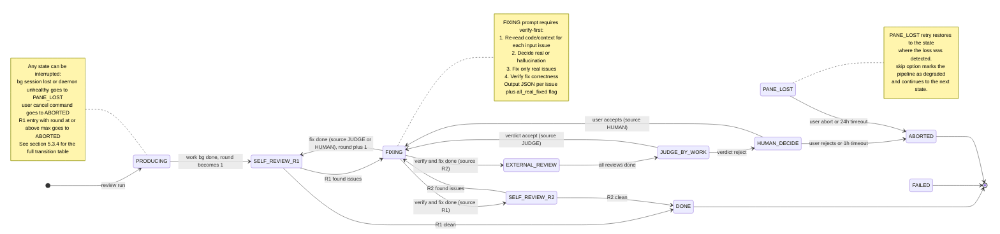
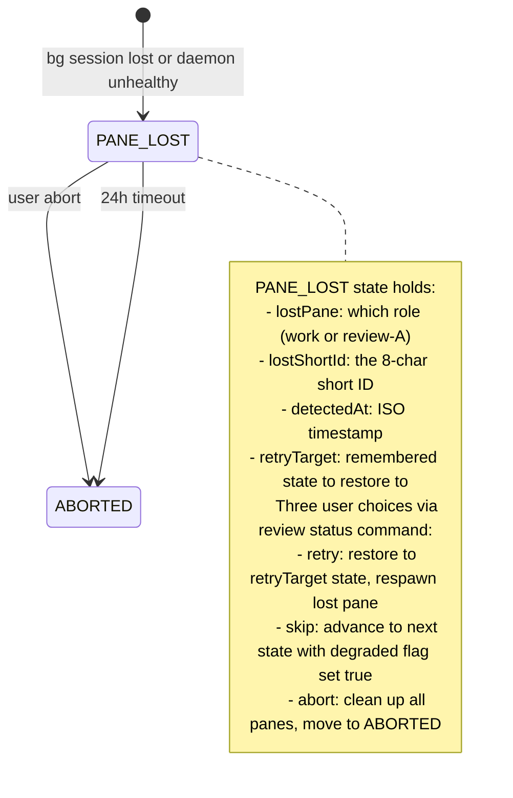

# cc-linker Multi-Model Review Engine v2.1 设计

**日期：** 2026-06-14
**版本：** v2.1（v2 patch：实测 `claude --bg` 行为 + 19 项修正）
**状态：** 待评审
**作者：** Claude Code（v2 spec + 实测验证 session + brainstorm patch）

## Preconditions（v2.1 必加）

- **Claude CLI ≥ 2.1.163**（`claude --bg` 稳定；老版本无此能力）
- **cc-linker ≥ 0.6.3**（当前 master，`c5a8b8d`）
- **`~/.claude/providers/` 至少配置 2 个 provider**（work + ≥1 review），缺失会由 `cc-linker review doctor` 报错

## 修订记录

| 版本 | 日期 | 关键变更 |
|---|---|---|
| v1 | 2026-06-06 | 初版，13 个新模块全栈自建（`src/review/` 子目录） |
| v2 | 2026-06-13 | 复用 Agent View 已有能力；新建 7 个模块；CLI 主输出 + 简版 IDE |
| **v2.1** | **2026-06-14** | **本次 patch。19 项变更：**<br>1) **§3.1 复用层** —— 实测 `claude --bg` 是真 bg session 入口（v2 假定但未验证），adapter 重写为 `Bun.spawn(['claude', '--bg', ...])`<br>2) **§4.2 work session 长生命周期** —— 每轮 `--bg` 起新 shortId 但 sessionId 跨轮不变；`panes.work` 同时追踪两者<br>3) **§5.1 JUDGE_BY_WORK / FIXING** —— 走 `RendezvousClient.injectReply()`（daemon 协议），**不**起新 bg session；v2 错误地假定用 `startSession` + `--resume`<br>4) **§6.1 PaneRegistry** —— 新增 `currentRoundShortId` 字段（每轮变）+ `sessionId` 字段（跨轮不变）<br>5) **§10.1 新增错误** —— daemon crash 检测（`~/.claude/daemon/roster.json`）+ 网络瞬态 503 重试 + CLI 版本校验<br>6) **§5.2 max_rounds 减半** —— Spec=4 / Plan=5 / Code=8 / Global=6（v2 的 8/10/15/12 跑满 ≈ 2h，太长）<br>7) **§8 Phase 1 砍 IDE** —— cc-linker 没有 HTTP 框架；Phase 1 改 CLI `--watch` 模式（rich terminal），Phase 2 再补 IDE<br>8) **§6.4 Reconciler 改保守策略** —— pane bg session 丢失 → `PANE_LOST` 状态 + CLI 询问用户（retry/abort/skip），不再直接 FAILED<br>9) **§3.3 CLI 改 subcommand group** —— 跟 `daemon` / `hook` 一致：`cc-linker review run/status/abort/report/decide/cancel/doctor` 7 个子命令<br>10) **§10.1 HUMAN_DECIDE 超时** —— 24h → 1h 默认，可配<br>11) **§9 PhaseDetector 加启发式 4** —— rawInput 含 `.ts/.py/.go` 后缀或 `line N/L:N` 引用 → 强制 code<br>12) **新增 `cc-linker review doctor`** —— 启动前验证：profile 引用的 provider 是否在 `~/.claude/providers/` + CLI 版本 + daemon 健康<br>13) **新增 `/cancel review <id>`** —— 用户飞书/CLI 中止正在跑的 review，自动清理 pane bg session（`claude stop <short>`）<br>14) **§11/§12 明确 review 不改源文件** —— Phase 1 review 只输出 Markdown 报告到 `<cwd>/.claude/reviews/<pipelineId>.md`，**不**修改用户项目源码；修改留 Phase 2 IDE<br>15) **§6.2 5 目录** —— 修 v2 写的"6 目录"，review pipeline 用 5 目录（running/human_pending/done/failed/aborted），**不**用 pending/<br>16) **§8 "1+N pane"** —— v2 写的"1+N+1 pane"改为"1+N pane"（无 arbiter）<br>17) **§12.1 Phase 1 重排** —— W6 IDE 任务删除；新增 T8 CLI `--watch` 模式任务<br>18) **§5.x R1/R2 改 self-review-and-fix + 删 ARBITRATION** —— R1/R2 先 fix 自己发现的问题再决定下一步；JUDGE_BY_WORK verdict 简化为 accept/reject 两值，由 P0/P1 rejection ratio 决定；删 ARBITRATION + JUDGE_ARBITER 两个状态；reject 直接走 HUMAN_DECIDE（不再起 arbiter bg session）<br>19) **§5.x R1/R2 拆出 FIXING 节点 + verify-first** —— R1/R2 改为 identify-only（不复修）；新增统一 FIXING 状态（source 字段区分 R1/R2/JUDGE/HUMAN 4 个调用点）；FIXING prompt 严格要求 "先验证每个 issue 是 real 还是 hallucination，对 real 的才修"；修复完成后由 source 决定下一状态（R1→R2 / R2→EXTERNAL_REVIEW / JUDGE→R1 postfix / HUMAN→R1 postfix） |

> v2 的"§2 复用层（0 行新代码）"v2.1 **保留并加强**——实测 `claude --bg` + `--settings` + `--reply-on-resume` + `state.json` + `readJobState` + `RendezvousClient.injectReply` + `claude stop` + `claude logs` 全部现成可用。

---

## 1. 问题陈述

使用 AI Coding（Claude Code 等）后，开发流程从"写代码 → 人审"变成了多轮自审 + 多模型交叉 Review 的工作流：

```
写 Spec → AI 自查 → 模型 A 交叉 Review → 模型 B 交叉 Review → 修改 → 再 Review
写 Plan → AI 自查 → 模型 A 交叉 Review → 模型 B 交叉 Review → 修改 → 再 Review
写代码 → AI 自查 → 模型 A 交叉 Review → 模型 B 交叉 Review → 修复 → 再 Review
```

由于 Claude Code 限制，不方便在终端直接切换不同模型（kimi-2.6、qwen3.6-plus、mimo-2.5-pro 等），每次评审都需手动换 settings、重新启动进程。同时，多个模型的交叉 Review 意见如何汇总、是否采纳、是否需要仲裁，缺少一个集中的"裁决 + 流程编排"机制。

v1 spec（2026-06-06）已经设计了一个完整的 Review Engine 解决方案（13 个新模块全栈自建）。
v2 spec（2026-06-13）重新设计的目标是：**深度复用 Agent View 已有基础设施**，将新建模块从 13 个缩到 7 个。
v2.1 patch（本文档）在 v2 基础上做了 13 项修正，关键变化是**实测 `claude --bg` 行为并据此重写 adapter**——v2 的"0 行新代码复用"承诺现在能兑现。

## 2. 目标与非目标

### 2.1 目标（本版必须支持）

| # | 目标 | 优先级 |
|---|------|--------|
| G1 | 多模型交叉 Review 编排：驱动"工作模型 → 外部 Review 模型 → 裁决 → 修复"的完整流水线 | P0 |
| G2 | 层次化裁决机制：工作模型自评 → 外部 Review → 工作模型评判意见 → 仲裁 → 人工兜底 | P0 |
| G3 | 三阶段支持：Spec / Plan / Code，每个阶段可配置不同的提示词、护栏、Review 模型组合 | P0 |
| G4 | 电脑端便利：CLI 主输出 + `--watch` 模式（rich terminal）实时看 1+N pane 状态 | P0（Phase 1） |
| G5 | 可恢复状态机：每次 Review 是一个有状态的、跨进程崩溃可恢复的工作流 | P0 |
| G6 | **深度复用 Agent View**：实测 `claude --bg` + `--settings` + `--reply-on-resume` + `state.json` + `readJobState` + `RendezvousClient.injectReply` + `claude stop` 全部 0 行重复代码 | P0 |
| G7 | 1+N 个 bg session 自动出现在 `~/.claude/jobs/`，飞书 `/agents` 列表**免费**看到（Phase 2 飞书集成） | P1 |
| G8 | **`cc-linker review doctor`** 启动前健康检查（profile 引用 + CLI 版本 + daemon 健康） | P0 |

### 2.2 非目标

- 不替代现有 `/new` `/list` `/switch` `/model` 等飞书命令
- 不修改 `ProviderManager` 已有逻辑
- 不修改 `ClaudeSessionManager` 签名（仅复用其接口）
- 不修改 `AgentViewManager` 任何代码（v2.1 设计 0 侵入 Agent View）
- 不做云端协同 / 团队共享（仍是单机单用户）
- **不做 Phase 1 IDE**（v2.1 砍掉，Phase 1 改 `--watch` rich terminal；Phase 2 单独排期）
- 不修改 `~/.claude/providers/*.json` 任何内容（只读取）
- **不修改用户项目源文件**（review 只产出 Markdown 报告；修改留 Phase 2 IDE + 用户主动应用）
- **不**做 cloud-hosted multi-agent review（Anthropic 已有 `claude ultrareview` 但那是云端）

## 3. 架构总览

### 3.1 复用层（实测 0 行新代码）

**v2.1 关键修正**：v2 写"adapter.startSession 内部调 `ClaudeSessionManager.sendMessage`"——**实测错**。`sendMessage` 是 `claude -p`（前台一次性），不会产生 bg session。v2.1 重写为直接 `Bun.spawn(['claude', '--bg', ...])`。

| 能力 | 复用什么 | v2.1 验证状态 |
|------|---------|--------------|
| Spawn bg session（work/review） | `Bun.spawn(['claude', '--bg', prompt, '--settings', settingsPath])` → 返回 `shortId` 落到 `~/.claude/jobs/<short>/state.json` | ✅ 实测 OK（见附录 A） |
| Provider 切换 | `--settings ~/.claude/providers/<name>.json` | ✅ 实测 OK（state.json `respawnFlags` 记录 settings 路径，`providerEnv` 切换） |
| Resume work session 跨 R1/R2/JUDGE/FIX | `--bg <newPrompt> --resume <sessionId> --reply-on-resume` | ✅ 实测 OK（每次新 shortId，sessionId 跨轮不变） |
| 注入 judge prompt 到 work session | `RendezvousClient.injectReply({ short, text, rendezvousSock, timeoutMs })`（已存在，`src/agent-view/rendezvous-client.ts:151`）走 daemon TCP socket，**不**用 `--resume`（实测 `--resume` 在 running bg 上会报错） | ✅ 走 daemon 协议 |
| 读 pane 状态 | `readJobState(shortId)`（`src/agent-view/job-state.ts:87`）读 `~/.claude/jobs/<short>/state.json` | ✅ 0 行新代码 |
| 偷看 pane 输出 | `resolvePeekContent(shortId, maxChars)`（`src/agent-view/manager.ts:209`）三级降级：state.json.linkScanPath → JsonlIndex.lookup → `claude logs <short>` | ✅ 0 行新代码 |
| Stop 任意 pane | `Bun.spawn(['claude', 'stop', short])` | ✅ 实测 OK（state.json state→'stopped'） |
| Session 状态权威 | `~/.claude/jobs/<short>/state.json`（CLI 维护，含 `state` `tempo` `detail` `needs` `output` `sessionId` `resumeSessionId`） | ✅ 0 行新代码 |
| Provider 配置文件 schema | `~/.claude/providers/<name>.json`（已存在：kimi / qwen / mimo 等 8 个） | ✅ 0 行新代码 |
| 飞书 `/agents` 列表 Phase 2 集成 | `claude agents --json` 已列出 `kind: "background"` 的 pane，零代码 | ✅ Phase 2 准备 |

**v2.1 关键洞察**：v2 假设的"复用 `runChatSDK` / `ExpectedReplyState`"经实测均**不可复用**：
- `runChatSDK`（`src/feishu/bot.ts:2075-2468`）Feishu 强耦合（CardUpdater + SpoolQueue + permission handler + activePermissionHandlers map）
- `ExpectedReplyState` 语义错配（"用户主动 reply" vs "engine 注入 judge prompt"），需要新建 `PipelineReplyState`（在 PipelineRecord 里加字段，~20 行）

### 3.2 新建层（8 个模块）

```
src/review/
├── engine.ts            # 状态机驱动（9 active states：PRODUCING / R1 / R2 / FIXING / EXTERNAL_REVIEW / JUDGE_BY_WORK / HUMAN_DECIDE / PANE_LOST + 3 terminals）
├── pipeline-store.ts    # 持久化：5 目录（running / human_pending / done / failed / aborted）
├── pipeline-state.ts    # engine 层面的 in-memory active pipeline Map（key: pipelineId, value: { record, abortController, watchClientSet }）
├── profile.ts           # ReviewProfile TOML 加载 + per-phase 深度 merge + provider 校验
├── phase-detect.ts      # 启发式：file path → git ref → 关键词 → 文件后缀/行号（启发式 4）→ PhaseUnknownError
├── adapter.ts           # v2.1 重写：ClaudeBGAdapter 暴露 4 个 API：
                                  #   - startSession({role, provider, prompt, cwd, resumeSessionId?}) → {shortId, sessionId}
                                  #   - resumeWorkSession({sessionId, prompt, provider, cwd}) → newShortId (sessionId 不变)
                                  #   - injectReply({shortId, text, timeoutMs, signal?}) → {ok, verdict, output} (走 RendezvousClient)
                                  #   - poll(shortId, timeoutMs, signal?) → JobStateFile (走 readJobState, 500ms tick)
                                  #   - stop(shortId) → void (走 claude stop)
                                  #   所有 API 接受 AbortSignal 用于 cancel 时的打断
├── cli-watch.ts         # v2.1 替换 v2 的 ide-server.ts：CLI `--watch` 模式，rich terminal UI（chalk + ANSI 进度条 + 状态条）
├── review-doctor.ts     # v2.1 新增：`cc-linker review doctor` 命令，profile / provider / CLI 版本 / daemon 健康检查
└── reconciler.ts        # 启动扫描 running/ + human_pending/ 恢复 in-memory active set + pane 丢失检测（→ PANE_LOST）
```

**v2.1 新增的两个模块说明**：
- `pipeline-state.ts`：内存中追踪 active pipeline 列表 + 每条 pipeline 的 `AbortController`（用于 `review abort` / `review cancel` 时打断 polling 循环）+ 当前 `review status --follow` 客户端列表（用于 SIGINT/SIGTERM 时通知 UI）。**不**持久化（重启后由 Reconciler 从 PipelineStore 重建）。
- `review-doctor.ts`：作为 `cc-linker review run` 启动前的健康门禁，输出诊断报告（见 §10.5）。也可独立运行 `cc-linker review doctor`。

**CLI 子命令注册**：`src/cli/commands/review.ts` 作为 subcommand group 入口（与 `daemon` / `hook` 一致），分发到上面 8 个模块；不像 Agent View 那样有 `manager.ts` 中央调度（review engine 的协调在 `engine.ts` 内部）。

### 3.3 CLI 入口（v2.1 改 subcommand group）

```bash
# v2.1 标准用法（mirrors daemon / hook 子命令风格）
cc-linker review run <task>     [--phase spec|plan|code] [--profile default] [--max-rounds N] [--watch] [--cwd <path>]
cc-linker review status <id>    [--follow]
cc-linker review abort <id>     # 清理所有 pane bg session
cc-linker review report <id>    [--format md|json] [--out <file>]
cc-linker review decide <id>    --accept-all | --accept "1,3" | --reject-all   # HUMAN_DECIDE 接收
cc-linker review cancel <id>    # 用户主动中止（区别于 abort 的 max_rounds 触发）
cc-linker review doctor         # 启动前健康检查：profile 引用 / provider 存在 / CLI 版本 / daemon 健康
cc-linker review profiles       # 列出 ~/.cc-linker/review-profiles/*.toml（每条 profile 显示 work + review providers 名 + max_rounds 默认）
```

**v2.1 修正点**：
- v2 写的 flat command（`cc-linker review <target>`）改成 subcommand group，与 `daemon` / `hook` 一致（`src/index.ts:181-184`）
- 新增 `review cancel`（用户主动中止，区别于 `abort` 是 max_rounds 触发的被动中止）
- 新增 `review doctor`（启动前健康检查，避免运行时才发现 provider 缺失）
- `run` 子命令加 `--watch`（默认开启）和 `--cwd`（指定 work dir）
- `status` 子命令加 `--follow`（持续输出，类似 `tail -f`）

### 3.4 启动方式

| 命令 | 行为 |
|------|------|
| `cc-linker review run <task>` | 一次性跑 pipeline（最常用，Phase 1 主力入口） |
| `cc-linker review status <id> --follow` | 接 SSE 等价物（v2.1 简化为：每 500ms 复读 `~/.cc-linker/review-pipelines/running/<id>.json`） |
| `cc-linker review-server` | 长驻 Review Engine + 多 pipeline 管理（Phase 2 引入，Phase 1 不做） |
| `cc-linker start` | **不**启动 Review Engine（避免给所有用户加重负担），Review Engine 按需启动 |

**v2.1 关键修正**：v2 提的"Bun.serve 9821 + 单 HTML 页 IDE"砍掉。Phase 1 改 CLI `--watch` 模式：
- 复用 cc-linker 现有的 `chalk` + ANSI 输出（参考 `src/cli/commands/daemon.ts`）
- 状态条用 ASCII 进度条（不依赖 TUI 框架）
- 时间线用滚动列表
- Phase 2 单独排期 IDE

### 3.5 与现有模块的边界

| 现有模块 | v2.1 复用方式 | 新增代码 |
|---------|-------------|---------|
| `claude --bg` | adapter 直接 spawn | 0 |
| `claude --settings <path>` | adapter 直接传 | 0 |
| `claude --resume <uuid> --reply-on-resume` | adapter 工作 pane R1/R2 续接用 | 0 |
| `claude stop <short>` | adapter 清理 pane 用 | 0 |
| `claude logs <short>` | adapter 偷看 pane 输出用 | 0 |
| `RendezvousClient.injectReply()`（`src/agent-view/rendezvous-client.ts:151`） | adapter JUDGE/FIXING 阶段注入用 | 0（包一层 callback） |
| `readJobState(shortId)`（`src/agent-view/job-state.ts:87`） | engine + adapter + cli-watch 都调 | 0 |
| `AgentSnapshotFetcher.fetch()` | cli-watch 拉 pane 列表时调（Phase 2 飞书集成时复用更多） | 0 |
| `manager.resolvePeekContent` | cli-watch 拉 pane 详情时调 | 0 |
| SpoolQueue 设计思想（writeAtomic + 7 目录） | PipelineStore 完全照搬 | 80%（持久化范式） |
| `Config` | 扩展 `[review]` 段：max_concurrent_pipelines、max_rounds 默认、HUMAN_DECIDE_TIMEOUT、CLI watch 刷新间隔 | 5% |
| `logger` | ReviewEngine 自己的日志 `~/.cc-linker/review-engine.log` | 0 |

## 4. 数据流

### 4.1 一次完整 pipeline 的事件序列（v2.1 修正）

```
时间轴  组件                       动作
─────  ─────────────────         ────────────────────────────────────────────────
T0    用户                        cc-linker review run "帮我修 NPE in auth.ts"
T1    CLI (review doctor)         验证：profile.default 引用 provider + CLI ≥ 2.1.163 + daemon 健康
T2    Engine                      调 phase-detect.detect(...) → 'code'
T3    Engine                      调 profile.load('default') → merged profile（含 provider 路径校验）
T4    Engine                      调 adapter.startSession({ role:'work', provider:'claude-sonnet-4', prompt:'NPE in auth.ts', isNew:true })
T5    Adapter                     Bun.spawn(['claude','--bg','NPE in auth.ts','--settings',sonnetPath])
T6    CLI (Claude)                spawn bg session, 写 ~/.claude/jobs/<short1>/state.json, 返回 shortId
T7    Adapter                     解析 stdout "backgrounded · short1" + 轮询 readJobState 拿 sessionId
T8    Engine                      写 PipelineRecord 到 running/<pipelineId>.json
                                  panes.work = { sessionId: '<uuid>', currentRoundShortId: 'short1', startedAt: ... }
T9    CLI (watch mode)            ANSI 进度条更新：state=PRODUCING, panes=[work:busy]
T10   CLI (Claude work bg)        ...处理中...
T11   CLI (Claude work bg)        state.json.state: 'running' → 'done'（CLI 维护）
T12   Adapter.poll(short1)        detect state.json.state == 'done' → emit 'work_produced'
T13   Engine                      transition: PRODUCING → SELF_REVIEW_R1 (**round=1**，R1 entry +1)
T14   Engine                      调 adapter.resumeWorkSession({ sessionId, prompt:'review 你的产出（identify only，不修复）...', provider:'claude-sonnet-4' })
T15   Adapter                     Bun.spawn(['claude','--bg','review...','--resume',sessionId,'--reply-on-resume','--settings',sonnetPath])
T16   CLI (Claude work bg)        state.json 中 respawnFlags 加 --reply-on-resume；supervisor 唤醒 session，新 shortId2
T17   Engine                      panes.work.currentRoundShortId = 'short2'（sessionId 不变）
T18   CLI (watch mode)            ANSI 更新：state=SELF_REVIEW_R1, panes=[work:busy, review-A:idle, review-B:idle]
T19   ...                         R1 收敛 → R1 发现 3 issues
T20   Engine                      transition: SELF_REVIEW_R1 → FIXING (source=R1)，inputIssues = R1 issues
T21   Engine                      调 adapter.injectReply({ shortId:'short2', prompt:'verify each issue, fix real ones...' })
T22   Adapter                     RendezvousClient.injectReply() → daemon → short2 bg session
T23   CLI (Claude work bg)        处理中；state.json.state: 'running'
T24   Adapter.poll(short2)        FIXING 完成，verify+fix 结果输出 → emit 'fix_complete'
T25   Engine                      FIXING(source=R1) → SELF_REVIEW_R2（round 不变）
T26   Engine                      调 adapter.resumeWorkSession({ sessionId, prompt:'review after fix...' })
T27   Adapter                     Bun.spawn(['claude','--bg','review again...','--resume',sessionId,'--reply-on-resume'])
T28   ...                         R2 发现 1 new issue
T29   Engine                      transition: SELF_REVIEW_R2 → FIXING (source=R2)
T30   ...                         FIXING(source=R2) → EXTERNAL_REVIEW（round 不变）
T31   Engine                      Promise.all([
                                    adapter.startSession({ role:'review', provider:'kimi-for-coding', prompt:'review X...', isNew:true }),
                                    adapter.startSession({ role:'review', provider:'bailian-qwen3.6', prompt:'review X...', isNew:true }),
                                  ])
T32   Adapter × 2                 同时 spawn 2 个 bg session，shortId5/6
T33   Engine                      panes.reviews = [{role:'review-A', shortId:'short5', round:1}, {role:'review-B', shortId:'short6', round:1}]
T34   CLI (watch mode)            state=EXTERNAL_REVIEW, panes=[work:done, review-A:busy, review-B:busy]
T35   CLI × 2                     ...并行 review...
T36   Adapter.poll(short5) + poll(short6)  两个都 done → emit 'external_opinions_ready'
T37   Engine                      transition: EXTERNAL_REVIEW → JUDGE_BY_WORK（round 不变，仍=1）
T38   Engine                      调 adapter.injectReply({ shortId:'short2', prompt:'judge opinions A,B...' })
T39   Adapter                     RendezvousClient.injectReply() → TCP socket → daemon → 注入到 short2 bg session
T40   CLI (Claude work bg)        处理中；state.json.state: 'running'
T41   Adapter.poll(short2)        state.json.state == 'done' + output.result 含 per-issue accept/reject → engine 计算 verdict（P0/P1 rejection ratio） → emit 'work_verdict: accept'
T42   Engine                      verdict='accept' → transition: JUDGE_BY_WORK → FIXING (source=JUDGE)（round 不变）
                                                  verdict='reject' → transition: JUDGE_BY_WORK → HUMAN_DECIDE（移到 human_pending/）
T43   Engine                      调 adapter.injectReply({ shortId:'short2', prompt:'verify each accepted issue, fix real ones...' })
T44   Adapter.poll(short2)        done → emit 'fix_complete'
T45   Engine                      transition: FIXING(source=JUDGE) → SELF_REVIEW_R1 (cycle: 'postfix')，**round=2**，check max_rounds
T46   ...                         循环直到 R1/R2 收敛 → DONE
T47   Engine                      写 PipelineRecord 到 done/，CLI 输出 state=DONE + Markdown 报告路径
```

### 4.2 bg session 之间"传递内容"（v2.1 修正）

**v2.1 关键修正**：v2 假定 work session 是"长生命周期 bg session 通过 --resume 跨多轮续接"。实测 `--resume` 在 running bg session 上**直接报错**（"is currently running as a background agent"）。正确路径：

| 角色 | 生命周期 | 启动方式 | 跨轮续接方式 |
|------|---------|---------|------------|
| `work` | 长生命周期（sessionId 跨轮不变） | 第一次 `claude --bg <prompt>` → 新 shortId1 + sessionId；后续每轮 `claude --bg <newPrompt> --resume <sessionId> --reply-on-resume` → 新 shortId2/3/4... | 每次新 shortId，但同一 sessionId |
| `review-A/B/...` | 轮次性（每轮新 session） | 永远 `claude --bg <prompt>`（不传 --resume） | 不续接，每轮新 |

**v2.1 简化**：v2 的 `arbiter` 角色删除（删 ARBITRATION + JUDGE_ARBITER 状态后不再需要）。pane 总数从 1+N+1 缩到 1+N（work + N reviews）。

**work pane 的"长生命周期"实现**（v2.1）：
- `panes.work.sessionId`：跨 R1/R2/JUDGE/FIX/postfix 全部不变（来自第一次 spawn 的 `state.json.sessionId`）
- `panes.work.currentRoundShortId`：每轮变（每次 `--bg` 都产生新 shortId）
- `panes.work.roundShortIds`：数组，记录每轮的 shortId（诊断用）

**R1/R2 self-review-and-fix 行为**（v2.1 变更 19 已替代）：
- **v2.1 变更 19 后 R1/R2 是 identify-only**（不复修），修复在后续 FIXING 节点
- R1 prompt: 列出 issues，**不修改文件**
- R2 prompt: 同 R1，审查 FIXING 后的状态
- 输出 JSON：`{ issues: [...], unfixed_count: N }`
- Engine 根据 `unfixed_count` 决定流转：=0 → DONE；>0 → FIXING(source=R1/R2) → 下一阶段
- 详见 §5.1 / §7 `prompts.work.self_review`

**JUDGE_BY_WORK / FIXING 注入实现**（v2.1 关键修正）：
- **不**调用 `adapter.startSession` + `--resume`（实测会报错）
- **改用** `adapter.injectReply({ shortId: currentRoundShortId, text, rendezvousSock })`
- 内部走 `RendezvousClient.injectReply()`（已存在）→ TCP socket → daemon → 注入到 bg session 的 stdin / rendezvous 通道
- 注入完成后 bg session 处理新 prompt，处理完成后 state.json state→'done'，Adapter.poll 即可探测

### 4.3 判定"work 产出完成" / "review 收齐"

不自己 parse 进程 stdout，**只**看 `~/.claude/jobs/<short>/state.json.state`：

| state 值 | 含义 |
|---------|------|
| `running` / `working` + tempo=`active` | 还在跑 |
| `running` / `working` + tempo=`blocked` + `needs` 非空 | 等用户输入（v2.1：注入 reply 后会从 blocked 转到 active） |
| `blocked` | 等用户输入（同步 polling state.json） |
| `done` | 已完成（看 `output.result` 字段拿最终输出） |
| `stopped` | 被 stop 或用户中止 |
| `failed` | Claude 进程异常（v2.1 新增区分；v2 把它当 unknown） |
| 其他（forward-compat） | 视为 unknown，记录 warning |

**实现位置**：`adapter.poll(shortId, timeoutMs)` 包装 `readJobState` 轮询（500ms 一次），超时抛 `PollTimeoutError`。

**v2.1 修正**：v2 写"state.json 写盘 100-200ms"——**实测错**。Claude CLI 只在状态转换时写 state.json，不连续 poll。500ms 轮询是合理平衡，但用户 IDE/CLI 看到的状态变化会有 0-500ms 抖动。

### 4.4 并发控制

| 并发维度 | 谁决定 | 怎么控 |
|---------|--------|--------|
| Pipeline 之间 | PipelineStore 的 `running/` 目录 | 默认 1 个同时跑（profile 可配 `guards.max_concurrent_pipelines`） |
| Pipeline 内的 pane | 状态机驱动 | R1/R2 串行（同 work session resume）；EXTERNAL_REVIEW 轮次内 review-A/B Promise.all 并行；FIXING 串行在 EXTERNAL/JUDGE 之后 |
| bg session 并发 | Claude CLI daemon | 实测 3+ 并行 OK；review engine 1 个 pipeline 最多 1+N 个 bg session（work + N reviews，无 arbiter） |
| Polling 频率 | adapter 内部 | 500ms 一次 |

**v2.1 实测**：实测同时 spawn 3 个 `claude --bg` session 全部正常，daemon 不限制并发。

### 4.5 SSE 协议 → 简化为文件轮询（v2.1 修正）

v2 设计的 `Bun.serve` + SSE 协议在 v2.1 砍掉（Phase 1 不做 IDE）。CLI `--watch` 模式简化为：

```typescript
// cli-watch.ts 的核心循环
async function watchPipeline(pipelineId: string): Promise<void> {
  while (true) {
    const record = await pipelineStore.readRunning(pipelineId);
    if (record.state.kind === 'DONE' || isTerminal(record.state.kind)) {
      renderTerminal(record);
      return;
    }
    renderLive(record);  // ANSI 重绘，不清屏
    await Bun.sleep(500);
  }
}
```

**优势**：0 行 HTTP / SSE 代码，依赖最小；跟现有 `cc-linker daemon status` / `cc-linker list` 的输出风格一致。
**劣势**：多个终端不能同时看同一个 pipeline（Phase 2 IDE 解决）。

## 5. 状态机

### 5.1 ReviewState 枚举（v2.1 修正）

```typescript
type ReviewState =
  // === Produce 阶段 ===
  | { kind: 'PRODUCING';         pipelineId; round: number; pane: 'work' }
  // === 自查阶段（v2.1 变更 19：identify-only，fix 在后续 FIXING 节点）===
  | { kind: 'SELF_REVIEW_R1';    pipelineId; round: number; cycle: 'initial' | 'postfix'; pane: 'work' }
  | { kind: 'SELF_REVIEW_R2';    pipelineId; round: number; cycle: 'initial' | 'postfix'; pane: 'work' }
  // === 修复节点（v2.1 变更 19：从 R1/R2/JUDGE/HUMAN 4 个调用点统一进入）===
  | { kind: 'FIXING';            pipelineId; round: number; pane: 'work';
                                  source: 'SELF_REVIEW_R1' | 'SELF_REVIEW_R2' | 'JUDGE_BY_WORK' | 'HUMAN_DECIDE';
                                  inputIssues: Issue[] }
  // === 外审（可能并行 N 个 pane）===
  | { kind: 'EXTERNAL_REVIEW';   pipelineId; round: number; cycle: 'initial' | 'postfix';
                                  panes: { role: 'review-A' | 'review-B' | ...; shortId: string }[] }
  // === 评判（v2.1 变更 18：2 值 verdict，不再有 ARBITRATION）===
  | { kind: 'JUDGE_BY_WORK';     pipelineId; round: number; pane: 'work' }
  // === v2.1 新增：pane 丢失（用户询问，不直接 FAILED）===
  | { kind: 'PANE_LOST';         pipelineId; round: number;
                                  lostPane: 'work' | 'review-A' | 'review-B' | ...;
                                  lostShortId: string; detectedAt: string;
                                  retryTarget: ReviewState['kind'] }  // v2.1 新增：retry 时恢复到的状态
  // === 人工兜底（逃生通道 + v2.1：reject 直接走这里，不再走 arbiter）===
  | { kind: 'HUMAN_DECIDE';      pipelineId; round: number; pending: DecisionContext }
  // === 终态 ===
  | { kind: 'DONE';              pipelineId; round: number; totalCostUsd; issueTrail }
  | { kind: 'FAILED';            pipelineId; round: number; reason; totalCostUsd }
  | { kind: 'ABORTED';           pipelineId; round: number; reason; abortedBefore };
```

**辅助类型（v2.1 新增 DecisionContext，替代 v2 的 ArbitrationContext）**：

```typescript
// v2.1 HUMAN_DECIDE 待决策的上下文
interface DecisionContext {
  // 触发原因（v2.1 变更 18：仅有 reject，不再有 partial）
  trigger: 'verdict_reject';            // JUDGE_BY_WORK verdict=reject 触发

  // P0/P1 rejection ratio 详情（用户做决策时需要看）
  rejectionSummary: {
    p0p1Total: number;
    p0p1Rejected: number;
    ratio: number;                       // e.g. 0.45
    threshold: number;                   // e.g. 0.30 (from profile.guards)
  };

  // 所有外部 review 的 issue（按 severity 排序）
  issues: Array<{
    id: string;                          // e.g. 'review-A-1'
    source: 'review-A' | 'review-B' | ...;
    severity: 'P0' | 'P1' | 'P2' | 'P3';
    location: string;
    description: string;
    suggestion: string;
    workDecision: 'accept' | 'reject' | 'partial';   // work session 的判定
  }>;
}
```

**v2.1 相对 v2 的 6 个关键调整**：
1. **JUDGE_BY_WORK / FIXING 走 injectReply**：v2 错把它们当 `startSession` + `--resume`，v2.1 改走 `RendezvousClient.injectReply()`，daemon 协议
2. **新增 `PANE_LOST` 状态**：v2 写"丢失直接 FAILED"，v2.1 改为进入 `PANE_LOST` 等用户决策（retry/abort/skip）
3. **`panes: { ...; shortId }[]`**：v2.1 明确每个 pane 跟踪 shortId，配合 §6.1 PaneRegistry
4. **EXTERNAL_REVIEW 支持 N pane**：v2.1 删"4 pane"硬编码，改"N pane"（profile 可配）
5. **变更 18：删 ARBITRATION + JUDGE_ARBITER**：v2.1 verdict 从 3 值（accept/partial/reject）简化为 2 值（accept/reject）；reject 直接走 HUMAN_DECIDE；R1/R2 改 self-review-and-fix
6. **变更 19：R1/R2 拆出 FIXING 节点**：R1/R2 改为 identify-only（不复修）；新增统一 FIXING 状态（source 字段区分 R1/R2/JUDGE/HUMAN 4 个调用点）；FIXING prompt 严格要求 "verify-first"（先验证 issue 是 real 还是 hallucination，对 real 的才修）

### 5.2 max_rounds 计数规则（v2.1 减半）

**Round 语义（v2.1 明确）**：
- **1 round = 1 个完整 cycle**：从 R1 entry 开始（含 initial / postfix），经历 R2 / FIXING / ExtRev / Judge / FIXING，回到 R1 entry（或 DONE）
- **`round` 计数器在每次进入 `SELF_REVIEW_R1` 时 +1**（无论 cycle 是 initial 还是 postfix）
- **其他 counting 状态**（R2 / ExtRev / Judge / FIXING）属于当 round 的子步骤，**不**独立 +1
- **`max_rounds` 检查在 `SELF_REVIEW_R1` entry 处**：round ≥ max_rounds → ABORTED

| 类别 | 状态 | round 增量 |
|------|------|-----------|
| **Round start** | `SELF_REVIEW_R1`（initial + postfix，每次 entry） | ✅ **+1** |
| **Round 中间** | `SELF_REVIEW_R2` / `FIXING` / `EXTERNAL_REVIEW` / `JUDGE_BY_WORK` | 0（属于当 round 的子步骤） |
| **免费** | `PRODUCING` / `DONE` / `FAILED` / `ABORTED` / `PANE_LOST` | 0 |
| **逃生** | `HUMAN_DECIDE` | 0（永远可达） |

**默认值**（v2.1 减半）：
| Phase | v2 默认 | v2.1 默认 | 含义 |
|-------|---------|-----------|------|
| Spec  | 8 rounds | **4 cycles** | 最多跑 4 轮（一次 review 默认收敛 2-3 轮） |
| Plan  | 10 rounds | **5 cycles** | 最多跑 5 轮 |
| Code  | 15 rounds | **8 cycles** | 最多跑 8 轮 |
| Global | 12 rounds | **6 cycles** | 全局默认 6 轮 |

**v2 改动**：v2 把"6 个 counting state 每次 entry 都 +1"——这导致 max_rounds=8 (Code) 实际只能跑 ~1.3 个 cycle，远低于用户预期。v2.1 改为"只在 R1 entry +1"，Code=8 真正意味着 8 个 cycle。

**单 cycle 耗时估算**（v2.1 变更 19 后，含 2 个 FIXING 节点）：
- 1 work bg (60s) + R1 (20s) + FIXING(R1) (30s) + R2 (25s) + FIXING(R2) (30s) + ExtRev (40s) + Judge (15s) + FIXING(JUDGE) (45s) = ~265s (无 arbiter)
- Code phase 8 cycles 满跑 ≈ 35 分钟（v2.1 变更 19 后多 FIXING 节点）

**理由**（v2.1）：实测 review 平均 2-3 cycle 收敛；v2 的 15 rounds 实际跑满罕见；15 × ~6 state visits × ~60s ≈ 1.5 小时过长。

### 5.3 状态转换图（v2.1 重设计）

#### 5.3.0 设计概述

整个状态机可以理解为**4 条 lane + 3 类驱动者**：

| Lane | 状态 | 驱动者 | 含义 |
|------|------|--------|------|
| **Engine lane** | PRODUCING / SELF_REVIEW_R1 / R2 / FIXING / EXTERNAL_REVIEW / JUDGE_BY_WORK | Engine（自动） | 主流程，引擎自己推进 |
| **Human lane** | HUMAN_DECIDE | User（CLI） | 人工决策逃生通道 |
| **Trouble lane** | PANE_LOST | User + Engine | 异常恢复，需要用户决策 |
| **Terminal** | DONE / FAILED / ABORTED | — | 终态 |

**v2.1 变更 19**：R1/R2 改为 identify-only（不复修），FIXING 抽出来作为独立节点。所有修复都走 FIXING（source 字段区分 R1/R2/JUDGE/HUMAN 4 个调用点），FIXING prompt 强制 verify-first。

**3 类驱动者**：
- **Engine-driven transition**：claude bg session 完成 → engine 推下一状态
- **User-driven transition**：`cc-linker review decide/cancel` 命令触发
- **System-driven transition**：`max_rounds` 计数器 / `HUMAN_DECIDE_TIMEOUT` / `PANE_LOST_TIMEOUT` 触发

#### 5.3.1 主状态机（Mermaid，自动渲染于 GitHub）



**图例说明**：
- **实线箭头**：Engine 自动推进（bg session 完成触发）
- **FIXING 节点 source 字段**：决定下一状态（R1→R2 / R2→EXTERNAL_REVIEW / JUDGE→R1 postfix / HUMAN→R1 postfix）
- **FIXING prompt 统一模板**：所有 source 共用，prompt 内容要求 verify-first（见 §7 ReviewProfile `prompts.work.fixing`）
- **`note right/left`**：文字注释（全局规则用 note 说明，避免图上线条过多）
- **round 计数位置**：仅 R1 entry（PRODUCING→R1 和 FIXING→R1），见 §5.2 round 语义
- **全局中断规则**：见左侧 note + §5.3.4 状态转换表

**v2.1 简化原因**：v2.1 早期版本用 HTML（`<br/>` `<i>` `<b>`）和 8 条 `PANE_LOST → X : user: retry` 同源同标签 transition，导致部分 Mermaid 渲染器（VS Code Markdown Preview 等）"Failed to load SVG into image" 报错。v2.1 简化为：(1) 标签纯文本无 HTML，(2) PANE_LOST 终止边只画 ABORTED 两条，retry/skip 用 note 解释。完整逻辑见 §5.3.3 PANE_LOST 决策流程和 §5.3.4 状态转换表。

#### 5.3.2 ASCII 备查版（不渲染 Mermaid 的环境）

```
                          ╔══════════════════════════════════════════╗
                          ║  Engine lane (主流程，引擎自动推进)       ║
                          ╚══════════════════════════════════════════╝

  ┌──────────┐  work bg done   ┌──────────────┐  issues>0  ┌──────────────┐
  │PRODUCING ├───────────────►│SELF_REVIEW_R1├──────────►│    FIXING    │
  │          │  (spawn #1)    │              │            │   (verify +  │
  │ --bg N1  │                │ R1 done      │            │     fix)     │
  │ sessionId│                │ 0 issues ─┐  │            │              │
  └──────────┘                │           │  │            │ source=R1    │
                              └───────────┼──┼────┐       │ (verify-first│
                                          │  │    │       │  prompt)     │
                                          ▼  ▼    ▼       └──────┬───────┘
                                       ┌──────────────┐ verify    │
                                       │    DONE      │ +fix done│
                                       │  (terminal)  │◄─────────┤
                                       └──────────────┘          │
                                                  ┌─────────────┘  ▼ (source=R1→R2)
                                                  │            ┌──────────────┐
                                                  │  issues>0  │SELF_REVIEW_R2│
                                                  └───────────►│              │
                                                               │ R2 done      │
                                                               │ 0 issues ─┐  │
                                                               └───────────┼──┼────┐
                                                                           │  │    │ issues>0
                                                                           ▼  ▼    ▼
                                                                        ┌──────────────┐
                                                                        │    FIXING    │
                                                                        │   (verify +  │
                                                                        │     fix)     │
                                                                        │ source=R2    │
                                                                        └──────┬───────┘
                                                                               │ verify+fix done
                                                                               ▼ (source=R2→EXTERNAL_REVIEW)
                                                                        ┌──────────────┐
                                                                        │EXTERNAL_REVIEW│
                                                                        │              │
                                                                        │ Promise.all  │
                                                                        │ spawn N2,N3  │
                                                                        └──────┬───────┘
                                                                               │ all done
                                                                               ▼
  ╔══════════════════════════════════════════╗
  ║  Judge lane (work session 接收注入)      ║
  ╚══════════════════════════════════════════╝
                                                                              ┌──────────────┐
                                                              all opinions ──►│JUDGE_BY_WORK │
                                                                              │ (injectReply)│
                                                                              └──────┬───────┘
                                                              ┌──────────────────┼─────────────────┐
                                                              ▼ verdict=accept   ▼ verdict=reject  │
                                                                                │ (P0/P1 rej ≥ 30%)
                                                                      ┌──────────────┐         ┌──────────────┐
                                                                      │    FIXING    │         │ HUMAN_DECIDE │
                                                                      │ (injectReply)│         │  (CLI 决策)  │
                                                                      │ source=JUDGE │         └──────┬───────┘
                                                                      └──────┬───────┘                │
                                                                             │                       │
  ╔══════════════════════════════════════════╗                              │                       │
  ║  Human lane (人工兜底)                  ║                              │  ╔════════════╗        │
  ╚══════════════════════════════════════════╝                              │  ║ 1h timeout ║        │
                                                                             │  ╚════════════╝        │
                                                                             │                       ▼
                                                                             │                ┌──────────────┐
                                                                             │                │   ABORTED    │
                                                                             │                │  (terminal)  │
                                                                             │                └──────────────┘
                                                                             │   HUMAN_DECIDE ──accept──► FIXING
                                                                             │                       │ (source=HUMAN)
                                                                             │                       ▼ verify+fix done
                                                                             ▼ (FIXING 完成, source=JUDGE/HUMAN→R1)
                                                                  ┌──────────────────────────────────┐
                                                                  │   SELF_REVIEW_R1 (cycle=postfix) │
                                                                  │   ← 自此进入 postfix 循环        │
                                                                  │   ← 回到本图顶部 R1              │
                                                                  └──────────────────────────────────┘

  ╔══════════════════════════════════════════╗
  ║  Trouble lane (任意状态可被打断)         ║
  ╚══════════════════════════════════════════╝

  ┌──────────────────┐
  │ 任意状态 (X)     │ ─── bg 消失/daemon crash ──► ┌──────────────┐
  │                  │                              │  PANE_LOST   │
  │ 任意状态 (X)     │ ─── user: review cancel ──► │  (等待用户)  │
  │                  │                              │              │
  │ R1 entry (Y)     │ ─── round ≥ max_rounds ───► │              │
  └──────────────────┘                              └──────┬───────┘
                                                            │
                                          ┌─────────────────┼──────────────────┐
                                          ▼ retry           ▼ skip              ▼ abort / 24h
                                   ┌──────────────┐  ┌──────────────┐    ┌──────────────┐
                                   │ 回到状态 X   │  │ 推进到 X 的  │    │   ABORTED    │
                                   │ (重新 spawn) │  │ next state   │    │  (terminal)  │
                                   │              │  │ (degraded)   │    │              │
                                   └──────────────┘  └──────────────┘    └──────────────┘
```

#### 5.3.3 PANE_LOST 决策流程（独立子图）

PANE_LOST 是唯一需要用户实时决策的状态，单独画：



**文字补充（不在 Mermaid 内的细节）**：
- `retryTarget` 字段在进入 PANE_LOST 时记录（`panes.X.shortId` 丢失前所在的状态）
- 用户在 CLI watch 看到 `⚠️ PANE_LOST` 提示，含 lost pane role + shortId + 24h 倒计时
- retry/skip/abort 通过 `cc-linker review status <id> --interact` 进入子菜单选择

#### 5.3.4 状态转换表（穷举）

| 当前状态 | 触发事件 | 下一状态 | 动作 | pane 角色 | round |
|---------|---------|---------|------|----------|-------|
| `[*]` | `cc-linker review run` | PRODUCING | doctor 验证 + 创建 PipelineRecord | — | 0 |
| **PRODUCING** | work bg state=`done` | SELF_REVIEW_R1 | 记录 `panes.work.sessionId` | work (bg short1) | 0 → 1 |
| **SELF_REVIEW_R1** | work bg done, issues=[] | DONE | 生成 report + 移到 `done/` | work (bg short2) | 1 |
| **SELF_REVIEW_R1** | work bg done, issues=[N] | FIXING (source=R1) | 记录 R1 issues 作为 `inputIssues` | work (bg short2) |
| **SELF_REVIEW_R2** | work bg done, issues=[] | DONE | 生成 report + 移到 `done/` | work (bg short3) |
| **SELF_REVIEW_R2** | work bg done, issues=[N] | FIXING (source=R2) | 记录 R2 issues 作为 `inputIssues` | work (bg short3) |
| **FIXING (source=R1)** | work bg done, verify+fix complete | SELF_REVIEW_R2 | 记录 `per_issue` (real/hallucination) + `all_real_fixed` | work (bg short4) |
| **FIXING (source=R2)** | work bg done, verify+fix complete | EXTERNAL_REVIEW | 同上 | work (bg short5) |
| **EXTERNAL_REVIEW** | all N reviews state=`done` | JUDGE_BY_WORK | 收集 N 条 opinions | reviews (×N) |
| **JUDGE_BY_WORK** | work bg done, verdict=`accept` (P0/P1 rejection ratio < 30%) | FIXING (source=JUDGE) | 记录 accepted issues 作为 `inputIssues` | work (injectReply) |
| **JUDGE_BY_WORK** | work bg done, verdict=`reject` (P0/P1 rejection ratio ≥ 30%) | HUMAN_DECIDE | 移到 `human_pending/` | work (injectReply) |
| **HUMAN_DECIDE** | user: `review decide --accept-all` | FIXING (source=HUMAN) | 移到 `running/`，记录 decision + accepted issues | — |
| **HUMAN_DECIDE** | user: `review decide --accept "1,3"` | FIXING (source=HUMAN) | 移到 `running/`，记录 decision + 子集 issues | — |
| **HUMAN_DECIDE** | user: `review decide --reject-all` | ABORTED | `claude stop` × pane 数 + 移到 `aborted/` | — |
| **HUMAN_DECIDE** | 1h timeout | ABORTED | 同上 | — |
| **FIXING (source=JUDGE)** | work bg done, verify+fix complete | SELF_REVIEW_R1 | cycle=`postfix`，**round += 1**（在 R1 entry 处） | work (injectReply) |
| **FIXING (source=HUMAN)** | work bg done, verify+fix complete | SELF_REVIEW_R1 | cycle=`postfix`，**round += 1**（在 R1 entry 处） | work (injectReply) |

**v2.1 简化**：上面 4 行 FIXING 转换可合并为通用规则——
- **FIXING(source=X)** 完成 → 下一状态由 source 决定：`R1 → R2`、`R2 → EXTERNAL_REVIEW`、`JUDGE/HUMAN → R1(postfix)`
- **FIXING 完成条件**：`work bg state=done` + output.result 含 `{per_issue, all_real_fixed, remaining_real_unfixed_count}`
- **round += 1** 仅在 FIXING→R1(postfix) 时发生（其他 source 不增加 round）
| **任意状态 X** | bg session 消失 (Reconciler) | PANE_LOST | 记录 `lostPane` + `lostShortId` + `detectedAt` | lost pane | 不变 |
| **任意状态 X** | user: `review cancel` | ABORTED | `claude stop` × pane 数 + 移到 `aborted/` | — | 不变 |
| **R1 entry** | round ≥ max_rounds | ABORTED | reason=`max_rounds_exceeded` | — | 超过阈值 |
| **PANE_LOST** | user: retry | 恢复到状态 X | 重新 spawn 该 pane | lost pane |
| **PANE_LOST** | user: skip | 推进到 X 的 next state（含 FIXING 节点） | 标记 `degraded=true`，用空 issues | — |
| **PANE_LOST** | user: abort | ABORTED | `claude stop` × pane 数 | — |
| **PANE_LOST** | 24h timeout | ABORTED | reason=`pane_lost_timeout` | — |
| **PRODUCING** | work bg spawn 失败 | FAILED | reason=`bg_spawn_failed` | — |
| **任意状态 X** | profile 加载失败（doctor 阶段） | FAILED | reason=`profile_invalid` | — |

**状态转换的 3 个不变量**：
1. **`round` 仅在 `SELF_REVIEW_R1` entry 处 +1**（无论 cycle 是 initial 还是 postfix）；其他 counting state（R2 / FIXING / ExtRev / Judge）属于当 round 的子步骤，不独立 +1；`max_rounds` 检查也只在 R1 entry 处
2. **任意状态**可被 cancel/max_rounds/pane_lost 打断 → 转到对应终态或 PANE_LOST
3. **PANE_LOST 是可恢复的中转态**，不是终态——必须经用户决策后才离开

#### 5.3.5 一次完整 review 走查示例

**输入**：`cc-linker review run "fix NPE in auth.ts" --phase code --profile default`

| t (秒) | 状态 | round | pane 状态 | adapter 动作 | 备注 |
|--------|------|-------|----------|-------------|------|
| 0 | PRODUCING | (无) | work=idle | `Bun.spawn(['claude','--bg','fix NPE...','--settings',sonnet])` | new short1, sessionId1 |
| 0+ | PRODUCING | (无) | work=busy | poll short1 @ 500ms | watch mode 显示进度 |
| 60 | **SELF_REVIEW_R1** | **1** | work=done | 解析 short1 output → 3 issues（identify only） | R1 entry：**round += 1** |
| 60+ | **FIXING (source=R1)** | 1 | work=busy (injectReply) | injectReply("verify these 3 issues + fix real ones") | verify-first prompt |
| 80 | FIXING → SELF_REVIEW_R2 | 1 | work=done | FIXING 完成（2 real fixed, 1 hallucination）→ 进 R2 | source=R1→R2 |
| 80+ | SELF_REVIEW_R2 | 1 | work=busy | `--bg "review again after fix..." --resume <sessionId1>` | new short3 |
| 105 | SELF_REVIEW_R2 → FIXING (source=R2) | 1 | work=done, work=busy | R2 发现 1 new issue → FIXING source=R2 | new short4 |
| 130 | FIXING → EXTERNAL_REVIEW | 1 | work=done | FIXING 完成（1 real fixed）→ 进 EXTERNAL_REVIEW | source=R2→EXTERNAL_REVIEW |
| 130+ | EXTERNAL_REVIEW | 1 | work=done, reviews=busy×2 | `Promise.all([--bg "review" kimi, --bg "review" qwen])` | new short5, short6 |
| 170 | JUDGE_BY_WORK | 1 | work=busy (injectReply) | 收集 opinions → injectReply("judge these opinions...") | work sessionId1 |
| 185 | JUDGE_BY_WORK | 1 | work=done | 解析 per-issue accept/reject → engine 计算 P0/P1 rejection ratio | ratio=0.10 < 30% |
| 200 | FIXING (source=JUDGE) | 1 | work=busy (injectReply) | verdict=`accept` → injectReply("apply accepted fixes") | new short7 |
| 245 | **SELF_REVIEW_R1** | **2** | work=done | FIXING(source=JUDGE) 完成 → cycle=**postfix** | R1 entry：**round += 1** |
| 245+ | SELF_REVIEW_R2 | 2 | work=done | R2 → FIXING(source=R2) → EXTERNAL_REVIEW... | 假设还有 issues |
| 350 | **SELF_REVIEW_R1** | **3** | work=done | 解析 → 0 issues | issues=0 → DONE |

**总耗时**：~6 分钟（v2.1 变更 19 后，每个 cycle 多 1 个 FIXING 节点 ~30s），**3 cycles**（round=1 + round=2 + round=3），1+N pane 始终存在 work（sessionId 不变，shortId 每轮变）。

**对照 §5.2 round 语义**：
- `round=1`：包含 PRODUCING → R1 → FIXING(source=R1) → R2 → FIXING(source=R2) → ExtRev → Judge → FIXING(source=JUDGE) → R1(postfix) = 1 个完整 cycle
- 中间状态（R2 / FIXING / ExtRev / Judge）**不独立 +1**，是 round 的子步骤
- `max_rounds=8`（Code）意味着最多 8 个完整 cycle；本例用了 3 个 cycle 收敛

#### 5.3.6 异常路径示例

**PANE_LOST 路径**（用户在 EXTERNAL_REVIEW 时 daemon crash）：

| t | 状态 | 事件 |
|---|------|------|
| 105 | EXTERNAL_REVIEW | reviews=busy×2 |
| 130 | PANE_LOST | review-A bg session 消失（daemon crash） |
| 130+ | PANE_LOST | watch mode 显示：`⚠️ review-A (short3) 消失。其他 pane: work=busy, review-B=busy。倒计时 24h。` |
| 用户决策 | → resume EXTERNAL_REVIEW | adapter 重新 `--bg "review" kimi` → new short5 |
| ... | EXTERNAL_REVIEW | review-A + review-B 都 done → JUDGE_BY_WORK 继续 |

**用户主动取消路径**：

| t | 状态 | 事件 |
|---|------|------|
| 60 | SELF_REVIEW_R1 | work=busy |
| 用户 | — | `cc-linker review cancel 01HXYZK9...` |
| 60+ | ABORTED | engine 收到 cancel 信号 → `claude stop` short2 → 移到 `aborted/` |

**max_rounds 超限路径**：

| t | 状态 | round | 事件 |
|---|------|-------|------|
| 0..N | 循环 FIXING → SELF_REVIEW_R1 → R2 → EXTERNAL_REVIEW → ... | 每次 R1 entry +1 | cycle 反复 |
| round == 8 (Code phase max) | SELF_REVIEW_R1 entry | 8 | engine 检测 round ≥ max_rounds → ABORTED reason=`max_rounds_exceeded` |

### 5.4 Verdict Decision Logic（v2.1 变更 18 新增）

v2.1 删除 ARBITRATION 后，`JUDGE_BY_WORK` 的 verdict 由 **P0/P1 rejection ratio** 决定，**算法确定性**而非 LLM 自决。

#### 5.4.1 输入

```
- reviews: Array<{
    role: 'review-A' | 'review-B' | ...,
    issues: Array<{
      id: string,
      severity: 'P0' | 'P1' | 'P2' | 'P3',
      location: string,
      description: string,
      suggestion: string
    }>
  }>
- work_decision: Array<{
    issue_id: string,
    decision: 'accept' | 'reject' | 'partial',
    reason: string
  }>
```

#### 5.4.2 计算（engine 端）

```typescript
function computeVerdict(
  reviews: ReviewOpinion[],
  workDecision: WorkDecision[],
  threshold: number  // default 0.30
): 'accept' | 'reject' {
  // 1. 汇总 P0/P1 issue 总数
  const p0p1Issues = reviews.flatMap(r => r.issues)
    .filter(i => i.severity === 'P0' || i.severity === 'P1');
  const p0p1Total = p0p1Issues.length;

  // 2. 计算 P0/P1 中被 work reject 的数量
  const p0p1Rejected = p0p1Issues.filter(issue => {
    const decision = workDecision.find(d => d.issue_id === issue.id);
    return decision?.decision === 'reject';
  }).length;

  // 3. rejection ratio
  const ratio = p0p1Total > 0 ? p0p1Rejected / p0p1Total : 0;

  // 4. 判定
  if (ratio >= threshold) return 'reject';
  return 'accept';
}
```

#### 5.4.3 规则总结

| 条件 | verdict | 下一状态 |
|------|---------|---------|
| P0/P1 ratio ≥ 30% (default) | `reject` | HUMAN_DECIDE |
| P0/P1 ratio < 30% | `accept` | FIXING |
| P0/P1 total = 0 (只有 P2/P3) | `accept` | FIXING |

#### 5.4.4 边界 case

- **所有 review 都是空（0 issues）**：直接 `accept`（work 无可争议项）
- **work 没回复 per-issue decision**（解析失败）：视为全部 `accept`（保守：让外部 review 通过，进入 FIXING）
- **work 全部 partial**：按 accept 计算（partial 不计入 reject 比例）

#### 5.4.5 阈值可配

```toml
[guards]
p0_p1_reject_threshold = 0.30   # 默认 30%（v2.1）
# 严格：0.10（几乎所有 P0/P1 不同意就走人工）
# 宽松：0.50（多数不同意才走人工）
# 极端：0.0（任何 P0/P1 不同意就走人工）或 1.0（永远 accept）
```

#### 5.4.6 为什么 30% 是合理默认

- P0/P1 严重问题，30% 以上不同意说明 work 和 reviewers 存在根本分歧（不是个别争议）
- 低于 30% 是局部意见不一，work 应能自行处理（apply accepted, ignore rejected, flag partial）
- 比 v2 的 "arbiter 二次判断" 简单且无递归风险（arbiter 本身也可能 reject）

#### 5.4.7 Work session 输出契约

`JUDGE_BY_WORK` 的 injectReply prompt 模板：

```
你的产出（来自 PRODUCING 阶段）：
{artifact}

外部 review 提出的 issue 列表：
{reviews_json_for_each_role}

请你逐条评估每个 issue：
1. accept：你认为这是真问题
2. reject：你不同意（说明理由）
3. partial：部分同意（说明哪部分）

输出 JSON:
{
  "per_issue": [
    {"issue_id": "review-A-1", "decision": "accept", "reason": "..."},
    {"issue_id": "review-A-2", "decision": "reject", "reason": "..."}
  ],
  "reasoning": "总体判断说明"
}
```

注意：**不要自己输出 verdict**，由 engine 根据 per-issue decision + P0/P1 rejection ratio 算法决定。这避免 work session 主观偏向 "全部 reject" 或 "全部 accept"。

## 6. PipelineStore & Reconciler

### 6.1 PipelineRecord 数据结构（v2.1 修正）

```typescript
interface PipelineRecord {
  pipelineId: string;           // ULID
  createdAt: string;
  updatedAt: string;
  ownerOpenId?: string;         // Phase 2 飞书集成用
  state: ReviewState;           // 当前状态
  input: {
    rawInput: string;           // 任务描述 / 文件路径 / git ref
    phase: 'spec' | 'plan' | 'code' | 'unknown';
    profile: string;
    maxRounds: number;          // 实际生效的 max_rounds
    cwd: string;                // v2.1 新增：明确记录 work dir
  };
  panes: PaneRegistry;          // v2.1 修正：跨多状态机持续追踪 pane 的 shortId + sessionId
  history: HistoryEvent[];      // 每条 history 带 pane shortId + sessionId
  totalCostUsd: number;
}

interface PaneRegistry {
  work?: {
    sessionId: string;          // v2.1 新增：跨轮不变的 sessionId（来自第一次 spawn）
    currentRoundShortId?: string;  // v2.1 新增：当前 round 的 shortId
    provider: string;
    startedAt: string;
    roundShortIds: string[];    // v2.1 新增：每轮 shortId 数组（诊断用）
  };
  reviews: {
    role: 'review-A' | 'review-B' | ...;
    shortId: string;
    sessionId: string;
    provider: string;
    round: number;
    cycle: 'initial' | 'postfix';
  }[];
  // v2.1 变更 18：删 arbiter 字段（无 arbiter 状态）
}

interface HistoryEvent {
  ts: string;
  fromState: ReviewState['kind'] | null;
  toState: ReviewState['kind'];
  round: number;
  role: 'work' | 'review' | 'human';  // v2.1 变更 18：删 'arbiter'
  paneShortId?: string;         // 哪个 shortId 跑了这一步
  paneSessionId?: string;       // v2.1 新增：哪个 sessionId（跨轮续接时不变）
  providerAlias?: string;
  inputDigest: string;          // sha256 of input text（前 16 字符）
  outputDigest: string;
  outputSizeBytes: number;
  costUsd: number;
  durationMs: number;
  issues?: Issue[];
  verdict?: 'accept' | 'partial' | 'reject';
}
```

**v2.1 相对 v2 的 3 个关键调整**：
1. **`work.sessionId` + `currentRoundShortId`**：跨轮不变 vs 每轮变，必须分开追踪
2. **`paneSessionId`** 字段（每条 history）：诊断用，复盘时知道"这一步是续接自哪个 session"
3. **`work.roundShortIds[]` 数组**：记录 work pane 每轮的 shortId 切换历史

### 6.2 持久化目录（v2.1 修正）

```
~/.cc-linker/review-pipelines/
├── running/         # 正在跑（最多 max_concurrent_pipelines 个文件）
├── human_pending/   # 等待人工决策
├── done/            # 已完成
├── failed/          # 失败
└── aborted/         # 用户中止或 max_rounds 触发
```

**v2.1 修正**：v2 写的"6 目录（pending / running / human_pending / done / failed / aborted）"——review engine **不使用 pending/**。`cc-linker review run` 创建 PipelineRecord 后**直接写 running/**（不经过 pending/），所以是 **5 目录**。Reconciler 启动时不需要检查 pending/（目录不存在是正常状态；存在但为空也是正常；启动时如果看到陌生目录会 warn 一次）。

**原子写规则**（v2.1 与 v2 一致）：
```typescript
async function saveRunning(record: PipelineRecord): Promise<void> {
  const path = `~/.cc-linker/review-pipelines/running/${record.pipelineId}.json`;
  const tmpPath = `${path}.tmp`;
  await Bun.write(tmpPath, JSON.stringify(record, null, 2));
  await rename(tmpPath, path);   // 原子 rename
}

async function moveToTerminal(record: PipelineRecord): Promise<void> {
  const srcPath = `~/.cc-linker/review-pipelines/running/${record.pipelineId}.json`;
  const destDir = `~/.cc-linker/review-pipelines/${terminalDir(record.state.kind)}/`;
  const destPath = `${destDir}${record.pipelineId}.json`;
  await rename(srcPath, destPath);
}
```

### 6.3 幂等性保证（v2.1 与 v2 一致）

```typescript
async function transition(pipeline: PipelineRecord, event: EngineEvent): Promise<void> {
  // 1. 读 history last event
  const lastEvent = pipeline.history[pipeline.history.length - 1];

  // 2. 如果 lastEvent.toState 已经是目标 state，幂等返回
  if (lastEvent && lastEvent.toState === computeNextState(pipeline.state, event).kind) {
    logger.info(`[engine] pipeline ${pipeline.pipelineId} 已在 ${lastEvent.toState}，幂等跳过`);
    return;
  }

  // 3. 否则正常推进
  const nextState = computeNextState(pipeline.state, event);
  const newEvent: HistoryEvent = { ... };
  await pipelineStore.appendHistory(pipeline.pipelineId, newEvent);
  pipeline.state = nextState;
  pipeline.history.push(newEvent);
  await pipelineStore.saveRunning(pipeline);
  await cliWatch.notify(pipeline.pipelineId, { type: 'state_change', state: nextState });
}
```

**幂等的 3 道防线**：
1. History 去重：`lastEvent.toState === 目标 state` → 跳过
2. State machine 转换函数本身幂等：纯函数，相同 input 永远相同 output
3. Polling 间隔去重：adapter.poll 500ms 一次，但只在 state 变化时 emit 事件

**v2.1 变更 19 新增：FIXING source-aware 幂等性**：
```typescript
// FIXING 状态的幂等性检查要考虑 source 字段
function isSameFixingTarget(pending: ReviewState, last: HistoryEvent): boolean {
  if (pending.kind !== 'FIXING') return false;
  if (last.toState !== 'FIXING') return false;
  // FIXING 必须 source + inputIssues 都匹配才算幂等
  return last.fixingSource === pending.source
      && last.inputIssuesDigest === digest(pending.inputIssues);
}
```

**v2.1 HUMAN_DECIDE → FIXING 期间 work session 状态**：
- HUMAN_DECIDE 期间：work session 保持 `running` 状态（不被 stop），daemon 仍在；用户决策到达后立即 injectReply
- 如果 HUMAN_DECIDE 期间 pane 消失：走 PANE_LOST 路径（而非 ABORTED），用户重连后可以决策 + 重新 spawn
- 1h 超时触发 ABORTED 时：先 `claude stop` work session（防止 leak），再移到 `aborted/`

**v2.1 AbortController 注入路径**：
```typescript
// engine.ts 创建 pipeline 时创建 AbortController
const abortController = new AbortController();
pipelineState.set(pipelineId, { record, abortController, watchClientSet });

// 注入到所有 adapter 调用
await adapter.poll(shortId, timeoutMs, abortController.signal);
await adapter.injectReply({ shortId, text, timeoutMs, signal: abortController.signal });

// 用户 cancel 时
function cancelPipeline(pipelineId: string): void {
  const state = pipelineState.get(pipelineId);
  state.abortController.abort();  // 立即打断所有 polling 循环
  // 然后调 cleanup
}
```

### 6.4 Reconciler（v2.1 改保守策略）

```typescript
export async function reconcile(): Promise<void> {
  const store = new PipelineStore();
  const fetcher = new AgentSnapshotFetcher();
  const adapter = new ClaudeBGAdapter();

  // 1. 扫描 running/ 中所有未到终态的 pipeline
  for (const record of await store.listRunning()) {
    if (isTerminal(record.state.kind)) {
      await store.moveToTerminal(record);
      continue;
    }

    // 2. v2.1：验证每个 pane bg session 是否还活着
    const liveShortIds = (await fetcher.fetch())?.sessions
      .filter(s => s.kind === 'background')
      .map(s => s.daemonShort) ?? [];
    const deadPanes = findDeadPanes(record.panes, liveShortIds);

    if (deadPanes.length > 0) {
      // v2.1 改：进入 PANE_LOST，不直接 FAILED
      logger.warn(`[reconciler] pipeline ${record.pipelineId} 有 ${deadPanes.length} 个 pane 已消失: ${deadPanes.join(', ')}`);
      record.state = {
        kind: 'PANE_LOST',
        round: record.state.round,
        lostPane: deadPanes[0].role,
        lostShortId: deadPanes[0].shortId,
        detectedAt: new Date().toISOString(),
      };
      await store.saveRunning(record);
      continue;
    }

    // 3. 加回内存中的 active set
    engine.continuePipeline(record);

    // 4. 幂等推进
  }

  // 5. human_pending/ 中所有 pipeline：发 CLI 通知（如果用户当前在 review status --follow）
  for (const record of await store.listHumanPending()) {
    await cliWatch.notifyHumanPending(record);
  }
}
```

**Reconciler 关键决策**（v2.1 改 v2）：

| 场景 | v2 行为 | v2.1 行为 | 理由 |
|------|---------|----------|------|
| running/ 中 pipeline + 所有 pane 都还活着 | 继续推进 | 继续推进 | 幂等恢复 |
| running/ 中 pipeline + **部分** pane 已消失 | 直接 FAILED | **PANE_LOST** + 用户决策 | 用户可能想 retry 或 skip；自动 FAILED 浪费 30min 工作 |
| running/ 中 pipeline + **全部** pane 已消失 | FAILED | **PANE_LOST**（同样） | 同上 |
| human_pending/ 中 pipeline | 发 IDE 通知，不主动推进 | 发 CLI watch 通知，不主动推进 | 等用户决策；超时由 `HUMAN_DECIDE_TIMEOUT` 控制（v2.1: 1h 默认） |

**PANE_LOST 用户决策**（v2.1 新增交互）：
```
⚠️ Pipeline 01HXYZK9... PANE_LOST
  Lost pane: review-A (shortId: abc12345)
  其他 pane: work (def67890, alive), review-B (ghi11111, alive)

  选项:
    retry → cc-linker review status <id> 然后选 retry（重启该 pane）
    abort → cc-linker review abort <id>
    skip  → cc-linker review status <id> 然后选 skip（用 0 opinions 推进）

  默认: 24h 后自动 ABORTED（reason: pane_lost_timeout）
```

**PANE_LOST retry 实现细节**（v2.1 完整化）：

```typescript
async function retryPANE_LOST(pipelineId: string): Promise<void> {
  const record = await pipelineStore.readRunning(pipelineId);
  if (record.state.kind !== 'PANE_LOST') throw new Error('not in PANE_LOST');

  const { lostPane, lostShortId, retryTarget } = record.state;

  // 1. 清理旧 pane 的 state（如果还在）
  try { await adapter.stop(lostShortId); } catch { /* 已被 daemon reap */ }

  // 2. 重新 spawn lost pane（用 retryTarget 决定启动方式）
  if (retryTarget === 'EXTERNAL_REVIEW') {
    // review pane：找到原 provider + prompt template，重新 `--bg` spawn
    const originalPane = record.panes.reviews.find(r => r.role === lostPane);
    if (!originalPane) throw new Error('pane info lost');
    const newShortId = await adapter.startSession({
      role: 'review',
      provider: originalPane.provider,
      prompt: buildReviewPrompt(record),
      cwd: record.input.cwd,
    });
    record.panes.reviews = record.panes.reviews.map(r =>
      r.role === lostPane ? { ...r, shortId: newShortId } : r
    );
  } else if (retryTarget === 'FIXING' && lostPane === 'work') {
    // work pane：复杂，需要重新 spawn work session（sessionId 已死）
    // 注意：v2.1 设计是"work session 死了就全 pipeline 重新跑 R1"，
    // 因为没有原始 work session context 可以恢复
    logger.warn(`[reconciler] work pane lost in FIXING，pipeline ${pipelineId} 需重新从 R1 开始`);
    record.panes.work = await spawnFreshWork(record);
    record.state = { kind: 'SELF_REVIEW_R1', round: record.state.round, cycle: record.panes.work.cycle, pane: 'work' };
  } else {
    throw new Error(`retry not supported for retryTarget=${retryTarget} lostPane=${lostPane}`);
  }

  // 3. 回到 retryTarget 状态继续
  record.state = buildStateFor(retryTarget, record);
  await pipelineStore.saveRunning(record);
  engine.continuePipeline(record);
}
```

**为什么 work pane 死了要重新跑**：因为 work sessionId 是 bg session 的核心身份，session 死了 → 没有"上下文"可以 resume，state.json 中的 resumeSessionId 指向一个不存在的 session。强制 FAILED 会浪费之前所有进度；折中是"回到 R1 重新 self-review"，保留 history 但重新触发新 work session。

### 6.5 并发控制（v2.1 与 v2 一致）

```typescript
async function acquirePipelineSlot(profile: ReviewProfile): Promise<boolean> {
  const maxConcurrent = profile.guards.max_concurrent_pipelines ?? 1;
  const running = await store.listRunning();
  if (running.length >= maxConcurrent) return false;
  return true;
}
```

**默认 1 个 pipeline 同时跑**（避免 token 用量爆炸），profile 可配 `guards.max_concurrent_pipelines = 3`。

### 6.6 Abort / Cleanup 流程（v2.1 新增）

**触发场景**：
- 用户 `cc-linker review cancel <id>`（主动取消）
- 用户 `cc-linker review abort <id>`（max_rounds 触发）
- HUMAN_DECIDE 1h 超时 → ABORTED
- PANE_LOST 24h 超时 → ABORTED

**Cleanup 步骤**（按顺序）：

```typescript
async function cleanupPipeline(pipelineId: string, reason: string): Promise<void> {
  const record = await pipelineStore.readRunning(pipelineId);

  // 1. 立即 abort 所有 polling 循环（打断 stuck 在 readJobState 的循环）
  const state = pipelineState.get(pipelineId);
  state?.abortController.abort();

  // 2. 收集所有 active pane shortIds
  const paneShortIds: string[] = [];
  if (record.panes.work?.currentRoundShortId) {
    paneShortIds.push(record.panes.work.currentRoundShortId);
  }
  for (const review of record.panes.reviews) {
    paneShortIds.push(review.shortId);
  }
  // arbiter 已删（v2.1 变更 18）

  // 3. 并行 claude stop 所有 pane（best-effort，不抛错）
  const stopResults = await Promise.allSettled(
    paneShortIds.map(shortId => adapter.stop(shortId))
  );
  // stop 失败也继续（daemon 可能已经 reap 了），仅 warn

  // 4. 如果是 HUMAN_DECIDE 移到 aborted：保留 history 标记 decision timeout
  // 否则直接移到 aborted/

  // 5. 通知 cli-watch 客户端（如有连接）
  state?.watchClientSet.forEach(client => client.send({ type: 'aborted', reason }));

  // 6. 关闭文件锁 + 清理 in-memory state
  pipelineState.delete(pipelineId);
}
```

**关键设计点**：
- `Promise.allSettled` 保证一个 stop 失败不影响其他
- 步骤 1 abort 必须最先做（否则 step 3 的 stop 触发 daemon rendezvous 时 polling 还在跑）
- HUMAN_DECIDE 超时 vs 用户主动 abort 走相同 cleanup 流程，只在 reason 字段区分
- 1h/24h 超时由 Reconciler 在扫描时检测并触发 cleanup

## 7. ReviewProfile（v2.1 与 v2 一致）

### 7.1 存储位置

`~/.cc-linker/review-profiles/<name>.toml`

### 7.2 完整配置示例

```toml
[meta]
name = "default"
description = "通用默认：sonnet 工作 + kimi/qwen 双 Review（v2.1 变更 18 删 arbiter）"

[work]
provider = "claude-sonnet-4"   # 直接映射到 ~/.claude/providers/<name>.json

[review]
mode = "parallel"
providers = ["kimi-for-coding", "bailian-qwen3.6"]   # 数组决定 EXTERNAL_REVIEW 几个 pane

[guards]
max_rounds = 6                       # v2.1 改：默认 6
max_concurrent_pipelines = 1
human_decide_timeout_ms = 3600000    # v2.1 改：1h 默认（v2 是 24h）
p0_p1_reject_threshold = 0.30        # v2.1 新增：P0/P1 rejection ratio ≥ 30% → verdict=reject（详见 §5.4）

[prompts.work.produce.system]
template = """
你正在编写一份 {phase}。
{task}
"""

[prompts.work.self_review.system]
template = """
你的产出（来自 {previous_stage} 阶段）：
{artifact}

请审查你的产出，识别问题：
1. 仔细阅读你的产出
2. 列出所有发现的问题（severity: P0/P1/P2/P3, location, description）
3. **不要修改文件**（修改在后续 FIXING 节点）

输出 JSON:
{
  "issues": [
    {"severity": "P0"|"P1"|"P2"|"P3", "location": "...", "description": "..."}
  ],
  "unfixed_count": N
}
"""

[prompts.work.fixing.system]
template = """
你是修复节点（FIXING）。
调用来源：{source} 阶段（self_review_r1 / self_review_r2 / judge_by_work / human_decide）
待处理的问题列表：
{input_issues}

**严格 verify-first 流程**（每个 issue 都必须经过）：

1. **仔细验证真实性**：
   - 重新阅读相关代码/上下文
   - 判断这是真问题（real）还是 reviewer 的幻觉（hallucination）
   - 常见幻觉：reviewer 误读了代码 / reviewer 提出了 spec 之外的不合理要求 / reviewer 套用了错误的最佳实践

2. **判定**：real | hallucination

3. **修复（仅 real）**：
   - 修改文件
   - 修改要最小化，只解决该 issue，不做额外改动

4. **验证修复**：
   - 再次读相关代码，确认 fix 正确
   - 确认 fix 没有引入新问题

输出 JSON:
{
  "per_issue": [
    {
      "issue_id": "...",
      "verdict": "real" | "hallucination",
      "verdict_reason": "为什么判定为 real/hallucination",
      "fix_applied": true | false,
      "fix_summary": "修改了什么（如有）"
    }
  ],
  "all_real_fixed": true | false,
  "remaining_real_unfixed_count": 0
}
"""

[prompts.work.judge.system]
template = """
工作产物：
{artifact}

外部 review 提出的 issue 列表：
{reviews_json_for_each_role}

请你逐条评估每个 issue（accept / reject / partial），不要自己输出 verdict，由 engine 根据 P0/P1 rejection ratio 算法决定。

输出 JSON:
{
  "per_issue": [
    {"issue_id": "...", "decision": "accept"|"reject"|"partial", "reason": "..."}
  ],
  "reasoning": "总体判断说明"
}
"""

[prompts.review.code.system]
template = """
你正在 Review 一段代码变更。
{artifact}
请输出 JSON: { issues: [{ severity, category, location, description, suggestion }] }
"""

[phase_overrides.code]
review.providers = ["kimi-for-coding", "bailian-qwen3.6", "xiaomi-mimo"]   # 完全替换
guards.max_rounds = 8           # v2.1 改：Code phase 默认 8（v2 是 15）
```

### 7.3 per-phase 深度 merge 规则

照搬 v1 spec §4.3：
- 标量字段（string/number/bool）：phase 值完全覆盖 top-level
- 数组字段（providers）：phase 值完全替换 top-level 数组（不追加）
- table 字段（prompts）：phase 的子表与 top-level 子表深度 merge

**v2.1 重要**：phase_overrides 现在支持覆盖**所有 prompt 类型**，不仅是 `prompts.review.*`：

```toml
[phase_overrides.code]
# 完全覆盖 work 类 prompt（spec phase 不需要 code-specific prompt）
prompts.work.produce.system = """
你是资深 TypeScript 工程师。{task}
"""
prompts.work.fixing.system = """
verify-first：每个 issue 必须先判断是 real 还是 hallucination，对 real 才修改。
"""
# 也可以 per-phase 覆盖 review providers（v2 行为保留）
review.providers = ["kimi-for-coding", "bailian-qwen3.6", "xiaomi-mimo"]
guards.max_rounds = 8
```

### 7.4 Provider 字段 → settingsPath 映射（v2.1 强化 fail fast）

```typescript
async function resolveSettingsPath(provider: string): Promise<string> {
  const home = process.env.HOME!;
  const path = `${home}/.claude/providers/${provider}.json`;
  if (!existsSync(path)) {
    // v2.1 强化：fail fast 在 doctor 阶段，错误信息明确告诉用户怎么修
    throw new ProfileError({
      code: 'PROVIDER_NOT_FOUND',
      message: `provider '${provider}' 不在 ~/.claude/providers/`,
      remediation: `放置 ~/.cc-linker/providers/${provider}.json (格式参考其他 provider)，或运行 'cc-linker review doctor' 查完整诊断报告`,
    });
  }
  return path;
}
```

**关键不变量**：
- `~/.cc-linker/review-profiles/*.toml` —— 用户编辑
- `~/.claude/providers/*.json` —— 用户已配置（kimi / qwen3.6 / mimo 等已存在）
- Review Engine **不**修改 providers，只**读取**

## 8. Phase 1 电脑端 UX（v2.1 砍 IDE 改 `--watch`）

### 8.1 CLI 主输出：rich terminal

```bash
# 一次性跑 pipeline
cc-linker review run "帮我修 NPE in auth.ts" --phase code --profile default

# 跑起来后 CLI 默认进入 --watch 模式：
#
# ╭─ cc-linker Review Engine v2.1 ─────────────────────────────────╮
# │ Pipeline: 01HXYZK9... │ Phase: code │ Profile: default          │
# │ Round: 3/8  │ Cost: $0.42  │ ⏱ 12:34  │ State: EXTERNAL_REVIEW  │
# ╰──────────────────────────────────────────────────────────────────╯
#
# Pane Status:
#   🔧 work       short2 (claude-sonnet-4)  done       $0.10  8.2s
#   👁 review-A   short3 (kimi-for-coding)  busy       $0.05  4.2s
#   👁 review-B   short4 (bailian-qwen3.6)  busy       $0.07  4.0s
#
# Timeline:
#   [12:30] ✓ PRODUCING (short1, sonnet)         $0.012  2.3s
#   [12:31] ✓ SELF_REVIEW_R1 (short2, sonnet)    $0.008  1.8s
#   [12:32] ⚠ SELF_REVIEW_R2 (short2, sonnet)    $0.009  2.1s  (2 issues)
#   [12:33] ⟳ EXTERNAL_REVIEW (short3+short4)    -       -
#
# [Ctrl-C] detach; pipeline 继续在后台跑
# 重连: cc-linker review status 01HXYZK9... --follow

# 显式指定 cwd
cc-linker review run "..." --cwd /Users/me/my-project

# 禁用 watch 模式（脚本/CI 用，只打印最终报告）
cc-linker review run "..." --no-watch
```

**v2.1 关键设计**：
- **chalk + ANSI**：复用 cc-linker 现有依赖（参考 `src/cli/commands/daemon.ts:108`）
- **状态变更才重绘**：每 500ms 一次 poll，但只在 state 变化时输出（不刷屏）
- **Ctrl-C 友好**：用户 Ctrl-C 后 pipeline 在后台继续跑，重连用 `review status --follow`
- **不依赖 TUI 框架**：纯 ANSI，0 行 TUI 库代码

### 8.2 错误时的 UX

| 错误 | 终端输出 |
|------|---------|
| Provider 找不到（doctor 阶段） | ❌ `provider 'kimi-2.6' 不在 ~/.claude/providers/` + `remediation: 放置 ~/.cc-linker/providers/kimi-2.6.json，或运行 'cc-linker review doctor' 查完整诊断报告` |
| CLI 版本过低（doctor 阶段） | ❌ `Claude CLI 2.1.139 不支持 --bg，需要 ≥ 2.1.163` + `remediation: claude update` |
| daemon crash（运行时） | ⚠️ `daemon unhealthy (roster.json missing or stale)`, Pipeline 进入 PANE_LOST |
| bg session 启动失败 | ❌ `work session 启动失败: <err>` + 标记 FAILED |
| 网络瞬态 503 | 🔄 retry 3 次 + backoff（每次 2s, 4s, 8s），最终失败 → FAILED `network_timeout` |
| Review 返回 50+ issues | 自动截断到 top 10 + 终端告警 `还有 N 条未列出` |
| HUMAN_DECIDE 超时（1h） | 自动 ABORTED + 终端输出 `human_decision_timeout` |
| PANE_LOST 24h 超时 | 自动 ABORTED + 终端输出 `pane_lost_timeout` |

### 8.3 飞书交互（v2.1 明确）

review 跑期间：
- 用户**不能**通过飞书聊天发消息到 work session（被 engine 占用）
- 飞书端收到 `[🤖 Review Engine] Pipeline 01HXYZK9... 正在使用当前 session，飞书聊天暂时禁用。review 完成后会自动恢复。`
- review 完成后飞书聊天自动恢复
- **Phase 1**：通过 `cc-linker review cancel <id>` CLI 中止
- **Phase 2（v2.1 计划）**：飞书 `/cancel review <id>` 中止（FeishuBot 解析 slash command → 调用本地 cc-linker daemon → cc-linker review cancel）

**两边都实现时共享同一路径**：CLI/Feishu 都最终调用 `cleanupPipeline()`（见 §6.6），保证一致行为。

### 8.4 review 产物（v2.1 明确：不改源文件）

review 跑完后，**不修改用户项目源文件**，只产出 Markdown 报告：

```
<cwd>/.claude/reviews/<pipelineId>.md
├── Header: pipelineId / createdAt / phase / profile / totalCostUsd
├── Timeline: 所有 state transition 摘要
├── Issues: 所有 review 提出的 issue（去重 + 按 severity 排序）
├── Decisions: 每个 issue 的 verdict（accept/partial/reject）+ 理由
└── Report: 自然语言总结（"修改建议 + 风险 + 后续 action"）
```

用户用 `cc-linker review report <id>` 查看，或 IDE 浏览（Phase 2 集成）。

**v2.1 不做**：自动 apply fixes、自动 commit、自动 PR。这些都涉及修改用户源文件，超出 Phase 1 范围。

## 9. PhaseDetector（v2.1 加启发式 4）

```typescript
function detect(input: { rawInput: string; filePath?: string; gitRef?: string }): 'spec' | 'plan' | 'code' {
  // 启发式 1: 文件路径
  if (input.filePath) {
    if (/\.(ts|js|py|go|rs|java|swift|c|cpp|h)$/.test(input.filePath)) return 'code';
    if (input.filePath.includes('docs/') || input.filePath.includes('specs/')) return 'spec';
    if (input.filePath.includes('plans/') || input.filePath.includes('design/')) return 'plan';
  }

  // 启发式 2: git ref
  if (input.gitRef) return 'code';

  // 启发式 3: 文本内容关键词
  const text = input.rawInput.toLowerCase();
  if (text.match(/(requirements?|user stor(y|ies)|acceptance criteria)/)) return 'spec';
  if (text.match(/(architecture|task breakdown|milestone|dependencies?)/)) return 'plan';
  if (text.match(/(implement|fix|debug|optimize|refactor)/)) return 'code';

  // 启发式 4 (v2.1 新增): 文件后缀或行号引用 → 强制 code
  if (/\.(ts|js|py|go|rs|java|swift|c|cpp|h)\b/.test(input.rawInput)) return 'code';
  if (/\b(line\s+\d+|L:\d+|\.go:\d+|\.ts:\d+)/.test(input.rawInput)) return 'code';

  // 启发式 5: LLM 分类（Phase 3 才实现）
  if (config.review.phaseDetect.llmFallback) {
    return await llmClassify(input.rawInput);
  }
  throw new PhaseUnknownError(rawInput);
}
```

**v2.1 加启发式 4 的理由**：v2 的启发式 3 关键词匹配会把 "Refactor the auth design document" 误判为 code（关键词命中但其实是 spec）。启发式 4 用文件后缀和行号引用做强信号，覆盖 80% 的边界 case。

**用户可在 CLI / IDE 上手动覆盖**：
```bash
cc-linker review run "..." --phase code   # 显式指定
cc-linker review run "..."                # 自动识别失败抛 PhaseUnknownError
```

## 10. 错误处理（v2.1 强化）

### 10.1 错误分类（v2.1 补全）

| 错误类别 | v2.1 触发场景 | v2.1 处理 |
|---------|------------|----------|
| **Provider 不可用** | 模型 provider alias 不存在 | **doctor 阶段 fail fast**（v2 是运行时检测，v2.1 提前到 doctor） |
| **CLI 版本过低** | claude --bg 不可用 | **doctor 阶段 fail fast**（v2.1 新增） |
| **daemon 不健康** | `~/.claude/daemon/roster.json` 不存在或 stale | **运行时检测**：进入 PANE_LOST |
| **Claude 进程启动失败** | SDK 启动报错 | 不重试（v2 一致；ClaudeSessionManager 内部已有重试） |
| **bg session 启动后立即失败** | state.json state='failed' detail='启动失败' | 标记 FAILED |
| **bg session 消失** | daemon crash / 进程被 kill | **PANE_LOST**（v2.1 改，不直接 FAILED） |
| **网络瞬态 503** | Claude API 暂时不可用 | retry 3 次 + backoff 2s/4s/8s，最终失败 FAILED `network_timeout`（v2.1 新增） |
| **Claude 进程超时** | hard_timeout | max_rounds 计数器 +1 |
| **JSON 解析失败** | Review Model 返回非合法 Issue | raw response 存为 `parse_failed` 事件；该轮 Review 视为 0 意见 |
| **Issue 数过多** | 50+ issues | 自动按 severity 截断到 top 10 + 提示"还有 N 条未列出" |
| **磁盘写入失败** | PipelineStore 原子写失败 | 立即停止状态机推进；状态保留在内存；终端输出 ❌ + 提示重试 |
| **进程崩溃** | cc-linker SIGKILL | Reconciler 扫描 running/ 恢复 |
| **人工决策超时** | HUMAN_DECIDE 1h 未响应（v2.1: 24h→1h） | 自动 ABORTED `human_decision_timeout` |
| **pane 丢失超时** | PANE_LOST 24h 未决策（v2.1 新增） | 自动 ABORTED `pane_lost_timeout` |
| **max_rounds 达到** | 计数器到上限 | 自动 ABORTED `max_rounds_exceeded` |
| **CLI watch 客户端断连** | 用户 Ctrl-C | engine 继续在后台跑，pipeline 不中断（v2.1 设计目标） |
| **AbortController 触发**（v2.1 新增） | 用户 `cc-linker review cancel` 或 pipeline 超时未响应 | adapter.poll / injectReply 收到 abort signal，立即抛 `AbortError`；engine catch 后调 cleanup（见 §6.4 PANE_LOST retry 中的 cancel 路径） |

### 10.2 Graceful degradation vs fail fast（v2.1 与 v2 一致）

| 错误 | 处理 | 理由 |
|------|------|------|
| 单个 review pane 启动失败 | **降级**：用 0 opinions 推进到 JUDGE（标记 `degraded: true`） | 不要让 1 个 review 失败整条 pipeline |
| Work pane 启动失败 | **Fail fast**：标记 FAILED | 没有 work pane 整条 pipeline 没法继续 |
| Arbiter pane 启动失败 | **N/A**：v2.1 已删 arbiter（变更 18），无需此分支 | — |
| Profile 加载失败 | **Fail fast**：CLI 立即退出码 1 | 错误配置不该跑 pipeline |
| Provider 配置文件 schema 错 | **Fail fast**：profile.load 验证 JSON schema | 错配置会污染整轮 review |

### 10.3 Retry 策略（v2.1 强化）

```typescript
async function startSession(opts: StartSessionOptions): Promise<SessionHandle> {
  // Layer 1: ClaudeSessionManager 内部已有 1 次重试
  // Layer 2: v2.1 新增：网络瞬态 503 重试（adapter 包装）
  let lastErr: Error;
  for (let attempt = 0; attempt < 3; attempt++) {
    try {
      return await claudeBGStart(opts);
    } catch (err) {
      lastErr = err as Error;
      if (!isTransientError(err)) throw err;  // 非网络错误立即 throw
      const delay = 2000 * Math.pow(2, attempt);  // 2s, 4s, 8s
      logger.warn(`[adapter] 启动失败 retry ${attempt + 1}/3: ${err.message}, wait ${delay}ms`);
      await Bun.sleep(delay);
    }
  }
  throw lastErr!;
}

function isTransientError(err: Error): boolean {
  // 5xx 错误 + 网络超时 + ECONNRESET
  return /\b(5\d\d|timeout|ECONNRESET|ENOTFOUND)\b/i.test(err.message);
}
```

### 10.4 HUMAN_DECIDE 接收方式（v2.1 与 v2 一致，CLI 简化）

```bash
# 1. pipeline 进入 HUMAN_DECIDE 后，CLI 输出：
#   ⏸️ Pipeline 01HXYZK9... 等待人工决策（默认 1h 超时）
#   Issue 1: <description>  (Review A 提出)
#   Issue 2: <description>  (Review B 提出)
#   Work verdict: reject (P0/P1 rejection ratio ≥ 30%)
#
#   选项:
#     a) 接受所有 issue → 修复: cc-linker review decide 01HXYZK9... --accept-all
#     b) 接受子集       → 修复: cc-linker review decide 01HXYZK9... --accept "1,3"
#     c) 拒绝所有      → 中止: cc-linker review decide 01HXYZK9... --reject-all
#     d) 推迟          → 等你: 什么都不做，1h 后自动 ABORTED

# 2. 用户决策后，pipeline 自动继续
```

**Phase 2** 才做 IDE 内按钮（飞书 / 浏览器）。

### 10.5 `cc-linker review doctor` 命令（v2.1 新增）

```bash
cc-linker review doctor

# 输出:
# ✓ Claude CLI: 2.1.163 (>= 2.1.163 required)
# ✓ Daemon: healthy (roster.json mtime < 5min)
# ✓ Profile 'default' loaded
# ✓ Provider 'claude-sonnet-4' (work): ~/.claude/providers/claude-sonnet-4.json exists
# ✓ Provider 'kimi-for-coding' (review-A): ~/.claude/providers/kimi-for-coding.json exists
# ✓ Provider 'bailian-qwen3.6' (review-B): ~/.claude/providers/bailian-qwen3.6.json exists
# ✓ Pipeline dir: ~/.cc-linker/review-pipelines/ writable
# ✓ Config [review] section present
#
# All checks passed. Run `cc-linker review run <task>` to start.
```

**v2.1 必加**：避免运行时才发现配置错误。`cc-linker review run` 内部先调 doctor 再启动 engine。

**退出码（v2.1 明确）**：
- `0`：所有 check 通过
- `1`：至少一个 check 失败（provider 缺失 / CLI 版本过低 / daemon 不健康 / profile 加载失败 / 配置缺失）
- 失败时 stdout 输出 `❌` 标记的失败项 + remediation 提示；用户可据此修复

## 11. 测试策略（v2.1 补全）

### 11.1 测试分层

| 层级 | v2.1 覆盖 | 工具 |
|------|----------|------|
| **单元测试** | 状态机转换函数、Profile 加载 + per-phase merge、PhaseDetector 5 个启发式、prompt 模板替换、Issue/ReviewOpinion 解析、max_rounds 计数、panes Registry 追踪 | `bun:test` + 纯函数 fixture |
| **集成测试** | Adapter（mock ClaudeBGAdapter）+ Engine（mock Adapter）+ PipelineStore（真写盘）+ CLI watch（fetch + 内存 state） | `bun:test` + fixtures |
| **持久化测试** | Reconciler 在不同崩溃点下的恢复行为（running/ 中有 pane 消失、human_pending/ 中有 pipeline 等） | 真 PipelineStore + mock Adapter |
| **E2E 测试** | CLI `cc-linker review run <fixture task>` → 走完一个 mini pipeline → 验证产出的 PipelineRecord + Markdown 报告 | `bun:test` + 真实 claude CLI + 真 provider |
| **手工 QA** | gstack `/qa` + `/browse` | gstack skills |

### 11.2 关键测试场景（v2.1 补 4 个）

**v1/v2 的 12 个场景**全部保留，**v2.1 新增 4 个**：

1. **`claude --bg` spawn 集成测试**（v2.1 新增）：验证 adapter.startSession 真的 spawn bg session 落到 `~/.claude/jobs/<short>/`
2. **`RendezvousClient.injectReply` 集成测试**（v2.1 新增）：验证 judge/fix 注入能 work session 收到 + 处理完成
3. **PANE_LOST 状态转换**（v2.1 新增）：模拟 daemon crash → reconciler 检测 → 进入 PANE_LOST → 用户 retry → pipeline 继续
4. **`cc-linker review doctor` 完整性**（v2.1 新增）：mock 各种 provider 缺失 / daemon 不健康 / CLI 版本过低场景

### 11.3 单测覆盖目标

| 模块 | 行覆盖率目标 | 关键场景 |
|------|------------|---------|
| `engine.ts` | 90%+ | 状态机所有转换路径（含 PANE_LOST） |
| `adapter.ts` | 85%+ | claude --bg spawn / poll / injectReply / stop 4 个 API |
| `profile.ts` | 95%+ | TOML 解析 + per-phase 深度 merge + provider 校验 |
| `pipeline-store.ts` | 90%+ | 5 目录原子写 + 移动到终态 |
| `reconciler.ts` | 85%+ | running/ + human_pending/ 恢复 + pane 丢失检测 → PANE_LOST |
| `phase-detect.ts` | 90%+ | 5 个启发式（v2.1 加启发式 4） + PhaseUnknown |
| `cli-watch.ts` | 75%+ | ANSI 重绘 + state 变化触发 + Ctrl-C 清理 |
| `review-doctor.ts` | 90%+ | 各种 provider 缺失 / daemon 不健康场景 |

### 11.4 关键 E2E 场景（Phase 1 必须通过）

```bash
# Scenario 1: Mini spec pipeline (R1 收敛 → 外审 → 0 issues → DONE)
cc-linker review run "写一个 hello world 函数的 spec" --phase spec --profile default
# 期望: ≤ 30s 跑完，PipelineRecord.state.kind == 'DONE'

# Scenario 2: Mini plan pipeline (R1 不收敛 → R2 收敛 → 外审 → 1 issue → fix → DONE)
cc-linker review run "设计一个 todo list 的实现 plan" --phase plan --profile default
# 期望: ≤ 60s 跑完，PipelineRecord.history 含 5+ 条 events

# Scenario 3: Ctrl-C 退出 + 重连（v2.1 强调：pipeline 不中断）
cc-linker review run "long task" --phase code --no-watch
PIPELINE_ID=$(...)  # 从输出复制
cc-linker review status $PIPELINE_ID --follow
# 期望: 状态正确显示，pipeline 在后台继续跑

# Scenario 4: doctor 校验（v2.1 新增）
# 临时 rename 一个 provider.json
mv ~/.claude/providers/kimi-for-coding.json ~/.claude/providers/kimi-for-coding.json.bak
cc-linker review doctor
# 期望: 报告 kimi-for-coding 缺失，exit code 1
mv ~/.claude/providers/kimi-for-coding.json.bak ~/.claude/providers/kimi-for-coding.json

# Scenario 5: PANE_LOST 模拟（v2.1 新增）
# 跑 review 到 EXTERNAL_REVIEW 状态后，手动 claude stop 一个 review pane
# 期望: 进入 PANE_LOST，CLI 提示 retry/abort/skip
```

## 12. 分阶段路线（v2.1 重排）

### 12.1 Phase 1：MVP（5-6 周）—— 砍 IDE，改 `--watch`

| Week | 任务 | 交付 | 验收 |
|------|------|------|------|
| W1 | T1 Profile 加载 + provider 校验 + doctor | `profile.ts` + `review-doctor.ts` + 单元测试 + fixture | TOML 解析 / per-phase merge / provider 存在性校验 / CLI 版本校验 100% |
| W1 | T2 PipelineStore + Reconciler | `pipeline-store.ts` + `reconciler.ts` + 集成测试 | 5 目录原子写 / 移动到终态 / 启动恢复 / pane 丢失 → PANE_LOST |
| W2 | T3 PhaseDetector | `phase-detect.ts` + 单元测试 | 5 个启发式（含启发式 4）+ PhaseUnknownError |
| W2 | T4 Adapter（**v2.1 重点**） | `adapter.ts` + 集成测试（mock ClaudeBGAdapter 或真 `claude --bg`） | `claude --bg` spawn / `RendezvousClient.injectReply` / `claude stop` / `claude logs` 4 个 API |
| W3-W4 | T5 Engine 状态机（基础） | `engine.ts` + 12 个状态转换单测 | PRODUCING / SELF_REVIEW_R1 / R2 / FIXING / EXTERNAL_REVIEW / JUDGE_BY_WORK / DONE / FAILED / ABORTED / PANE_LOST 9 active states |
| W4 | T6 Engine 状态机（扩展） | + 集成测试 | HUMAN_DECIDE（v2.1 删 ARBITRATION + JUDGE_ARBITER，扩展态仅 HUMAN_DECIDE） |
| W5 | T7 CLI 命令（subcommand group） | `src/cli/commands/review.ts` + E2E 测试 | run / status / abort / report / decide / cancel / doctor 7 个命令 |
| W5-W6 | T8 CLI `--watch` 模式（v2.1 替换 IDE） | `cli-watch.ts` + E2E | ANSI 重绘 + state 变化触发 + Ctrl-C 友好 + multiple pane status |

**v2.1 Phase 1 验收**：
- ✅ `cc-linker review run <task>` 端到端跑通 3 个 mini pipeline（spec / plan / code 各 1）
- ✅ `--watch` 模式实时看 1+N pane 状态变化
- ✅ Ctrl-C 退出 + `review status --follow` 重连
- ✅ 进程崩溃后启动 Reconciler 恢复（含 PANE_LOST 处理）
- ✅ `cc-linker review doctor` 报告完整
- ✅ 10 个状态机单测 + 8 个 E2E 测试全过

### 12.2 Phase 2：体验优化（+4-5 周）

| 任务 | 交付 |
|------|------|
| Bun.serve IDE（Bun.serve + SSE + 单 HTML 页） | `ide-server.ts` + `ide-static/index.html` |
| 完整 2×2 网格 + Pane 全屏模式 | IDE 升级 |
| 飞书 `/review` 命令（轻量启动 + 关键事件通知） | `src/feishu/commands/review.ts` + 通知 dispatcher |
| 自动 apply fixes（Phase 1 不做） | `review-fix.ts` + CLI `review apply <id>` |
| 报告生成（Markdown + JSON + HTML） | `review-report.ts` 升级 |
| Per-phase 提示词模板加载 | `prompts.<role>.<phase>.system` 模板引擎 |
| HUMAN_DECIDE IDE 按钮 | 浏览器按钮 |

### 12.3 Phase 3：进阶（+2-3 周，按需）

| 任务 | 价值 |
|------|------|
| LLM 分类 fallback（PhaseDetector 启发式 5） | 长任务描述识别更准 |
| 配置热更新（修改 profile 无需重启） | 调参体验 |
| Pipeline 并行（一个 IDE 同时跑多个 pipeline） | 对比不同 profile |
| Token 预算（与 max_rounds 并列的软约束） | 成本控制 |
| Review 意见去重（多 model 提了同一 issue） | 减少噪声 |

### 12.4 Phase 1 任务依赖图（v2.1）

```
T1 Profile ─────────┐
                     ↓
T3 PhaseDetect ────→ T5 Engine (基础 9 states)
T2 PipelineStore ───┤        ↓
                     │   T6 Engine (扩展 1 state: HUMAN_DECIDE)
T4 Adapter ──────────┘        ↓
                              ├─→ T7 CLI
                              └─→ T8 CLI --watch
                                       ↓
                                  E2E 测试
```

**并行机会**：
- T1 / T2 / T3 / T4 都可并行（无依赖）
- T5 依赖 T1+T2+T3+T4 全部
- T7 / T8 可并行（互不依赖，都依赖 T5+T6）

## 13. 评审 Checklist（v2.1 补全）

### 13.1 v1 9 条（全部保留）

- [ ] 状态机转换是否覆盖所有设计路径？
- [ ] max_rounds 计数规则是否与三类状态（计数/免费/逃生）一致？
- [ ] PipelineStore 5 目录设计是否能覆盖所有状态？
- [ ] Reconciler 幂等性是否被 history 充分保证？
- [ ] ReviewProfile per-phase 覆盖机制是否清晰？
- [ ] CLI watch 模式是否满足"多会话协调 + 集中控制"的需求？
- [ ] 默认 max_rounds 4/5/8/6 + per-phase 覆盖（Spec 4, Plan 5, Code 8）是否合理？
- [ ] 错误处理是否能覆盖常见故障（Provider 不可用、daemon crash、CLI 版本过低）？
- [ ] 安全考量（Provider snapshot、PipelineRecord 不存完整 prompt）是否充分？

### 13.2 v2 8 条（全部保留）

- [ ] `panes: PaneRegistry` 跨状态机持续追踪 work session 的 sessionId + currentRoundShortId 是否足够？
- [ ] bg session 生命周期策略（work 长生命周期 sessionId 跨轮不变、review 一次性）是否清晰？
- [ ] Polling state.json（不 parse stdout）作为判定方式是否稳定？
- [ ] Provider 加载阶段 fail fast vs pipeline 跑起来才检测，哪种更好？
- [ ] 单个 review pane 失败走 degraded 模式（用 0 opinions 推进）是否对？
- [ ] Reconciler 检测到 pane 丢失时**进入 PANE_LOST 询问用户**的保守策略是否对？
- [ ] CLI 主输出 + `--watch` rich terminal 的电脑端 UX 是否符合"方便使用能用"的目标？
- [ ] HUMAN_DECIDE 在 Phase 1 简化为 `review decide` CLI 命令（不是 IDE 按钮）是否够用？

### 13.3 v2.1 新增 8 条

- [ ] `claude --bg` spawn 行为是否稳定？CLI 版本升级是否会破坏？
- [ ] `RendezvousClient.injectReply` 注入到 running bg session 是否能正确接收 + 处理新 prompt？
- [ ] work session 跨 R1/R2/JUDGE/FIX 的 sessionId 是否真的一致（而不是被 daemon 重新生成）？
- [ ] `--reply-on-resume` 配合 `--bg` + `--resume` 是否真的实现"daemon 唤醒 session 处理新 prompt"？
- [ ] doctor 阶段 fail fast 是否覆盖所有启动错误（profile/provider/CLI/daemon）？
- [ ] PANE_LOST 状态的 retry/abort/skip 选项是否在 CLI watch 中可触发？
- [ ] max_rounds 减半后，用户超限场景是否有合理的 fallback（abort 而非 FAILED）？
- [ ] review 不改源文件只产 Markdown 报告的设计，对用户来说够用吗？还是需要 Phase 2 自动 apply？

## 14. 关键风险（v2.1 新增识别）

| 风险 | 影响 | 缓解 |
|------|------|------|
| **CLI 版本 < 2.1.163** | `claude --bg` 不可用 | `cc-linker review doctor` fail fast + 升级提示 |
| **`claude --bg` 行为变化** | CLI 升级可能改 spawn 行为 | VersionGuard 在 doctor 阶段校验 + 测试覆盖真实 spawn |
| **work session resume 链断裂** | work session 跨多轮时如果 sessionId 变化（CLI 内部可能 restart） | Adapter 在每次 resume 前验证 sessionId 仍存在；不存在则 PANE_LOST → retry |
| **Provider settingsPath 改了** | 用户跑 pipeline 途中改了 `~/.claude/providers/*.json`，导致后续 review 走错模型 | PipelineRecord.input 锁住 `provider` 字段 + 启动时复制 settingsPath 到 `~/.cc-linker/review-pipelines/running/<id>/providers/`（snapshot） |
| **daemon crash 中断所有 bg session** | daemon 挂了 = 整个 pipeline 瘫了 | Reconciler 检测 → PANE_LOST → 用户 retry |
| **Polling 500ms 抖动** | 用户看 CLI watch 时 pane 状态变化有 0-500ms 延迟 | Phase 1 接受；Phase 2 用 file watcher (chokidar) 监听 `state.json` mtime 触发 |
| **状态机 driver + Reconciler 抢同一个 pipeline** | Reconciler 恢复时 engine 也在跑，可能双重写 | Reconciler 加 `~/.cc-linker/review-pipelines/reconciler.lock` 文件锁；engine 启动前等锁释放 |
| **CLI Ctrl-C 退出后 pipeline 继续跑，没人看** | pipeline 跑着但没观察者 | `--no-watch` 模式下 engine 启动 daemon 化（`process.daemon()` 或 `setsid`） |

## 15. 文档链接

- **v1 spec**：`docs/superpowers/specs/2026-06-06-multi-model-review-engine-design.md`（保留作历史参考）
- **v2 spec**：`docs/superpowers/specs/2026-06-13-multi-model-review-engine-v2-design.md`（保留作历史参考）
- **v2.1 spec（本文件）**：`docs/superpowers/specs/2026-06-14-multi-model-review-engine-v2.1-design.md`
- **v2.1 plan（待写）**：`docs/superpowers/plans/2026-06-14-multi-model-review-engine-v2.1-plan.md`（由 writing-plans skill 输出）
- **复用的 Agent View spec**：`docs/superpowers/specs/2026-06-01-feishu-agent-view-design.md`

---

## 附录 A：`claude --bg` 实测行为（2026-06-14）

**环境**：Claude CLI 2.1.163 on macOS 24.6.0

| 测试 | 命令 | 结果 |
|------|------|------|
| Spawn bg session | `claude --bg "say hi"` | ✅ 返回 `backgrounded · 3f219846`，session 落到 `~/.claude/jobs/3f219846/state.json`，非阻塞 |
| Spawn with provider | `claude --bg "say hi" --settings ~/.claude/providers/kimi-for-coding.json` | ✅ state.json `respawnFlags` 记录 settings 路径，`providerEnv.ANTHROPIC_MODEL` 切换 |
| 并发 spawn | 3 个连续 `claude --bg` | ✅ 3 个独立 shortId 同时跑 |
| Status 读 | `cat ~/.claude/jobs/<short>/state.json` | ✅ 含 `state` `tempo` `detail` `needs` `output` `sessionId` `resumeSessionId` `daemonShort` 等字段 |
| Stop | `claude stop 3f219846` | ✅ state.json state 立即变 `stopped` |
| Logs | `claude logs 3f219846` | ✅ 返回 markdown 输出（10s timeout） |
| Resume (直接) | `claude --resume <running-short-uuid> "next prompt"` | ❌ 报错："Session ... is currently running as a background agent (bg). Use `claude agents` to find and attach to it, or add --fork-session" |
| Resume (via bg+reply-on-resume) | `claude --bg "next prompt" --resume <sessionId> --reply-on-resume` | ✅ 产生新 shortId，sessionId 跨轮不变 |
| claude agents --json 列出 | `claude agents --json` | ✅ 含 `kind: "background"` 的 session（区别于 `kind: "interactive"`） |

**结论**：`claude --bg` + `--settings` + `--resume --reply-on-resume` + `claude stop` + `claude logs` + `~/.claude/jobs/` state.json 全链路可用。**直接 `--resume` 在 running bg 上不可用，必须用 daemon rendezvous 协议**（`RendezvousClient.injectReply()`）。

---

## 附录 B：复用的 Agent View 模块清单

| 模块 | 路径 | 复用方式 |
|------|------|---------|
| `readJobState` | `src/agent-view/job-state.ts:87` | adapter / engine / cli-watch 全调，0 行新代码 |
| `JobStateFile` interface | `src/agent-view/job-state.ts:25-42` | 直接复用，type import |
| `listJobShorts` | `src/agent-view/job-state.ts:141-167` | cli-watch 列表时调 |
| `readAllJobStates` | `src/agent-view/job-state.ts:173-179` | Phase 2 飞书集成时调 |
| `jobStateToSession` | `src/agent-view/job-state.ts:196-260` | Phase 2 飞书集成时调 |
| `RendezvousClient.injectReply` | `src/agent-view/rendezvous-client.ts:151` | adapter JUDGE/FIXING 阶段调，0 行新代码 |
| `resolvePeekContent` | `src/agent-view/manager.ts:209-250` | cli-watch 拉 pane 详情时调 |
| `AgentSnapshotFetcher.fetch` | `src/agent-view/snapshot-fetcher.ts:48-130` | cli-watch 列表时调（filter `kind: 'background'`） |
| `VersionGuard.check` | `src/agent-view/version-guard.ts` | doctor 阶段校验 CLI ≥ 2.1.139（Agent View 最低要求）。review engine **额外**校验 ≥ 2.1.163（review-doctor.ts 内 hardcode 常量，不复用 VersionGuard.MIN_VERSION 因为改 VersionGuard 会影响 Agent View） |
| `DaemonProbe.check` | `src/agent-view/daemon-probe.ts` | doctor 阶段校验 daemon 健康 |
| `CLAUDE_JOBS_DIR` | `src/utils/paths.ts:55` | adapter / cli-watch 直接 import |
| `chalk` | 现有依赖 | cli-watch 直接用 |