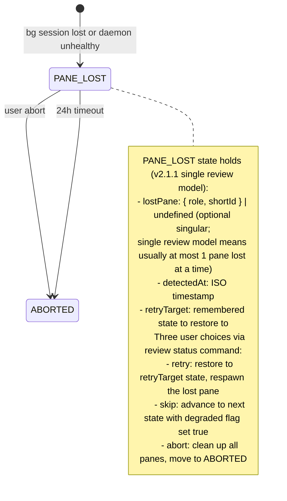

# cc-linker Multi-Model Review Engine v2.1.1 设计

**日期：** 2026-06-15
**基础版本：** v2.1（`docs/superpowers/specs/2026-06-14-multi-model-review-engine-v2.1-design.md`）
**版本：** v2.1.1（v2.1 patch：6 项重大变更）
**状态：** 待评审
**作者：** Claude Code（基于 v2.1 + 用户拍板）

## Preconditions（v2.1.1）

- **Claude CLI ≥ 2.1.163**（`claude --bg` 稳定；老版本无此能力）
- **cc-linker ≥ 0.6.3**（当前 master，`c5a8b8d`）
- **`~/.claude/providers/` 至少配置 2 个 provider**（work + 1 review），缺失会由 `cc-linker review doctor` 报错
- **cwd 推荐为 git 仓库**（commit preamble 要求；如果非 git repo，preamble 会输出 `checkpoint_sha: null` 跳过 commit）

## 修订记录

| 版本 | 日期 | 关键变更 |
|---|---|---|
| v1 | 2026-06-06 | 初版，13 个新模块全栈自建（`src/review/` 子目录） |
| v2 | 2026-06-13 | 复用 Agent View 已有能力；新建 7 个模块；CLI 主输出 + 简版 IDE |
| **v2.1** | **2026-06-14** | **本次 patch。19 项变更：**<br>1) **§3.1 复用层** —— 实测 `claude --bg` 是真 bg session 入口（v2 假定但未验证），adapter 重写为 `Bun.spawn(['claude', '--bg', ...])`<br>2) **§4.2 work session 长生命周期** —— 每轮 `--bg` 起新 shortId 但 sessionId 跨轮不变；`panes.work` 同时追踪两者<br>3) **§5.1 JUDGE_BY_WORK / FIXING** —— 走 `RendezvousClient.injectReply()`（daemon 协议），**不**起新 bg session；v2 错误地假定用 `startSession` + `--resume`<br>4) **§6.1 PaneRegistry** —— 新增 `currentRoundShortId` 字段（每轮变）+ `sessionId` 字段（跨轮不变）<br>5) **§10.1 新增错误** —— daemon crash 检测（`~/.claude/daemon/roster.json`）+ 网络瞬态 503 重试 + CLI 版本校验<br>6) **§5.2 max_rounds 减半** —— Spec=4 / Plan=5 / Code=8 / Global=6（v2 的 8/10/15/12 跑满 ≈ 2h，太长）<br>7) **§8 Phase 1 砍 IDE** —— cc-linker 没有 HTTP 框架；Phase 1 改 CLI `--watch` 模式（rich terminal），Phase 2 再补 IDE<br>8) **§6.4 Reconciler 改保守策略** —— pane bg session 丢失 → `PANE_LOST` 状态 + CLI 询问用户（retry/abort/skip），不再直接 FAILED<br>9) **§3.3 CLI 改 subcommand group** —— 跟 `daemon` / `hook` 一致：`cc-linker review run/status/abort/report/decide/cancel/doctor` 7 个子命令<br>10) **§10.1 HUMAN_DECIDE 超时** —— 24h → 1h 默认，可配<br>11) **§9 PhaseDetector 加启发式 4** —— rawInput 含 `.ts/.py/.go` 后缀或 `line N/L:N` 引用 → 强制 code<br>12) **新增 `cc-linker review doctor`** —— 启动前验证：profile 引用的 provider 是否在 `~/.claude/providers/` + CLI 版本 + daemon 健康<br>13) **新增 `/cancel review <id>`** —— 用户飞书/CLI 中止正在跑的 review，自动清理 pane bg session（`claude stop <short>`）<br>14) **§11/§12 明确 review 不改源文件** —— Phase 1 review 只输出 Markdown 报告到 `<cwd>/.claude/reviews/<pipelineId>.md`，**不**修改用户项目源码；修改留 Phase 2 IDE<br>15) **§6.2 5 目录** —— 修 v2 写的"6 目录"，review pipeline 用 5 目录（running/human_pending/done/failed/aborted），**不**用 pending/<br>16) **§8 "1+N pane"** —— v2 写的"1+N+1 pane"改为"1+N pane"（无 arbiter）<br>17) **§12.1 Phase 1 重排** —— W6 IDE 任务删除；新增 T8 CLI `--watch` 模式任务<br>18) **§5.x R1/R2 改 self-review-and-fix + 删 ARBITRATION** —— R1/R2 先 fix 自己发现的问题再决定下一步；JUDGE_BY_WORK verdict 简化为 accept/reject 两值，由 P0/P1 rejection ratio 决定；删 ARBITRATION + JUDGE_ARBITER 两个状态；reject 直接走 HUMAN_DECIDE（不再起 arbiter bg session）<br>19) **§5.x R1/R2 拆出 FIXING 节点 + verify-first** —— R1/R2 改为 identify-only（不复修）；新增统一 FIXING 状态（source 字段区分 R1/R2/JUDGE/HUMAN 4 个调用点）；FIXING prompt 严格要求 "先验证每个 issue 是 real 还是 hallucination，对 real 的才修"；修复完成后由 source 决定下一状态（R1→R2 / R2→EXTERNAL_REVIEW / JUDGE→R1 postfix / HUMAN→R1 postfix） |
| **v2.1 review 修正** | **2026-06-14** | **代码评审后 10 项修正：**<br>1) **§3.1 `injectReply`** —— 行号 151→实际 114；补充 `stateJsonPath` 参数说明（不传则走 legacy 长连接而非新 daemon 协议）<br>2) **§3.1/§7.5.6 `JobStateFile`** —— 磁盘 JSON 有 `output`/`sessionId` 字段但 TS 接口未声明；新增 §7.5.6 定义接口扩展方案<br>3) **§3.1 `resolvePeekContent`** —— 3 级降级→实际 4 级（linkScanPath → findJsonlForShort → roster parent → claude logs）<br>4) **§7.4 provider remediation** —— 路径错误 `~/.cc-linker/providers/` → `~/.claude/providers/`<br>5) **§7.5 新增 Output Contract** —— 定义 JSON 提取策略 + Zod schemas + parse 失败降级（状态机依赖结构化输出但之前完全没定义解析方式）<br>6) **§2.2 "不改源文件"** —— 与 FIXING prompt "修改文件" 矛盾；修正为"不自动 commit/PR，FIXING 在 cwd 内做最小化修改"<br>7) **§7 prompt** —— self_review 加 `{r1_or_r2_instruction}` 占位符区分 R1 vs R2 提示<br>8) **§5.1/§6.4 PANE_LOST** —— 单 pane 丢失（`lostPane`）→ 多 pane（`lostPanes: Array<{role, shortId}>`）<br>9) **§14 Context window** —— 新增 risk：work session 跨 8 轮 ~48 次注入 context 可能超 200k tokens + 缓解策略<br>10) **全文行号引用** —— 精确行号（`:151`/`:87`）→ 函数名引用，避免代码修改后失效 |
| **v2.1.1** | **2026-06-15** | **v2.1 patch。6 项变更：**<br>1) **§3.1/§6.1 单一 Review 模型** —— EXTERNAL_REVIEW 阶段只 spawn 1 个 review bg session（v2.1 是 N 个并行）。`review.providers` 数组改为 `review.provider` 标量。显著简化状态机、PaneRegistry、并发控制、JUDGE verdict 计算<br>2) **§7.2 commit 前置指令** —— FIXING prompt 模板前面追加 "先 `git add -A && git commit -m 'pre-fix checkpoint by review engine'`，记录 checkpoint SHA 作为修复 baseline"，让用户能一键 `git reset --hard <sha>` 回滚<br>3) **§7.5.4 JSON parse 失败不静默** —— parse 失败 → retry 1 次（追加"严格按 JSON schema 输出"提示让 bg 重生成）→ 仍失败 → 标记 `parse_degraded: true` + 终端告警 + **排除该 review**（不再视为 0 issues）。PipelineRecord 新增 `parseDegraded[]` 字段<br>4) **§5.3/§10.1 Context Window 策略** —— 新增 context 用量检查（在 EXTERNAL_REVIEW 完成后、JUDGE_BY_WORK 注入前触发）。Profile 新增 `[guards]` 三个字段：`context_overflow_threshold_1m` / `context_overflow_threshold_default` / `context_overflow_strategy`（`reset` / `review_fix` / `abort`，默认 `reset`）<br>5) **§3.2 adapter 新增 `getContextUsage(shortId)` API** —— 读 linkScanPath 指向的 jsonl 末条 + 解析 usage；解析 `providerEnv.ANTHROPIC_MODEL` 后缀（`[1m]` / `[256k]`）拿 context 上限；复用现有 `src/agent-view/jsonl-last-assistant.ts` 解析逻辑<br>6) **§10.1 review_fix 模式约束自然满足** —— v2.1.1 单一 Review 模型后，review_fix 模式下天然就是单 session 串行执行，不再有 v2.1 中"多 review 并发写文件"的协调问题 |
| **v2.1.1 评审反馈** | **2026-06-17** | **3 项反馈 + 1 项 I9 重设计：**<br>**反馈项**（patch 后追加）：<br>1) **§7.2 human_decide_timeout_ms 1h→4h（I10）** —— v2.1 改 1h 太激进，4h 覆盖午餐 + 半天工作场景<br>2) **§7.5.4 parse_retry_timeout 30s→15s + profile 可配（I11）** —— 默认 15s（90% retry 5-10s 完成），profile `parse_retry_timeout_ms` 可调高<br>3) **§7.5.6 / §3.2.1 等 7 个 P0 bug 修复** —— `output` 类型错（string→object）、`readLastAssistantUsage` 函数名错、executeReviewFix 引用未定义变量、model-parser 公式 num*num 冗余、signal 不可达底层、profile 缺参数、getContextUsage 注释与代码不一致等<br>4) **7 项 P1 一致性** —— 12+ 处 v2.1 review-A/B 残留、panes.review 生命周期、findDeadPanes 实现、JobStateFile 拍板等<br>**I9 重设计**（重大）：**`context_overflow_strategy` 删 `review_fix`，重设 `reset` 策略**为"杀 work + spawn 新 work + 注入 review issues + history + related docs → worker verify+fix → DONE"。理由：work session 最懂自己的代码；review 模型对代码上下文理解不如 work；新 worker 有 fresh context + 完整 issue 记忆。FIXING.source 枚举从 5 值回退到 4 值（v2.1 原设计），状态机简化 ~150 行 |
| **v2.1.1 文档去重** | **2026-06-17** | **合并 patch.md → design.md 后，清理重复 / 矛盾 / 遗漏：**<br>1) **附录 C 重写** —— 从"整段 patch 复制"改为"动机+决策+章节索引"格式，**删去所有与主文 §3-§16 重复的实现细节**（TOML 模板、状态机代码、字段定义、Markdown 报告段、排期表、影响清单）。让读者 5 分钟看清全貌，**实现细节请跳到主文对应章节**<br>2) **附录 D 修正** —— 评审反馈汇总表"修复"列改为指向主文章节索引（不再含具体修复内容），让表格更紧凑且与主文单一真相源对齐<br>3) **§5.3.1 Mermaid 加 note** —— `note right of EXTERNAL_REVIEW` 说明 I9 reset 路径（杀 work + 注入 issues + worker verify+fix）<br>4) **§5.3.2 ASCII 备查版补** —— 增 I9 reset 路径（EXTERNAL_REVIEW 3 路分发 → 新 worker → SELF_REVIEW_R1(postfix)），修 1h→4h<br>5) **§5.3.5 走查示例加 §5.3.5.1** —— "context overflow 触发 I9 reset" 完整时序示例<br>6) **§16 影响清单 + 文件清单更新** —— 增 I9 / I10 / I11 行；strategy enum 二选一；新增 `build-context-reset-prompt.ts` 模块<br>7) **§1 问题陈述历史叙事补全** —— 加 v2.1 / v2.1.1 / I9 / I10 / I11 关键节点说明<br>8) **§3.2 新建层 8→9 模块** —— 增 `output-contract.ts` (v2.1.1 变更 3) + `context-overflow.ts` (v2.1.1 变更 4) + `build-context-reset-prompt.ts` (v2.1.1 I9)<br>**净影响**：spec 减重 -173 行（删除重复实现 + I9 重设计后过期内容）|

> v2 的"§2 复用层（0 行新代码）"v2.1 **保留并加强**——实测 `claude --bg` + `--settings` + `--reply-on-resume` + `state.json` + `readJobState` + `RendezvousClient.injectReply` + `claude stop` + `claude logs` 全部现成可用。

---

## 1. 问题陈述

使用 AI Coding（Claude Code 等）后，开发流程从"写代码 → 人审"变成了多轮自审 + 多模型交叉 Review 的工作流：

```
写 Spec → AI 自查 → 模型 A 交叉 Review → 模型 B 交叉 Review → 修改 → 再 Review
写 Plan → AI 自查 → 模型 A 交叉 Review → 模型 B 交叉 Review → 修改 → 再 Review
写代码 → AI 自查 → 模型 A 交叉 Review → 模型 B 交叉 Review → 修复 → 再 Review
```

由于 Claude Code 限制，不方便在终端直接切换不同模型（kimi-2.6、qwen3.6-plus、mimo-2.5-pro 等），每次评审都需手动换 settings、重新启动进程。同时，多个模型的交叉 Review 意见如何汇总、是否采纳、是否需要仲裁，缺少一个集中的"裁决 + 流程编排"机制。

v1 spec（2026-06-06）已经设计了一个完整的 Review Engine 解决方案（13 个新模块全栈自建）。
v2 spec（2026-06-13）重新设计的目标是：**深度复用 Agent View 已有基础设施**，将新建模块从 13 个缩到 7 个。
v2.1（2026-06-14）做了 19 项修正（关键变化是实测 `claude --bg` 行为并据此重写 adapter）+ 10 项代码评审修正。
v2.1.1（2026-06-15）做了 6 项重大变更：单一 Review 模型 / commit preamble / parse retry / context overflow 策略（后 I9 重设计为 reset+inject-issues）/ getContextUsage API / review_fix 模式约束（I9 后已删）。
v2.1.1 I9（2026-06-17）删 `context_overflow_strategy = "review_fix"`，重设 `reset` 策略为"杀 work + 注入 review issues + worker verify+fix"。
v2.1.1 I10/I11：human_decide_timeout 1h→4h；parse_retry_timeout 30s→15s + profile 可配。
v2 的"0 行新代码复用"承诺在 v2.1 已兑现（adapter 直接 spawn + RendezvousClient.injectReply）。

## 2. 目标与非目标

### 2.1 目标（本版必须支持）

| # | 目标 | 优先级 |
|---|------|--------|
| G1 | 多模型交叉 Review 编排：驱动"工作模型 → 外部 Review 模型 → 裁决 → 修复"的完整流水线 | P0 |
| G2 | 层次化裁决机制：工作模型自评 → 外部 Review → 工作模型评判意见 → 仲裁 → 人工兜底 | P0 |
| G3 | 三阶段支持：Spec / Plan / Code，每个阶段可配置不同的提示词、护栏、Review 模型组合 | P0 |
| G4 | 电脑端便利：CLI 主输出 + `--watch` 模式（rich terminal）实时看 **1+1 pane** 状态（work + 1 review） | P0（Phase 1） |
| G5 | 可恢复状态机：每次 Review 是一个有状态的、跨进程崩溃可恢复的工作流 | P0 |
| G6 | **深度复用 Agent View**：实测 `claude --bg` + `--settings` + `--reply-on-resume` + `state.json` + `readJobState` + `RendezvousClient.injectReply` + `claude stop` 全部 0 行重复代码 | P0 |
| G7 | **1+1** 个 bg session 自动出现在 `~/.claude/jobs/`，飞书 `/agents` 列表**免费**看到（Phase 2 飞书集成） | P1 |
| G8 | **`cc-linker review doctor`** 启动前健康检查（profile 引用 + CLI 版本 + daemon 健康） | P0 |
| G9 | **Context window 超限自动处理**（v2.1.1）：检测 work session 上下文用量，两种可配策略（`reset` 重建 work session + 注入 review issues 让 worker verify+fix / `abort` 终止），避免恶性假收敛 | P0 |

### 2.2 非目标

- 不替代现有 `/new` `/list` `/switch` `/model` 等飞书命令
- 不修改 `ProviderManager` 已有逻辑
- 不修改 `ClaudeSessionManager` 签名（仅复用其接口）
- 不修改 `AgentViewManager` 任何代码（v2.1 设计 0 侵入 Agent View）
- 不做云端协同 / 团队共享（仍是单机单用户）
- **不做 Phase 1 IDE**（v2.1 砍掉，Phase 1 改 `--watch` rich terminal；Phase 2 单独排期）
- 不修改 `~/.claude/providers/*.json` 任何内容（只读取）
- **review 产出不自动 commit / 不创建 PR**（FIXING 节点会在用户 cwd 内修改文件（verify-first 最小化修改），所有修改可通过 `git diff` 查看、`git checkout` 回滚；自动 apply/commit/PR 留 Phase 2）
- **不**做 cloud-hosted multi-agent review（Anthropic 已有 `claude ultrareview` 但那是云端）

## 3. 架构总览

### 3.1 复用层（实测 0 行新代码）

**v2.1 关键修正**：v2 写"adapter.startSession 内部调 `ClaudeSessionManager.sendMessage`"——**实测错**。`sendMessage` 是 `claude -p`（前台一次性），不会产生 bg session。v2.1 重写为直接 `Bun.spawn(['claude', '--bg', ...])`。

| 能力 | 复用什么 | v2.1 验证状态 |
|------|---------|--------------|
| Spawn bg session（work / 单 review，v2.1.1 单一 review 模型） | `Bun.spawn(['claude', '--bg', prompt, '--settings', settingsPath])` → 返回 `shortId` 落到 `~/.claude/jobs/<short>/state.json` | ✅ 实测 OK（见附录 A） |
| Provider 切换 | `--settings ~/.claude/providers/<name>.json` | ✅ 实测 OK（state.json `respawnFlags` 记录 settings 路径，`providerEnv` 切换） |
| Resume work session 跨 R1/R2/JUDGE/FIX | `--bg <newPrompt> --resume <sessionId> --reply-on-resume` | ✅ 实测 OK（每次新 shortId，sessionId 跨轮不变） |
| 注入 judge/fix prompt 到 work session | `RendezvousClient.injectReply({ short, text, rendezvousSock, timeoutMs, stateJsonPath })`（`src/agent-view/rendezvous-client.ts` `injectReply`）走 daemon socket + **state.json 轮询**（v2.4.x 新协议），**不**用 `--resume`（实测 `--resume` 在 running bg 上会报错）。**必须传 `stateJsonPath`** 才走新协议；不传则 fallback 到 legacy 长连接（仅测试用） | ✅ 0 行逻辑新代码 |
| 读 pane 状态 | `readJobState(shortId)`（`src/agent-view/job-state.ts` `readJobState`）读 `~/.claude/jobs/<short>/state.json`。**前置**：需扩展 `JobStateFile` 接口加 `output` 字段（磁盘 JSON 已有，TS 类型未声明） | ✅ 0 行**逻辑**新代码（仅加类型声明，需 Agent View PR 或本地 ExtendedJobStateFile，详见 §7.5.6） |
| 偷看 pane 输出 | `resolvePeekContent(shortId, maxChars)`（`src/agent-view/manager.ts` `resolvePeekContent`）**4 级降级**：state.json.linkScanPath → findJsonlForShort（JsonlIndex 全盘扫描）→ roster parent JSONL → `claude logs <short>` | ✅ 0 行新代码 |
| Stop 任意 pane | `Bun.spawn(['claude', 'stop', short])` | ✅ 实测 OK（state.json state→'stopped'） |
| Session 状态权威 | `~/.claude/jobs/<short>/state.json`（CLI 维护，含 `state` `tempo` `detail` `needs` `output` `sessionId` `resumeSessionId`） | ✅ 0 行新代码 |
| Provider 配置文件 schema | `~/.claude/providers/<name>.json`（已存在：kimi / qwen / mimo 等 8 个） | ✅ 0 行新代码 |
| 飞书 `/agents` 列表 Phase 2 集成 | `claude agents --json` 已列出 `kind: "background"` 的 pane，零代码 | ✅ Phase 2 准备 |

**v2.1 关键洞察**：v2 假设的"复用 `runChatSDK` / `ExpectedReplyState`"经实测均**不可复用**：
- `runChatSDK`（`src/feishu/bot.ts:2075-2468`）Feishu 强耦合（CardUpdater + SpoolQueue + permission handler + activePermissionHandlers map）
- `ExpectedReplyState` 语义错配（"用户主动 reply" vs "engine 注入 judge prompt"），需要新建 `PipelineReplyState`（在 PipelineRecord 里加字段，~20 行）

### 3.2 新建层（9 个模块，含 v2.1.1 I9 新增 `build-context-reset-prompt.ts`）

```
src/review/
├── engine.ts            # 状态机驱动（**v2.1.1 I9 P0-A3 修复后 9 active states**：PRODUCING / R1 / R2 / FIXING / EXTERNAL_REVIEW / JUDGE_BY_WORK / HUMAN_DECIDE / PANE_LOST + 3 terminals = 9 + 3；CONTEXT_CHECK v2.1.1 变更 4 引入但 P0-A3 后删除（改为 onExternalReviewComplete 内 3 路直接分发））
├── pipeline-store.ts    # 持久化：5 目录（running / human_pending / done / failed / aborted）
├── pipeline-state.ts    # engine 层面的 in-memory active pipeline Map（key: pipelineId, value: { record, abortController, watchClientSet }）
├── profile.ts           # ReviewProfile TOML 加载 + per-phase 深度 merge + provider 校验
├── phase-detect.ts      # 启发式：file path → git ref → 关键词 → 文件后缀/行号（启发式 4）→ PhaseUnknownError
├── adapter.ts           # v2.1 重写 + v2.1.1 变更 5 加 1 个 API：ClaudeBGAdapter 暴露 6 个 API：
                                  #   - startSession({role, provider, prompt, cwd, resumeSessionId?}) → {shortId, sessionId}
                                  #   - resumeWorkSession({sessionId, prompt, provider, cwd}) → newShortId (sessionId 不变)
                                  #   - injectReply({shortId, text, timeoutMs}) → RendezvousReplyResult
                                  #     内部构造 stateJsonPath = join(CLAUDE_JOBS_DIR, shortId, 'state.json')
                                  #     调 RendezvousClient.injectReply({short, text, rendezvousSock, stateJsonPath})
                                  #     走 v2.4.x 新协议：daemon socket submit + state.json 轮询（非 legacy 长连接）
                                  #   **v2.1.1 限制**：底层 RendezvousClient.injectReply 暂无 signal 支持（v2.4.x 协议自己轮询），
                                  #     cancel 不会中途打断 injectReply，会跑满 timeoutMs（默认 60s）。
                                  #     短期方案：cancel 走 Promise.race（injectReply + sleep）实现伪中断。
                                  #     长期方案：给 RendezvousClient.injectReply 加 signal 参数（需 PR 到 agent-view）。
                                  #   - poll(shortId, timeoutMs, signal?) → JobStateEnvelope (走 readJobState, 500ms tick)
                                  #   - stop(shortId) → void (走 claude stop)
                                  #   - getContextUsage(shortId) → ContextUsage | null  # v2.1.1 变更 5 新增
                                  #     读 linkScanPath 指向的 jsonl 末条 + 解析 usage（用 readLastAssistantTurn 替换 v2 文档中错误的 readLastAssistantUsage）；
                                  #     解析 providerEnv.ANTHROPIC_MODEL 后缀（实测是结构化对象 { result: string }，不是 string）
                                  #     拿 context 上限；复用现有 src/agent-view/jsonl-last-assistant.ts 解析逻辑
                                  #   所有 API 接受 AbortSignal 用于 cancel 时的打断（除 injectReply 受 v2.1.1 限制）
├── model-parser.ts      # v2.1.1 变更 5 新增：parseModelFromProviderEnv + lookupContextLimit + KNOWN_CONTEXT_LIMITS 已知模型表
                                  #   解析 "claude-sonnet-4-5[1m]" / "kimi-for-coding[256k]" 等后缀拿 context hint
├── context-overflow.ts  # v2.1.1 变更 4 新增：checkContextOverflow + 共享类型 ContextCheckResult + readReviewOutput 辅助函数
├── build-context-reset-prompt.ts  # v2.1.1 I9 新增：新 worker prompt 模板（含 history + injectedIssues + relatedDocs + checkpoint SHA）
├── output-contract.ts   # v2.1.1 变更 3 新增：parseBgOutputWithRetry 函数（带 retry 1 次 + I11 timeoutMs 字段）
├── cli-watch.ts         # v2.1 替换 v2 的 ide-server.ts：CLI `--watch` 模式，rich terminal UI（chalk + ANSI 进度条 + 状态条）
├── review-doctor.ts     # v2.1 新增：`cc-linker review doctor` 命令，profile / provider / CLI 版本 / daemon 健康检查
└── reconciler.ts        # 启动扫描 running/ + human_pending/ 恢复 in-memory active set + pane 丢失检测（→ PANE_LOST）
```

**v2.1 新增的两个模块说明**：
- `pipeline-state.ts`：内存中追踪 active pipeline 列表 + 每条 pipeline 的 `AbortController`（用于 `review abort` / `review cancel` 时打断 polling 循环）+ 当前 `review status --follow` 客户端列表（用于 SIGINT/SIGTERM 时通知 UI）。**不**持久化（重启后由 Reconciler 从 PipelineStore 重建）。
- `review-doctor.ts`：作为 `cc-linker review run` 启动前的健康门禁，输出诊断报告（见 §10.6）。也可独立运行 `cc-linker review doctor`。

**v2.1.1 新增的 3 个模块说明**（含 I9）：
- `context-overflow.ts`（变更 4）：`checkContextOverflow` 阈值判断 + 二策略调度入口（reset / abort）
- `build-context-reset-prompt.ts`（I9）：`buildContextResetPrompt` 新 worker prompt 模板 + `collectAllExternalReviewIssues` / `collectRelatedDocs` 辅助函数
- `output-contract.ts`（变更 3）：`parseBgOutputWithRetry` JSON 解析（带 retry 1 次 + 5 种降级策略 + I11 timeoutMs 字段）

**CLI 子命令注册**：`src/cli/commands/review.ts` 作为 subcommand group 入口（与 `daemon` / `hook` 一致），分发到上面 12 个模块（v2.1 + v2.1.1 + I9 共新增 4 个）；不像 Agent View 那样有 `manager.ts` 中央调度（review engine 的协调在 `engine.ts` 内部）。

### 3.2.1 `adapter.getContextUsage` API（v2.1.1 变更 5）

```typescript
// src/review/adapter.ts (v2.1.1 新增)

export interface ContextUsage {
  used: number;           // 当前 context tokens
  max: number;            // 模型 context 上限
  model: string;          // 模型名（如 "claude-sonnet-4-5"）
  percentUsed: number;    // 0.0 ~ 1.0
  source: 'jsonl' | 'estimate' | 'unavailable';
  breakdown?: {
    inputTokens: number;
    cacheCreationTokens: number;
    cacheReadTokens: number;
  };
}

class ClaudeBGAdapter {
  // ... v2.1 已有的 5 个 API（startSession / resumeWorkSession / injectReply / poll / stop）...

  /**
   * v2.1.1 新增：读 work session 的当前 context 用量。
   *
   * 行为：
   *   1. readJobState 拿 state.json
   *   2. 解析 providerEnv.ANTHROPIC_MODEL 拿模型名 + context 上限（从后缀 [1m]/[256k]）
   *   3. 读 linkScanPath 指向的 jsonl 末条
   *   4. 调 jsonl-last-assistant.ts 的 readLastAssistantTurn 拿 usage（turn.usage）
   *   5. 返回 ContextUsage
   *
   * 返回值（v2.1.1）：
   *   - session 不存在 → null（调用方按 unavailable 处理）
   *   - state.json 缺 modelInfo → { source: 'unavailable', ... }（model 字段为 'unknown'）
   *   - 读 jsonl 成功 → { source: 'jsonl', ... }
   *   - 缺 linkScanPath 或 jsonl 读失败 → null（调用方按 unavailable 处理）
   *
   * 注意：v2.1.1 当前**没有** estimate 分支（按累计 chars 估算）；如果想做，参见
   * §13.4 v2.1.1 评审项"context overflow 策略"的扩展空间。
   */
  async getContextUsage(shortId: string): Promise<ContextUsage | null> {
    const state = await readJobState(shortId);
    if (!state) return null;

    const modelInfo = parseModelFromProviderEnv(state.state.providerEnv);
    if (!modelInfo) {
      return { used: 0, max: 200_000, model: 'unknown', percentUsed: 0, source: 'unavailable' };
    }

    const maxContext = lookupContextLimit(modelInfo.name) ?? 200_000;

    // 尝试读 jsonl 末条
    const linkScanPath = state.state.linkScanPath;
    if (linkScanPath && existsSync(linkScanPath)) {
      const turn = await readLastAssistantTurn(linkScanPath);  // 复用已有，返回 LastAssistantTurn | null
      const usage = turn?.usage;
      if (usage) {
        const used = (usage.input_tokens ?? 0)
                   + (usage.cache_creation_input_tokens ?? 0)
                   + (usage.cache_read_input_tokens ?? 0);
        return {
          used,
          max: maxContext,
          model: modelInfo.name,
          percentUsed: used / maxContext,
          source: 'jsonl',
          breakdown: {
            inputTokens: usage.input_tokens ?? 0,
            cacheCreationTokens: usage.cache_creation_input_tokens ?? 0,
            cacheReadTokens: usage.cache_read_input_tokens ?? 0,
          },
        };
      }
    }

    return null;  // 调用方按 unavailable 处理
  }
}
```

### 3.2.2 模型解析（v2.1.1 变更 5）

```typescript
// src/review/model-parser.ts (v2.1.1 新增)

interface ModelInfo {
  name: string;          // 纯模型名，如 "claude-sonnet-4-5"
  contextHint: number | null;  // 从后缀解析的 context hint，如 1_000_000（如果有）
}

/**
 * 解析 ANTHROPIC_MODEL="MiniMax-M3[1m]" 格式：
 *   "MiniMax-M3" → { name: "MiniMax-M3", contextHint: null }
 *   "MiniMax-M3[1m]" → { name: "MiniMax-M3", contextHint: 1_000_000 }
 *   "kimi-for-coding[256k]" → { name: "kimi-for-coding", contextHint: 256_000 }
 */
function parseModelFromProviderEnv(env: Record<string, string> | undefined): ModelInfo | null {
  if (!env) return null;
  const raw = env.ANTHROPIC_MODEL;
  if (!raw) return null;

  const match = raw.match(/^(.+?)(?:\[(\d+)([km]?)\])?$/);
  if (!match) return null;

  const name = match[1];
  const num = match[2] ? parseInt(match[2], 10) : null;
  const unit = match[3] ?? '';
  // 单位换算：m → ×1_000_000；k → ×1_000；无单位 → ×1（按原样）
  const contextHint = num ? (unit === 'm' ? num * 1_000_000
                                   : unit === 'k' ? num * 1_000
                                   : num) : null;

  return { name, contextHint };
}

// 内置已知模型表
const KNOWN_CONTEXT_LIMITS: Record<string, number> = {
  'MiniMax-M3': 1_000_000,
  'MiniMax-M3.5': 1_000_000,
  'claude-sonnet-4': 200_000,
  'claude-sonnet-4-5': 1_000_000,
  'claude-opus-4': 200_000,
  'claude-haiku-4': 200_000,
  'kimi-for-coding': 256_000,
  'bailian-qwen3.6': 128_000,
  'xiaomi-mimo': 128_000,
};

function lookupContextLimit(modelName: string, profileOverrides?: Record<string, number>): number {
  if (profileOverrides?.[modelName]) return profileOverrides[modelName];
  if (KNOWN_CONTEXT_LIMITS[modelName]) return KNOWN_CONTEXT_LIMITS[modelName];
  return 200_000;  // 兜底
}
```

**复用现有代码**：

| 复用 | 位置 | 用法 |
|------|------|------|
| `readJobState` | `src/agent-view/job-state.ts` | 读 state.json |
| `readLastAssistantTurn` | `src/agent-view/jsonl-last-assistant.ts` (`readLastAssistantTurn`) | 解析 jsonl 末条 assistant turn（已存在，turn.usage 含 token 统计） |
| `CLAUDE_JOBS_DIR` | `src/utils/paths.ts` | 默认 jobs dir |

### 3.3 CLI 入口（v2.1 改 subcommand group）

```bash
# v2.1 标准用法（mirrors daemon / hook 子命令风格）
cc-linker review run <task>     [--phase spec|plan|code] [--profile default] [--max-rounds N] [--watch] [--cwd <path>]
cc-linker review status <id>    [--follow]
cc-linker review abort <id>     # 清理所有 pane bg session
cc-linker review report <id>    [--format md|json] [--out <file>]
cc-linker review decide <id>    --accept-all | --accept "1,3" | --reject-all   # HUMAN_DECIDE 接收
cc-linker review cancel <id>    # 用户主动中止（区别于 abort 的 max_rounds 触发）
cc-linker review doctor         # 启动前健康检查：profile 引用 / provider 存在 / CLI 版本 / daemon 健康
cc-linker review profiles       # 列出 ~/.cc-linker/review-profiles/*.toml（每条 profile 显示 work + review providers 名 + max_rounds 默认）
```

**v2.1 修正点**：
- v2 写的 flat command（`cc-linker review <target>`）改成 subcommand group，与 `daemon` / `hook` 一致（`src/index.ts:181-184`）
- 新增 `review cancel`（用户主动中止，区别于 `abort` 是 max_rounds 触发的被动中止）
- 新增 `review doctor`（启动前健康检查，避免运行时才发现 provider 缺失）
- `run` 子命令加 `--watch`（默认开启）和 `--cwd`（指定 work dir）
- `status` 子命令加 `--follow`（持续输出，类似 `tail -f`）

### 3.4 启动方式

| 命令 | 行为 |
|------|------|
| `cc-linker review run <task>` | 一次性跑 pipeline（最常用，Phase 1 主力入口） |
| `cc-linker review status <id> --follow` | 接 SSE 等价物（v2.1 简化为：每 500ms 复读 `~/.cc-linker/review-pipelines/running/<id>.json`） |
| `cc-linker review-server` | 长驻 Review Engine + 多 pipeline 管理（Phase 2 引入，Phase 1 不做） |
| `cc-linker start` | **不**启动 Review Engine（避免给所有用户加重负担），Review Engine 按需启动 |

**v2.1 关键修正**：v2 提的"Bun.serve 9821 + 单 HTML 页 IDE"砍掉。Phase 1 改 CLI `--watch` 模式：
- 复用 cc-linker 现有的 `chalk` + ANSI 输出（参考 `src/cli/commands/daemon.ts`）
- 状态条用 ASCII 进度条（不依赖 TUI 框架）
- 时间线用滚动列表
- Phase 2 单独排期 IDE

### 3.5 与现有模块的边界

| 现有模块 | v2.1 复用方式 | 新增代码 |
|---------|-------------|---------|
| `claude --bg` | adapter 直接 spawn | 0 |
| `claude --settings <path>` | adapter 直接传 | 0 |
| `claude --resume <uuid> --reply-on-resume` | adapter 工作 pane R1/R2 续接用 | 0 |
| `claude stop <short>` | adapter 清理 pane 用 | 0 |
| `claude logs <short>` | adapter 偷看 pane 输出用 | 0 |
| `RendezvousClient.injectReply()`（`src/agent-view/rendezvous-client.ts` `injectReply`） | adapter JUDGE/FIXING 阶段注入用（必须传 `stateJsonPath` 走新协议） | 0（包一层 callback） |
| `readJobState(shortId)`（`src/agent-view/job-state.ts` `readJobState`） | engine + adapter + cli-watch 都调（需扩展 `JobStateFile` 加 `output` 字段） | 0（加类型声明） |
| `AgentSnapshotFetcher.fetch()` | cli-watch 拉 pane 列表时调（Phase 2 飞书集成时复用更多） | 0 |
| `manager.resolvePeekContent` | cli-watch 拉 pane 详情时调 | 0 |
| SpoolQueue 设计思想（writeAtomic + 7 目录） | PipelineStore 完全照搬 | 80%（持久化范式） |
| `Config` | 扩展 `[review]` 段：max_concurrent_pipelines、max_rounds 默认、HUMAN_DECIDE_TIMEOUT、CLI watch 刷新间隔 | 5% |
| `logger` | ReviewEngine 自己的日志 `~/.cc-linker/review-engine.log` | 0 |

## 4. 数据流

### 4.1 一次完整 pipeline 的事件序列（v2.1 修正）

```
时间轴  组件                       动作
─────  ─────────────────         ────────────────────────────────────────────────
T0    用户                        cc-linker review run "帮我修 NPE in auth.ts"
T1    CLI (review doctor)         验证：profile.default 引用 provider + CLI ≥ 2.1.163 + daemon 健康
T2    Engine                      调 phase-detect.detect(...) → 'code'
T3    Engine                      调 profile.load('default') → merged profile（含 provider 路径校验）
T4    Engine                      调 adapter.startSession({ role:'work', provider:'claude-sonnet-4', prompt:'NPE in auth.ts', isNew:true })
T5    Adapter                     Bun.spawn(['claude','--bg','NPE in auth.ts','--settings',sonnetPath])
T6    CLI (Claude)                spawn bg session, 写 ~/.claude/jobs/<short1>/state.json, 返回 shortId
T7    Adapter                     解析 stdout "backgrounded · short1" + 轮询 readJobState 拿 sessionId
T8    Engine                      写 PipelineRecord 到 running/<pipelineId>.json
                                  panes.work = { sessionId: '<uuid>', currentRoundShortId: 'short1', startedAt: ... }
T9    CLI (watch mode)            ANSI 进度条更新：state=PRODUCING, panes=[work:busy]
T10   CLI (Claude work bg)        ...处理中...
T11   CLI (Claude work bg)        state.json.state: 'running' → 'done'（CLI 维护）
T12   Adapter.poll(short1)        detect state.json.state == 'done' → emit 'work_produced'
T13   Engine                      transition: PRODUCING → SELF_REVIEW_R1 (**round=1**，R1 entry +1)
T14   Engine                      调 adapter.resumeWorkSession({ sessionId, prompt:'review 你的产出（identify only，不修复）...', provider:'claude-sonnet-4' })
T15   Adapter                     Bun.spawn(['claude','--bg','review...','--resume',sessionId,'--reply-on-resume','--settings',sonnetPath])
T16   CLI (Claude work bg)        state.json 中 respawnFlags 加 --reply-on-resume；supervisor 唤醒 session，新 shortId2
T17   Engine                      panes.work.currentRoundShortId = 'short2'（sessionId 不变）
T18   CLI (watch mode)            ANSI 更新：state=SELF_REVIEW_R1, panes=[work:busy, review:idle]（v2.1.1：单 review）
T19   ...                         R1 收敛 → R1 发现 3 issues
T20   Engine                      transition: SELF_REVIEW_R1 → FIXING (source=R1)，inputIssues = R1 issues
T21   Engine                      调 adapter.injectReply({ shortId:'short2', prompt:'verify each issue, fix real ones...' })
T22   Adapter                     RendezvousClient.injectReply() → daemon → short2 bg session
T23   CLI (Claude work bg)        处理中；state.json.state: 'running'
T24   Adapter.poll(short2)        FIXING 完成，verify+fix 结果输出 → emit 'fix_complete'
T25   Engine                      FIXING(source=R1) → SELF_REVIEW_R2（round 不变）
T26   Engine                      调 adapter.resumeWorkSession({ sessionId, prompt:'review after fix...' })
T27   Adapter                     Bun.spawn(['claude','--bg','review again...','--resume',sessionId,'--reply-on-resume'])
T28   ...                         R2 发现 1 new issue
T29   Engine                      transition: SELF_REVIEW_R2 → FIXING (source=R2)
T30   ...                         FIXING(source=R2) → EXTERNAL_REVIEW（round 不变）
T31   Engine                      adapter.startSession({ role:'review', provider:'kimi-for-coding', prompt:'review X...', isNew:true })
                                  // v2.1.1 变更 1：单一 review 模型，只 spawn 1 个
T32   Adapter                     spawn 1 个 bg session，shortId5
T33   Engine                      panes.review = {role:'review', shortId:'short5', sessionId:'uuid-r', round:1, cycle:'initial'}
                                  // v2.1.1：单数 `review`，非 `reviews[]`
T34   CLI (watch mode)            state=EXTERNAL_REVIEW, panes=[work:done, review:busy]
T35   CLI                         ...单 review session 跑 review...
T36   Adapter.poll(short5)        done → emit 'external_opinions_ready'
T37   Engine                      transition: EXTERNAL_REVIEW → JUDGE_BY_WORK（round 不变，仍=1）
T38   Engine                      调 adapter.injectReply({ shortId:'short2', prompt:'judge opinions A,B...' })
T39   Adapter                     RendezvousClient.injectReply() → TCP socket → daemon → 注入到 short2 bg session
T40   CLI (Claude work bg)        处理中；state.json.state: 'running'
T41   Adapter.poll(short2)        state.json.state == 'done' + output 含 per-issue accept/reject → engine 通过 Output Contract（§7.5）解析 → 计算 verdict（P0/P1 rejection ratio） → emit 'work_verdict: accept'
T42   Engine                      verdict='accept' → transition: JUDGE_BY_WORK → FIXING (source=JUDGE)（round 不变）
                                                  verdict='reject' → transition: JUDGE_BY_WORK → HUMAN_DECIDE（移到 human_pending/）
T43   Engine                      调 adapter.injectReply({ shortId:'short2', prompt:'verify each accepted issue, fix real ones...' })
T44   Adapter.poll(short2)        done → emit 'fix_complete'
T45   Engine                      transition: FIXING(source=JUDGE) → SELF_REVIEW_R1 (cycle: 'postfix')，**round=2**，check max_rounds
T46   ...                         循环直到 R1/R2 收敛 → DONE
T47   Engine                      写 PipelineRecord 到 done/，CLI 输出 state=DONE + Markdown 报告路径
```

### 4.2 bg session 之间"传递内容"（v2.1 修正）

**v2.1 关键修正**：v2 假定 work session 是"长生命周期 bg session 通过 --resume 跨多轮续接"。实测 `--resume` 在 running bg session 上**直接报错**（"is currently running as a background agent"）。正确路径：

| 角色 | 生命周期 | 启动方式 | 跨轮续接方式 |
|------|---------|---------|------------|
| `work` | 长生命周期（sessionId 跨轮不变） | 第一次 `claude --bg <prompt>` → 新 shortId1 + sessionId；后续每轮 `claude --bg <newPrompt> --resume <sessionId> --reply-on-resume` → 新 shortId2/3/4... | 每次新 shortId，但同一 sessionId |
| `review` | 轮次性（每轮新 session） | 永远 `claude --bg <prompt>`（不传 --resume）—— v2.1.1 变更 1：单一 review 模型（无 review-A/B/...） | 不续接，每轮新 |

**v2.1 简化**：v2 的 `arbiter` 角色删除（删 ARBITRATION + JUDGE_ARBITER 状态后不再需要）。pane 总数从 1+N+1 缩到 1+N（work + N reviews）。

**work pane 的"长生命周期"实现**（v2.1）：
- `panes.work.sessionId`：跨 R1/R2/JUDGE/FIX/postfix 全部不变（来自第一次 spawn 的 `state.json.sessionId`）
- `panes.work.currentRoundShortId`：每轮变（每次 `--bg` 都产生新 shortId）
- `panes.work.roundShortIds`：数组，记录每轮的 shortId（诊断用）

**R1/R2 self-review-and-fix 行为**（v2.1 变更 19 已替代）：
- **v2.1 变更 19 后 R1/R2 是 identify-only**（不复修），修复在后续 FIXING 节点
- R1 prompt: 列出 issues，**不修改文件**
- R2 prompt: 同 R1，审查 FIXING 后的状态
- 输出 JSON：`{ issues: [...], unfixed_count: N }`
- Engine 根据 `unfixed_count` 决定流转：=0 → DONE；>0 → FIXING(source=R1/R2) → 下一阶段
- 详见 §5.1 / §7 `prompts.work.self_review`

**JUDGE_BY_WORK / FIXING 注入实现**（v2.1 关键修正）：
- **不**调用 `adapter.startSession` + `--resume`（实测会报错）
- **改用** `adapter.injectReply({ shortId: currentRoundShortId, text, rendezvousSock })`
- 内部走 `RendezvousClient.injectReply()`（已存在）→ TCP socket → daemon → 注入到 bg session 的 stdin / rendezvous 通道
- 注入完成后 bg session 处理新 prompt，处理完成后 state.json state→'done'，Adapter.poll 即可探测

### 4.3 判定"work 产出完成" / "review 收齐"

不自己 parse 进程 stdout，**只**看 `~/.claude/jobs/<short>/state.json.state`：

| state 值 | 含义 |
|---------|------|
| `running` / `working` + tempo=`active` | 还在跑 |
| `running` / `working` + tempo=`blocked` + `needs` 非空 | 等用户输入（v2.1：注入 reply 后会从 blocked 转到 active） |
| `blocked` | 等用户输入（同步 polling state.json） |
| `done` | 已完成（看 `output` 字段拿最终输出文本；engine 通过 Output Contract §7.5 提取结构化 JSON） |
| `stopped` | 被 stop 或用户中止 |
| `failed` | Claude 进程异常（v2.1 新增区分；v2 把它当 unknown） |
| 其他（forward-compat） | 视为 unknown，记录 warning |

**实现位置**：`adapter.poll(shortId, timeoutMs)` 包装 `readJobState` 轮询（500ms 一次），超时抛 `PollTimeoutError`。

**v2.1 修正**：v2 写"state.json 写盘 100-200ms"——**实测错**。Claude CLI 只在状态转换时写 state.json，不连续 poll。500ms 轮询是合理平衡，但用户 IDE/CLI 看到的状态变化会有 0-500ms 抖动。

### 4.4 并发控制

| 并发维度 | 谁决定 | 怎么控 |
|---------|--------|--------|
| Pipeline 之间 | PipelineStore 的 `running/` 目录 | 默认 1 个同时跑（profile 可配 `guards.max_concurrent_pipelines`） |
| Pipeline 内的 pane | 状态机驱动 | R1/R2 串行（同 work session resume）；**EXTERNAL_REVIEW 单一 review session 串行**（v2.1.1 变更 1：删 N 个 review 并行）；FIXING 串行在 EXTERNAL/JUDGE 之后 |
| bg session 并发 | Claude CLI daemon | 实测 3+ 并行 OK；review engine 1 个 pipeline 最多 1+N 个 bg session（work + N reviews，无 arbiter） |
| Polling 频率 | adapter 内部 | 500ms 一次 |

**v2.1 实测**：实测同时 spawn 3 个 `claude --bg` session 全部正常，daemon 不限制并发。

### 4.5 SSE 协议 → 简化为文件轮询（v2.1 修正）

v2 设计的 `Bun.serve` + SSE 协议在 v2.1 砍掉（Phase 1 不做 IDE）。CLI `--watch` 模式简化为：

```typescript
// cli-watch.ts 的核心循环
async function watchPipeline(pipelineId: string): Promise<void> {
  while (true) {
    const record = await pipelineStore.readRunning(pipelineId);
    if (record.state.kind === 'DONE' || isTerminal(record.state.kind)) {
      renderTerminal(record);
      return;
    }
    renderLive(record);  // ANSI 重绘，不清屏
    await Bun.sleep(500);
  }
}
```

**优势**：0 行 HTTP / SSE 代码，依赖最小；跟现有 `cc-linker daemon status` / `cc-linker list` 的输出风格一致。
**劣势**：多个终端不能同时看同一个 pipeline（Phase 2 IDE 解决）。

## 5. 状态机

### 5.1 ReviewState 枚举（v2.1 修正）

```typescript
type ReviewState =
  // === Produce 阶段 ===
  | { kind: 'PRODUCING';         pipelineId; round: number; pane: 'work' }
  // === 自查阶段（v2.1 变更 19：identify-only，fix 在后续 FIXING 节点）===
  // v2.1.1 I9 重设计：EXTERNAL_REVIEW 3 路分发时（P0-A3），新增 `injectedIssues` 字段携带 review 意见给新 worker
  | { kind: 'SELF_REVIEW_R1';    pipelineId; round: number; cycle: 'initial' | 'postfix'; pane: 'work';
                                  contextReset?: boolean;       // v2.1.1 变更 4：context reset 后进 R1 时标记
                                  injectedIssues?: Issue[] }    // v2.1.1 I9：context overflow reset 时由 engine 注入的 review 意见（让新 worker verify+fix）
  | { kind: 'SELF_REVIEW_R2';    pipelineId; round: number; cycle: 'initial' | 'postfix'; pane: 'work' }
  // === 修复节点（v2.1 变更 19：从 R1/R2/JUDGE/HUMAN 4 个调用点统一进入）===
  // v2.1.1 I9 重设计：删 CONTEXT_CHECK 路径（EXTERNAL_REVIEW 3 路分发→reset 不再走 FIXING，直接 spawn 新 worker 走 R1 with injectedIssues）
  | { kind: 'FIXING';            pipelineId; round: number; pane: 'work';
                                  source: 'SELF_REVIEW_R1' | 'SELF_REVIEW_R2' | 'JUDGE_BY_WORK' | 'HUMAN_DECIDE';
                                  inputIssues: Issue[] }
  // === 外审（可能并行 N 个 pane）===
  | { kind: 'EXTERNAL_REVIEW';   pipelineId; round: number; cycle: 'initial' | 'postfix';
                                  pane: { role: 'review'; shortId: string } }  // v2.1.1 变更 1：单数
  // === v2.1.1 I9 重设计：删 CONTEXT_CHECK 顶层 state（P0-A3 修复） ===
  // 原 v2.1.1 变更 4 引入 CONTEXT_CHECK 顶层 state；但 spec 内 3 处用法冲突：
  //   - §5.1 把它当持久化顶层 state（kind: 'CONTEXT_CHECK'，写盘到 running/）
  //   - §5.3.4 把它当转换中间点（EXTERNAL_REVIEW → CONTEXT_CHECK → JUDGE_BY_WORK）
  //   - §7.5.7.1 把它当同步逻辑函数（onExternalReviewComplete 内 sync check）
  // P0-A3 决策：选 A 方案 —— 不作为持久化 state；CONTEXT_CHECK 作为内部 helper 函数名
  // `checkContextOverflow()`，在 onExternalReviewComplete 内同步调用，**直接 3 路分发**：
  //   - 不超阈值 → JUDGE_BY_WORK（无需记录中间状态）
  //   - 超阈值 + strategy=reset → executeContextReset（同步完成 6 步，最后 set SELF_REVIEW_R1）
  //   - 超阈值 + strategy=abort → ABORTED reason=`context_overflow`
  // 历史背景（v2.1.1 变更 4 原始设计）已废，CONTEXT_CHECK 概念只在 §7.5.7.1/§7.5.7.2 函数名中保留
  // === 评判（v2.1 变更 18：2 值 verdict，不再有 ARBITRATION）===
  // === 评判（v2.1 变更 18：2 值 verdict，不再有 ARBITRATION）===
  | { kind: 'JUDGE_BY_WORK';     pipelineId; round: number; pane: 'work' }
  // === v2.1 新增：pane 丢失（用户询问，不直接 FAILED）===
  | { kind: 'PANE_LOST';         pipelineId; round: number;
                                  lostPane?: { role: 'work' | 'review'; shortId: string };  // v2.1.1 变更 1：单数
                                  detectedAt: string;
                                  retryTarget: ReviewState['kind'] }  // v2.1 新增：retry 时恢复到的状态
  // === 人工兜底（逃生通道 + v2.1：reject 直接走这里，不再走 arbiter）===
  | { kind: 'HUMAN_DECIDE';      pipelineId; round: number; pending: DecisionContext }
  // === 终态 ===
  | { kind: 'DONE';              pipelineId; round: number; totalCostUsd; issueTrail;
                                  contextOverflowApplied?: 'reset' | 'abort' }  // v2.1.1 I9：删 review_fix 值（保留 'reset' 标记 fix-by-injected-issues）
  | { kind: 'FAILED';            pipelineId; round: number; reason; totalCostUsd }
  | { kind: 'ABORTED';           pipelineId; round: number; reason; abortedBefore };
```

**辅助类型（v2.1 新增 DecisionContext，替代 v2 的 ArbitrationContext）**：

```typescript
// v2.1 HUMAN_DECIDE 待决策的上下文
interface DecisionContext {
  // 触发原因（v2.1 变更 18：仅有 reject，不再有 partial）
  trigger: 'verdict_reject';            // JUDGE_BY_WORK verdict=reject 触发

  // P0/P1 rejection ratio 详情（用户做决策时需要看）
  rejectionSummary: {
    p0p1Total: number;
    p0p1Rejected: number;
    ratio: number;                       // e.g. 0.45
    threshold: number;                   // e.g. 0.30 (from profile.guards)
  };

  // 所有外部 review 的 issue（按 severity 排序）
  issues: Array<{
    id: string;                          // v2.1.1 单 review：e.g. 'review-1'
    source: 'review';                    // v2.1.1 固定（v2.1 是 'review-A' | 'review-B' | ...）
    severity: 'P0' | 'P1' | 'P2' | 'P3';
    location: string;
    description: string;
    suggestion: string;
    workDecision: 'accept' | 'reject' | 'partial';   // work session 的判定
  }>;
}
```

**v2.1 相对 v2 的 6 个关键调整**（v2.1.1 保留全部 + 加第 7 项）：
1. **JUDGE_BY_WORK / FIXING 走 injectReply**：v2 错把它们当 `startSession` + `--resume`，v2.1 改走 `RendezvousClient.injectReply()`，daemon 协议
2. **新增 `PANE_LOST` 状态**：v2 写"丢失直接 FAILED"，v2.1 改为进入 `PANE_LOST` 等用户决策（retry/abort/skip）
3. **`panes: { ...; shortId }[]`**：v2.1 明确每个 pane 跟踪 shortId，配合 §6.1 PaneRegistry
4. **EXTERNAL_REVIEW 支持 N pane**：v2.1 删"4 pane"硬编码，改"N pane"（profile 可配）
5. **变更 18：删 ARBITRATION + JUDGE_ARBITER**：v2.1 verdict 从 3 值（accept/partial/reject）简化为 2 值（accept/reject）；reject 直接走 HUMAN_DECIDE；R1/R2 改 self-review-and-fix
6. **变更 19：R1/R2 拆出 FIXING 节点**：R1/R2 改为 identify-only（不复修）；新增统一 FIXING 状态（source 字段区分 R1/R2/JUDGE/HUMAN 4 个调用点）；FIXING prompt 严格要求 "verify-first"（先验证 issue 是 real 还是 hallucination，对 real 的才修）

**v2.1.1 相对 v2.1 的 6 项关键调整**（即本次 patch 的 6 项变更）：
1. **§3.1/§6.1 单一 Review 模型**：`review.providers` 数组改为 `review.provider` 标量；`EXTERNAL_REVIEW.panes[]` 改为 `pane{}`；`PANE_LOST.lostPanes[]` 改为 `lostPane{}`。显著简化状态机、PaneRegistry、并发控制
2. **§7.2 commit 前置指令**：FIXING prompt 模板前面追加 git commit 指令，捕获 checkpoint SHA 作为修复 baseline，让用户能一键 `git reset --hard <sha>` 回滚
3. **§7.5.4 JSON parse 失败不静默**：parse 失败 → retry 1 次（追加"严格按 JSON schema 输出"提示让 bg 重生成）→ 仍失败 → 标记 `parse_degraded: true` + 终端告警 + **排除该 review**（不再视为 0 issues）。PipelineRecord 新增 `parseDegraded[]` 字段
4. **§5.3/§10.1 Context Window 策略**：新增 context 用量检查（在 EXTERNAL_REVIEW 完成后、JUDGE_BY_WORK 注入前触发）。Profile 新增 `context_overflow_threshold_1m` / `context_overflow_threshold_default` / `context_overflow_strategy`（`reset` / `review_fix` / `abort`，默认 `reset`）三种可配策略
5. **§3.2 adapter 新增 `getContextUsage(shortId)` API**：读 linkScanPath 指向的 jsonl 末条 + 解析 usage；解析 `providerEnv.ANTHROPIC_MODEL` 后缀（`[1m]` / `[256k]`）拿 context 上限；复用现有 `src/agent-view/jsonl-last-assistant.ts` 解析逻辑
6. **§10.1 review_fix 模式约束自然满足**：v2.1.1 单一 Review 模型后，review_fix 模式天然是单 session 串行执行，不再有 v2.1 中"多 review 并发写文件"的协调问题

### 5.2 max_rounds 计数规则（v2.1 减半）

**Round 语义（v2.1 明确）**：
- **1 round = 1 个完整 cycle**：从 R1 entry 开始（含 initial / postfix），经历 R2 / FIXING / ExtRev / Judge / FIXING，回到 R1 entry（或 DONE）
- **`round` 计数器在每次进入 `SELF_REVIEW_R1` 时 +1**（无论 cycle 是 initial 还是 postfix）
- **其他 counting 状态**（R2 / ExtRev / Judge / FIXING）属于当 round 的子步骤，**不**独立 +1
- **`max_rounds` 检查在 `SELF_REVIEW_R1` entry 处**：round ≥ max_rounds → ABORTED

| 类别 | 状态 | round 增量 |
|------|------|-----------|
| **Round start** | `SELF_REVIEW_R1`（initial + postfix，每次 entry） | ✅ **+1** |
| **Round 中间** | `SELF_REVIEW_R2` / `FIXING` / `EXTERNAL_REVIEW` / `JUDGE_BY_WORK` | 0（属于当 round 的子步骤） |
| **免费** | `PRODUCING` / `DONE` / `FAILED` / `ABORTED` / `PANE_LOST` | 0 |
| **逃生** | `HUMAN_DECIDE` | 0（永远可达） |

**默认值**（v2.1 减半）：
| Phase | v2 默认 | v2.1 默认 | 含义 |
|-------|---------|-----------|------|
| Spec  | 8 rounds | **4 cycles** | 最多跑 4 轮（一次 review 默认收敛 2-3 轮） |
| Plan  | 10 rounds | **5 cycles** | 最多跑 5 轮 |
| Code  | 15 rounds | **8 cycles** | 最多跑 8 轮 |
| Global | 12 rounds | **6 cycles** | 全局默认 6 轮 |

**v2 改动**：v2 把"6 个 counting state 每次 entry 都 +1"——这导致 max_rounds=8 (Code) 实际只能跑 ~1.3 个 cycle，远低于用户预期。v2.1 改为"只在 R1 entry +1"，Code=8 真正意味着 8 个 cycle。

**单 cycle 耗时估算**（v2.1 变更 19 后，含 2 个 FIXING 节点）：
- 1 work bg (60s) + R1 (20s) + FIXING(R1) (30s) + R2 (25s) + FIXING(R2) (30s) + ExtRev (40s) + Judge (15s) + FIXING(JUDGE) (45s) = ~265s (无 arbiter)
- Code phase 8 cycles 满跑 ≈ 35 分钟（v2.1 变更 19 后多 FIXING 节点）

**理由**（v2.1）：实测 review 平均 2-3 cycle 收敛；v2 的 15 rounds 实际跑满罕见；15 × ~6 state visits × ~60s ≈ 1.5 小时过长。

### 5.3 状态转换图（v2.1 重设计）

#### 5.3.0 设计概述

整个状态机可以理解为**4 条 lane + 3 类驱动者**：

| Lane | 状态 | 驱动者 | 含义 |
|------|------|--------|------|
| **Engine lane** | PRODUCING / SELF_REVIEW_R1 / R2 / FIXING / EXTERNAL_REVIEW / JUDGE_BY_WORK | Engine（自动） | 主流程，引擎自己推进 |
| **Human lane** | HUMAN_DECIDE | User（CLI） | 人工决策逃生通道 |
| **Trouble lane** | PANE_LOST | User + Engine | 异常恢复，需要用户决策 |
| **Terminal** | DONE / FAILED / ABORTED | — | 终态 |

**v2.1 变更 19**：R1/R2 改为 identify-only（不复修），FIXING 抽出来作为独立节点。所有修复都走 FIXING（source 字段区分 R1/R2/JUDGE/HUMAN 4 个调用点），FIXING prompt 强制 verify-first。

**3 类驱动者**：
- **Engine-driven transition**：claude bg session 完成 → engine 推下一状态
- **User-driven transition**：`cc-linker review decide/cancel` 命令触发
- **System-driven transition**：`max_rounds` 计数器 / `HUMAN_DECIDE_TIMEOUT` / `PANE_LOST_TIMEOUT` 触发

#### 5.3.1 主状态机（Mermaid，自动渲染于 GitHub）

```mermaid
stateDiagram-v2
    direction LR

    [*] --> PRODUCING : review run

    PRODUCING --> SELF_REVIEW_R1 : work bg done, round becomes 1
    SELF_REVIEW_R1 --> FIXING : R1 found issues
    SELF_REVIEW_R1 --> DONE : R1 clean
    FIXING --> SELF_REVIEW_R2 : verify and fix done (source R1)
    SELF_REVIEW_R2 --> FIXING : R2 found issues
    SELF_REVIEW_R2 --> DONE : R2 clean
    FIXING --> EXTERNAL_REVIEW : verify and fix done (source R2)
    %% v2.1.1 I9 P0-A3 修复：CONTEXT_CHECK 不再是状态节点（§5.1），改为 onExternalReviewComplete 内的 3 路直接分发
    EXTERNAL_REVIEW --> JUDGE_BY_WORK : context OK (v2.1.1 I9)
    EXTERNAL_REVIEW --> SELF_REVIEW_R1 : context overflow, strategy=reset (round+1, new work session + injectedIssues; v2.1.1 I9)
    EXTERNAL_REVIEW --> ABORTED : context overflow, strategy=abort
    JUDGE_BY_WORK --> FIXING : verdict accept (source JUDGE)
    JUDGE_BY_WORK --> HUMAN_DECIDE : verdict reject
    FIXING --> SELF_REVIEW_R1 : fix done (source JUDGE or HUMAN), round plus 1

    HUMAN_DECIDE --> FIXING : user accepts (source HUMAN)

    HUMAN_DECIDE --> ABORTED : user rejects or 4h timeout

    PANE_LOST --> ABORTED : user abort or 24h timeout

    DONE --> [*]
    FAILED --> [*]
    ABORTED --> [*]

    note right of FIXING
      FIXING prompt requires verify-first:
      1. Re-read code/context for each input issue
      2. Decide real or hallucination
      3. Fix only real issues
      4. Verify fix correctness
      Output JSON per issue plus all_real_fixed flag
    end note

    note right of PANE_LOST
      PANE_LOST retry restores to the state
      where the loss was detected.
      skip option marks the pipeline as degraded
      and continues to the next state.
    end note

    note left of PRODUCING
      Any state can be interrupted:
      bg session lost or daemon unhealthy goes to PANE_LOST
      user cancel command goes to ABORTED
      R1 entry with round at or above max goes to ABORTED
      See section 5.3.4 for the full transition table
    end note

    note right of EXTERNAL_REVIEW
      v2.1.1 I9 reset 策略（EXTERNAL_REVIEW 完成后，onExternalReviewComplete 内 3 路分发）：
      - 1. 调 checkContextOverflow() 同步检查 work session context
      - 2. 路径 A: context < threshold → transitionTo('JUDGE_BY_WORK')
      - 3. 路径 B: ≥ threshold, strategy=reset → executeContextReset 同步完成 6 步后 transitionTo('SELF_REVIEW_R1', contextReset=true, injectedIssues)
      - 4. 路径 C: ≥ threshold, strategy=abort → transitionTo('ABORTED', reason='context_overflow')
      - executeContextReset 内 6 步：snapshotCwd → collect injectedIssues + history + relatedDocs → adapter.stop(work) → adapter.startSession(new work, with injected issues + history + relatedDocs) → set SELF_REVIEW_R1 state → saveRunning
      - round += 1（在新 R1 entry 处自然 +1）
      - v2.1.1 P0-A3：CONTEXT_CHECK 不再是顶层 state（P0 修复，避免 §5.1 持久化 vs §5.3.4 转换点 3 处矛盾）
    end note
```



**图例说明**：
- **实线箭头**：Engine 自动推进（bg session 完成触发）
- **FIXING 节点 source 字段**：决定下一状态（R1→R2 / R2→EXTERNAL_REVIEW / JUDGE→R1 postfix / HUMAN→R1 postfix）
- **FIXING prompt 统一模板**：所有 source 共用，prompt 内容要求 verify-first（见 §7 ReviewProfile `prompts.work.fixing`）
- **`note right/left`**：文字注释（全局规则用 note 说明，避免图上线条过多）
- **round 计数位置**：仅 R1 entry（PRODUCING→R1 和 FIXING→R1），见 §5.2 round 语义
- **全局中断规则**：见左侧 note + §5.3.4 状态转换表

**v2.1 简化原因**：v2.1 早期版本用 HTML（`<br/>` `<i>` `<b>`）和 8 条 `PANE_LOST → X : user: retry` 同源同标签 transition，导致部分 Mermaid 渲染器（VS Code Markdown Preview 等）"Failed to load SVG into image" 报错。v2.1 简化为：(1) 标签纯文本无 HTML，(2) PANE_LOST 终止边只画 ABORTED 两条，retry/skip 用 note 解释。完整逻辑见 §5.3.3 PANE_LOST 决策流程和 §5.3.4 状态转换表。

#### 5.3.2 ASCII 备查版（不渲染 Mermaid 的环境）

```
                          ╔══════════════════════════════════════════╗
                          ║  Engine lane (主流程，引擎自动推进)       ║
                          ╚══════════════════════════════════════════╝

  ┌──────────┐  work bg done   ┌──────────────┐  issues>0  ┌──────────────┐
  │PRODUCING ├───────────────►│SELF_REVIEW_R1├──────────►│    FIXING    │
  │          │  (spawn #1)    │              │            │   (verify +  │
  │ --bg N1  │                │ R1 done      │            │     fix)     │
  │ sessionId│                │ 0 issues ─┐  │            │              │
  └──────────┘                │           │  │            │ source=R1    │
                              └───────────┼──┼────┐       │ (verify-first│
                                          │  │    │       │  prompt)     │
                                          ▼  ▼    ▼       └──────┬───────┘
                                       ┌──────────────┐ verify    │
                                       │    DONE      │ +fix done│
                                       │  (terminal)  │◄─────────┤
                                       └──────────────┘          │
                                                  ┌─────────────┘  ▼ (source=R1→R2)
                                                  │            ┌──────────────┐
                                                  │  issues>0  │SELF_REVIEW_R2│
                                                  └───────────►│              │
                                                               │ R2 done      │
                                                               │ 0 issues ─┐  │
                                                               └───────────┼──┼────┐
                                                                           │  │    │ issues>0
                                                                           ▼  ▼    ▼
                                                                        ┌──────────────┐
                                                                        │    FIXING    │
                                                                        │   (verify +  │
                                                                        │     fix)     │
                                                                        │ source=R2    │
                                                                        └──────┬───────┘
                                                                               │ verify+fix done
                                                                               ▼ (source=R2→EXTERNAL_REVIEW)
                                                                        ┌──────────────┐
                                                                        │EXTERNAL_REVIEW│
                                                                        │              │
                                                                        │ v2.1.1 单    │
                                                                        │ review session│
                                                                        │ (spawn #2)   │
                                                                        └──────┬───────┘
                                                                               │ done
                                                                               ▼
                                                                        ┌──────────────┐
                                                              ┌─────────────┐  │   ABORTED    │
                                                              │JUDGE_BY_WORK│  │  (terminal)  │
                                                              │(injectReply)│  │ reason=ctx_  │
                                                              │             │  │   overflow   │
                                                              └──────┬───────┘  └──────────────┘
                                                                     │
                                                              ...(接下 Judge lane 流程)
                                                                     │
                                                              ┌────────────────────────────────────────┐
                                                              │ ≥ threshold, strategy=reset            │
                                                              │ (v2.1.1 I9 重设计)                      │
                                                              │                                          │
                                                              │  1. 杀 work session                      │
                                                              │  2. 收集 injectedIssues + history + docs │
                                                              │  3. spawn 新 work session（fresh）      │
                                                              │  4. 新 worker verify+fix                 │
                                                              │  5. round += 1                            │
                                                              └────────────────────────────────────────┘
                                                                     │
                                                                     ▼
                                                              ┌──────────────────┐
                                                              │SELF_REVIEW_R1    │
                                                              │ cycle=postfix     │
                                                              │ contextReset=true │
                                                              │ injectedIssues=[]│
                                                              │ (新 worker prompt│
                                                              │  注入的 issues)   │
                                                              └──────────────────┘
  ╔══════════════════════════════════════════╗
  ║  Judge lane (work session 接收注入)      ║
  ╚══════════════════════════════════════════╝
                                                                              ┌──────────────┐
                                                              all opinions ──►│JUDGE_BY_WORK │
                                                                              │ (injectReply)│
                                                                              └──────┬───────┘
                                                              ┌──────────────────┼─────────────────┐
                                                              ▼ verdict=accept   ▼ verdict=reject  │
                                                                                │ (P0/P1 rej ≥ 30%)
                                                                      ┌──────────────┐         ┌──────────────┐
                                                                      │    FIXING    │         │ HUMAN_DECIDE │
                                                                      │ (injectReply)│         │  (CLI 决策)  │
                                                                      │ source=JUDGE │         └──────┬───────┘
                                                                      └──────┬───────┘                │
                                                                             │                       │
  ╔══════════════════════════════════════════╗                              │                       │
  ║  Human lane (人工兜底)                  ║                              │  ╔════════════╗        │
  ╚══════════════════════════════════════════╝                              │  ║ 4h timeout ║        │
                                                                             │  ╚════════════╝        │
                                                                             │                       ▼
                                                                             │                ┌──────────────┐
                                                                             │                │   ABORTED    │
                                                                             │                │  (terminal)  │
                                                                             │                └──────────────┘
                                                                             │   HUMAN_DECIDE ──accept──► FIXING
                                                                             │                       │ (source=HUMAN)
                                                                             │                       ▼ verify+fix done
                                                                             ▼ (FIXING 完成, source=JUDGE/HUMAN→R1)
                                                                  ┌──────────────────────────────────┐
                                                                  │   SELF_REVIEW_R1 (cycle=postfix) │
                                                                  │   ← 自此进入 postfix 循环        │
                                                                  │   ← 回到本图顶部 R1              │
                                                                  └──────────────────────────────────┘

  ╔══════════════════════════════════════════╗
  ║  Trouble lane (任意状态可被打断)         ║
  ╚══════════════════════════════════════════╝

  ┌──────────────────┐
  │ 任意状态 (X)     │ ─── bg 消失/daemon crash ──► ┌──────────────┐
  │                  │                              │  PANE_LOST   │
  │ 任意状态 (X)     │ ─── user: review cancel ──► │  (等待用户)  │
  │                  │                              │              │
  │ R1 entry (Y)     │ ─── round ≥ max_rounds ───► │              │
  └──────────────────┘                              └──────┬───────┘
                                                            │
                                          ┌─────────────────┼──────────────────┐
                                          ▼ retry           ▼ skip              ▼ abort / 24h
                                   ┌──────────────┐  ┌──────────────┐    ┌──────────────┐
                                   │ 回到状态 X   │  │ 推进到 X 的  │    │   ABORTED    │
                                   │ (重新 spawn) │  │ next state   │    │  (terminal)  │
                                   │              │  │ (degraded)   │    │              │
                                   └──────────────┘  └──────────────┘    └──────────────┘
```

#### 5.3.3 PANE_LOST 决策流程（独立子图）

PANE_LOST 是唯一需要用户实时决策的状态，单独画：



**文字补充（不在 Mermaid 内的细节）**：
- `retryTarget` 字段在进入 PANE_LOST 时记录（`panes.X.shortId` 丢失前所在的状态）
- 用户在 CLI watch 看到 `⚠️ PANE_LOST` 提示，含 lost panes role + shortId 列表 + 24h 倒计时
- retry/skip/abort 通过 `cc-linker review status <id> --interact` 进入子菜单选择

#### 5.3.4 状态转换表（穷举）

| 当前状态 | 触发事件 | 下一状态 | 动作 | pane 角色 | round |
|---------|---------|---------|------|----------|-------|
| `[*]` | `cc-linker review run` | PRODUCING | doctor 验证 + 创建 PipelineRecord | — | 0 |
| **PRODUCING** | work bg state=`done` | SELF_REVIEW_R1 | 记录 `panes.work.sessionId` | work (bg short1) | 0 → 1 |
| **SELF_REVIEW_R1** | work bg done, issues=[] | DONE | 生成 report + 移到 `done/` | work (bg short2) | 1 |
| **SELF_REVIEW_R1** | work bg done, issues=[N] | FIXING (source=R1) | 记录 R1 issues 作为 `inputIssues` | work (bg short2) |
| **SELF_REVIEW_R1 (contextReset=true, injectedIssues≠[])** | work bg done, `all_real_fixed=true` + `remaining_real_unfixed_count=0` | DONE | **v2.1.1 P0-A1 修复**：reset 路径 happy path（worker verify+fix 全完成）| work (新 session) | round+1 |
| **SELF_REVIEW_R1 (contextReset=true, injectedIssues≠[])** | work bg done, `all_real_fixed=true` + `remaining_real_unfixed_count>0` | SELF_REVIEW_R2 | **v2.1.1 P0-A1 修复**：reset 路径 mixed path（worker verify+fix 部分完成，剩余走正常 R2→ExtRev→Judge 循环）| work (新 session) | round+1 |
| **SELF_REVIEW_R1 (contextReset=true, injectedIssues≠[])** | work bg parse 失败 | SELF_REVIEW_R1 (contextReset=false) | **v2.1.1 P0-A1 修复**：reset 路径 parse 失败 fallback（重新 prompt worker 走 R1 standard 模式，输出 `{issues, unfixed_count}`）| work (新 session) | round+1 |
| **SELF_REVIEW_R2** | work bg done, issues=[] | DONE | 生成 report + 移到 `done/` | work (bg short3) |
| **SELF_REVIEW_R2** | work bg done, issues=[N] | FIXING (source=R2) | 记录 R2 issues 作为 `inputIssues` | work (bg short3) |
| **FIXING (source=R1)** | work bg done, verify+fix complete | SELF_REVIEW_R2 | 记录 `per_issue` (real/hallucination) + `all_real_fixed` | work (bg short4) |
| **FIXING (source=R2)** | work bg done, verify+fix complete | EXTERNAL_REVIEW | 同上 | work (bg short5) |
| **EXTERNAL_REVIEW** | all N reviews state=`done` + context < threshold | JUDGE_BY_WORK | 收集 N 条 opinions + 调 checkContextOverflow | reviews (×N) | 不变 |
| **EXTERNAL_REVIEW** | all N reviews state=`done` + context ≥ threshold, strategy=`reset` | SELF_REVIEW_R1 | **由 executeContextReset 内部完成 6 步**（见 §7.5.7.3）+ round += 1，cycle=postfix，injectedIssues 注入 | work (新 session) | +1 |
| **EXTERNAL_REVIEW** | all N reviews state=`done` + context ≥ threshold, strategy=`abort` | ABORTED | reason=`context_overflow` | — | 不变 |
| **JUDGE_BY_WORK** | work bg done, verdict=`accept` (P0/P1 rejection ratio < 30%) | FIXING (source=JUDGE) | 记录 accepted issues 作为 `inputIssues` | work (injectReply) |
| **JUDGE_BY_WORK** | work bg done, verdict=`reject` (P0/P1 rejection ratio ≥ 30%) | HUMAN_DECIDE | 移到 `human_pending/` | work (injectReply) |
| **HUMAN_DECIDE** | user: `review decide --accept-all` | FIXING (source=HUMAN) | 移到 `running/`，记录 decision + accepted issues | — |
| **HUMAN_DECIDE** | user: `review decide --accept "1,3"` | FIXING (source=HUMAN) | 移到 `running/`，记录 decision + 子集 issues | — |
| **HUMAN_DECIDE** | user: `review decide --reject-all` | ABORTED | `claude stop` × pane 数 + 移到 `aborted/` | — |
| **HUMAN_DECIDE** | 4h timeout（v2.1.1 I10）| ABORTED | 同上 | — |
| **FIXING (source=JUDGE)** | work bg done, verify+fix complete | SELF_REVIEW_R1 | cycle=`postfix`，**round += 1**（在 R1 entry 处） | work (injectReply) |
| **FIXING (source=HUMAN)** | work bg done, verify+fix complete | SELF_REVIEW_R1 | cycle=`postfix`，**round += 1**（在 R1 entry 处） | work (injectReply) |
| **任意状态 X** | bg session 消失 (Reconciler) | PANE_LOST | 记录 `lostPane` + `detectedAt`（v2.1.1 单 review 模型后通常只 1 个 pane 丢失） | lost pane | 不变 |
| **任意状态 X** | user: `review cancel` | ABORTED | `claude stop` × pane 数 + 移到 `aborted/` | — | 不变 |
| **R1 entry** | round ≥ max_rounds | ABORTED | reason=`max_rounds_exceeded` | — | 超过阈值 |
| **PANE_LOST** | user: retry | 恢复到状态 X | 重新 spawn 该 pane | lost pane |
| **PANE_LOST** | user: skip | 推进到 X 的 next state（含 FIXING 节点） | 标记 `degraded=true`，用空 issues | — |
| **PANE_LOST** | user: abort | ABORTED | `claude stop` × pane 数 | — |
| **PANE_LOST** | 24h timeout | ABORTED | reason=`pane_lost_timeout` | — |
| **PRODUCING** | work bg spawn 失败 | FAILED | reason=`bg_spawn_failed` | — |
| **任意状态 X** | profile 加载失败（doctor 阶段） | FAILED | reason=`profile_invalid` | — |

**v2.1.1 P0-A6 修复：DONE/FAILED/ABORTED 完整 reason 枚举**

| 终态 | reason | 触发位置 | spec 章节 |
|------|--------|----------|----------|
| **DONE** | (无 reason 字段) | R1/R2 issues=[] / reset happy path | §5.3.4 |
| **FAILED** | `bg_spawn_failed` | PRODUCING spawn | §10.1 |
| **FAILED** | `profile_invalid` | doctor 阶段 | §10.1 |
| **FAILED** | `r1_parse_degraded` | work R1 parse 失败（v2.1.1 P0-D4） | §7.5.4 |
| **ABORTED** | `max_rounds_exceeded` | R1 entry round≥max | §5.2 |
| **ABORTED** | `pane_lost_timeout` | PANE_LOST 24h | §5.3.4 |
| **ABORTED** | `human_decision_timeout` | HUMAN_DECIDE 4h | §10.1 |
| **ABORTED** | `context_overflow` | EXTERNAL_REVIEW strategy=abort | §7.5.7.4 |
| **ABORTED** | `context_reset_spawn_failed` | CONTEXT_CHECK→reset 中 startSession 抛错 | §5.3.6 |
| **ABORTED** | `work_session_lost_exceeds_max_rounds` | retryPANE_LOST 触发 | §6.4 |
| **ABORTED** | `user_cancelled` | `cc-linker review cancel` | §6.6 |
| **ABORTED** | `budget_exceeded` | 累计 costUsd > max_cost_usd | §7.2 (P0-D9) |
| **ABORTED** | `reset_loop` | contextResets 次数 > max_context_resets_per_pipeline | §7.2 (P0-A2) |
| **ABORTED** | `reset_timeout` | 单次 reset 耗时 > max_reset_duration_ms | §7.2 (P0-A2) |

**v2.1 简化（FIXING 通用规则）**：
- **FIXING(source=X)** 完成 → 下一状态由 source 决定：`R1 → R2`、`R2 → EXTERNAL_REVIEW`、`JUDGE/HUMAN → R1(postfix)`
- **FIXING 完成条件**：`work bg state=done` + output（通过 Output Contract §7.5 解析）含 `{per_issue, all_real_fixed, remaining_real_unfixed_count}`
- **round += 1** 仅在 FIXING→R1(postfix) 时发生（其他 source 不增加 round）

**状态转换的 3 个不变量**：
1. **`round` 仅在 `SELF_REVIEW_R1` entry 处 +1**（无论 cycle 是 initial 还是 postfix）；其他 counting state（R2 / FIXING / ExtRev / Judge）属于当 round 的子步骤，不独立 +1；`max_rounds` 检查也只在 R1 entry 处
2. **任意状态**可被 cancel/max_rounds/pane_lost 打断 → 转到对应终态或 PANE_LOST
3. **PANE_LOST 是可恢复的中转态**，不是终态——必须经用户决策后才离开

#### 5.3.5 一次完整 review 走查示例

**输入**：`cc-linker review run "fix NPE in auth.ts" --phase code --profile default`

| t (秒) | 状态 | round | pane 状态 | adapter 动作 | 备注 |
|--------|------|-------|----------|-------------|------|
| 0 | PRODUCING | (无) | work=idle | `Bun.spawn(['claude','--bg','fix NPE...','--settings',sonnet])` | new short1, sessionId1 |
| 0+ | PRODUCING | (无) | work=busy | poll short1 @ 500ms | watch mode 显示进度 |
| 60 | **SELF_REVIEW_R1** | **1** | work=done | 解析 short1 output → 3 issues（identify only） | R1 entry：**round += 1** |
| 60+ | **FIXING (source=R1)** | 1 | work=busy (injectReply) | injectReply("verify these 3 issues + fix real ones") | verify-first prompt |
| 80 | FIXING → SELF_REVIEW_R2 | 1 | work=done | FIXING 完成（2 real fixed, 1 hallucination）→ 进 R2 | source=R1→R2 |
| 80+ | SELF_REVIEW_R2 | 1 | work=busy | `--bg "review again after fix..." --resume <sessionId1>` | new short3 |
| 105 | SELF_REVIEW_R2 → FIXING (source=R2) | 1 | work=done, work=busy | R2 发现 1 new issue → FIXING source=R2 | new short4 |
| 130 | FIXING → EXTERNAL_REVIEW | 1 | work=done | FIXING 完成（1 real fixed）→ 进 EXTERNAL_REVIEW | source=R2→EXTERNAL_REVIEW |
| 130+ | EXTERNAL_REVIEW | 1 | work=done, review=busy×1（v2.1.1 单 review 模型） | `--bg "review X..." --settings kimi-for-coding` | new short5 |
| 170 | JUDGE_BY_WORK | 1 | work=busy (injectReply) | 收集 opinions → injectReply("judge these opinions...") | work sessionId1 |
| 185 | JUDGE_BY_WORK | 1 | work=done | 解析 per-issue accept/reject → engine 计算 P0/P1 rejection ratio | ratio=0.10 < 30% |
| 200 | FIXING (source=JUDGE) | 1 | work=busy (injectReply) | verdict=`accept` → injectReply("apply accepted fixes") | new short7 |
| 245 | **SELF_REVIEW_R1** | **2** | work=done | FIXING(source=JUDGE) 完成 → cycle=**postfix** | R1 entry：**round += 1** |
| 245+ | SELF_REVIEW_R2 | 2 | work=done | R2 → FIXING(source=R2) → EXTERNAL_REVIEW... | 假设还有 issues |
| 350 | **SELF_REVIEW_R1** | **3** | work=done | 解析 → 0 issues | issues=0 → DONE |

**总耗时**：~6 分钟（v2.1 变更 19 后，每个 cycle 多 1 个 FIXING 节点 ~30s），**3 cycles**（round=1 + round=2 + round=3），1+N pane 始终存在 work（sessionId 不变，shortId 每轮变）。

**对照 §5.2 round 语义**：
- `round=1`：包含 PRODUCING → R1 → FIXING(source=R1) → R2 → FIXING(source=R2) → ExtRev → Judge → FIXING(source=JUDGE) → R1(postfix) = 1 个完整 cycle
- 中间状态（R2 / FIXING / ExtRev / Judge）**不独立 +1**，是 round 的子步骤
- `max_rounds=8`（Code）意味着最多 8 个完整 cycle；本例用了 3 个 cycle 收敛

#### 5.3.5.1 走查示例 2：context overflow 触发 I9 reset（v2.1.1 I9 重设计）

**前置**：在 §5.3.5 示例的 t=170（JUDGE_BY_WORK）时刻，假设 work session context 用量已到 195K/200K（超过 `context_overflow_threshold_default`）。

| t (秒) | 状态 | round | pane 状态 | adapter 动作 | 备注 |
|--------|------|-------|----------|-------------|------|
| 170 | JUDGE_BY_WORK | 1 | work=busy (judge prompt 注入完成) | adapter.poll → 检测 state=done | work session 准备输出 |
| 170.5 | EXTERNAL_REVIEW | 1 | work=done | `checkContextOverflow` → 195K/200K ≥ threshold，3 路分发（P0-A3） | `strategy=reset`（默认） |
| 170.5+ | （reset 中） | 1 | work=刚 done | `adapter.stop(short2)` 杀 work；`snapshotCwd` → checkpointSha=`abc1234`；`collectAllExternalReviewIssues` → 5 issues | 收集注入给新 worker 的"外部记忆" |
| 170.5+ | （reset 中） | 1 | — | `generateRoundSummary` → "round=1: R1 找 3 issues, 修 2; R2 找 1 new, 修 1; ExtRev 提 5 issues (P0=1, P1=2, P2=2)" | history summary |
| 170.5+ | （reset 中） | 1 | — | `buildContextResetPrompt` 组装新 worker prompt | 含 history + 5 issues + relatedDocs + checkpointSha |
| 175 | SELF_REVIEW_R1 (postfix, contextReset=true) | **2** | work=busy（new）| `Bun.spawn(['claude','--bg',<新 prompt>,'--settings',sonnet])` | new short8，sessionId2（新 worker fresh） |
| 175+ | SELF_REVIEW_R1 | 2 | work=busy | poll short8 @ 500ms | watch mode 显示 "🔄 context_reset" + 注入 issue 数量 |
| 240 | SELF_REVIEW_R1 | 2 | work=done | 解析 short8 output → `{per_issue, all_real_fixed: true, remaining_real_unfixed_count: 0}` | 新 worker verify 完 5 issues + 全部修复 |
| 240+ | DONE | 2 | — | 生成 report（带 Checkpoints 段含 `pre-fix-context-reset: abc1234`）+ 移到 `done/` | `contextOverflowApplied='reset'`；跳过 R2/JUDGE/FIXING（fix 已 verify 完） |

**关键不变量验证**：
- ✅ work session 仍是唯一修复者（新 worker 是 work role）
- ✅ context fresh（new sessionId2 不含旧 sessionId1 的对话历史）
- ✅ issue 记忆保留（prompt 注入 5 issues + history + relatedDocs）
- ✅ verify-first（新 worker 仍按 FixingOutputSchema 输出 per_issue verdict）

**总耗时**：~70s（reset + spawn 30s + verify+fix 40s），比"走完 JUDGE→FIXING→R1→R2→JUDGE→FIXING→R1" 正常路径省 ~3 分钟。

#### 5.3.6 异常路径示例

**PANE_LOST 路径**（用户在 EXTERNAL_REVIEW 时 daemon crash）：

| t | 状态 | 事件 |
|---|------|------|
| 105 | EXTERNAL_REVIEW | review=busy×1（v2.1.1 单 review 模型） |
| 130 | PANE_LOST | review bg session 消失（daemon crash） |
| 130+ | PANE_LOST | watch mode 显示：`⚠️ review (short3) 消失。其他 pane: work=busy。倒计时 24h。` |
| 用户决策 | → resume EXTERNAL_REVIEW | adapter 重新 `--bg "review" kimi` → new short5 |
| ... | EXTERNAL_REVIEW | review done → onExternalReviewComplete 3 路分发（v2.1.1 I9 P0-A3 修复：不再经 CONTEXT_CHECK 顶层 state） |

**用户主动取消路径**：

| t | 状态 | 事件 |
|---|------|------|
| 60 | SELF_REVIEW_R1 | work=busy |
| 用户 | — | `cc-linker review cancel 01HXYZK9...` |
| 60+ | ABORTED | engine 收到 cancel 信号 → `claude stop` short2 → 移到 `aborted/` |

**max_rounds 超限路径**：

| t | 状态 | round | 事件 |
|---|------|-------|------|
| 0..N | 循环 FIXING → SELF_REVIEW_R1 → R2 → EXTERNAL_REVIEW → ... | 每次 R1 entry +1 | cycle 反复 |
| round == 8 (Code phase max) | SELF_REVIEW_R1 entry | 8 | engine 检测 round ≥ max_rounds → ABORTED reason=`max_rounds_exceeded` |

**reset 模式异常路径**（v2.1.1 I9 重设计：reset worker + 注入 review issues）：

| t | 状态 | 事件 |
|---|------|------|
| 130 | EXTERNAL_REVIEW | review=busy×1（v2.1.1 单 review pane） |
| 170 | EXTERNAL_REVIEW | work session context 超阈值（3 路分发，P0-A3），strategy=`reset` |
| 170+ | （reset 中） | engine 杀 work session + 收集 injectedIssues（review 提的所有 issues）+ history summary + related docs |
| 180 | SELF_REVIEW_R1 (postfix, contextReset=true, injectedIssues=[5]) | spawn 新 work session，prompt 含 5 issues + history + docs；round+=1，cycle=postfix |
| 180+ | （新 worker 处理） | 读每个 issue + verify-first（real vs hallucination） + fix real 的 + 输出 `{per_issue, all_real_fixed, remaining_real_unfixed_count}` |
| 280 | DONE | contextOverflowApplied='reset'，跳过 R2/JUDGE/FIXING（worker verify+fix 完成即 DONE） |

**reset 失败路径**：

| t | 状态 | 事件 |
|---|------|------|
| 170 | EXTERNAL_REVIEW | work session context 超阈值（3 路分发，P0-A3），strategy=`reset` |
| 170+ | （reset 中） | spawn 新 work session 失败（bg spawn error） |
| 170+ | ABORTED | reason=`context_reset_spawn_failed`（无法 reset 时直接 abort，比 review_fix 失败更安全） |

### 5.4 Verdict Decision Logic（v2.1 变更 18 新增）

v2.1 删除 ARBITRATION 后，`JUDGE_BY_WORK` 的 verdict 由 **P0/P1 rejection ratio** 决定，**算法确定性**而非 LLM 自决。

#### 5.4.1 输入

```
- reviews: Array<{                            // v2.1.1 单一 review 模型：通常 1 个元素
    role: 'review',                          // v2.1 是 'review-A' | 'review-B' | ...
    issues: Array<{
      id: string,
      severity: 'P0' | 'P1' | 'P2' | 'P3',
      location: string,
      description: string,
      suggestion: string
    }>
  }>
- work_decision: Array<{
    issue_id: string,
    decision: 'accept' | 'reject' | 'partial',
    reason: string
  }>
```

#### 5.4.2 计算（engine 端）

```typescript
function computeVerdict(
  reviews: ReviewOpinion[],
  workDecision: WorkDecision[],
  threshold: number  // default 0.30
): 'accept' | 'reject' {
  // 1. 汇总 P0/P1 issue 总数
  const p0p1Issues = reviews.flatMap(r => r.issues)
    .filter(i => i.severity === 'P0' || i.severity === 'P1');
  const p0p1Total = p0p1Issues.length;

  // 2. 计算 P0/P1 中被 work reject 的数量
  const p0p1Rejected = p0p1Issues.filter(issue => {
    const decision = workDecision.find(d => d.issue_id === issue.id);
    return decision?.decision === 'reject';
  }).length;

  // 3. rejection ratio
  const ratio = p0p1Total > 0 ? p0p1Rejected / p0p1Total : 0;

  // 4. 判定
  if (ratio >= threshold) return 'reject';
  return 'accept';
}
```

#### 5.4.3 规则总结

| 条件 | verdict | 下一状态 |
|------|---------|---------|
| P0/P1 ratio ≥ 30% (default) | `reject` | HUMAN_DECIDE |
| P0/P1 ratio < 30% | `accept` | FIXING |
| P0/P1 total = 0 (只有 P2/P3) | `accept` | FIXING |

#### 5.4.4 边界 case

- **所有 review 都是空（0 issues）**：直接 `accept`（work 无可争议项）
- **work 没回复 per-issue decision**（解析失败）：视为全部 `accept`（保守：让外部 review 通过，进入 FIXING）
- **work 全部 partial**：按 accept 计算（partial 不计入 reject 比例）

#### 5.4.5 阈值可配

```toml
[guards]
p0_p1_reject_threshold = 0.30   # 默认 30%（v2.1）
# 严格：0.10（几乎所有 P0/P1 不同意就走人工）
# 宽松：0.50（多数不同意才走人工）
# 极端：0.0（任何 P0/P1 不同意就走人工）或 1.0（永远 accept）
```

#### 5.4.6 为什么 30% 是合理默认

- P0/P1 严重问题，30% 以上不同意说明 work 和 reviewers 存在根本分歧（不是个别争议）
- 低于 30% 是局部意见不一，work 应能自行处理（apply accepted, ignore rejected, flag partial）
- 比 v2 的 "arbiter 二次判断" 简单且无递归风险（arbiter 本身也可能 reject）

#### 5.4.7 Work session 输出契约

`JUDGE_BY_WORK` 的 injectReply prompt 模板：

```
你的产出（来自 PRODUCING 阶段）：
{artifact}

外部 review 提出的 issue 列表：
{reviews_json_for_each_role}

请你逐条评估每个 issue：
1. accept：你认为这是真问题
2. reject：你不同意（说明理由）
3. partial：部分同意（说明哪部分）

输出 JSON:
{
  "per_issue": [
    {"issue_id": "review-1", "decision": "accept", "reason": "..."},  // v2.1.1 单 review 模型
    {"issue_id": "review-2", "decision": "reject", "reason": "..."}
  ],
  "reasoning": "总体判断说明"
}
```

注意：**不要自己输出 verdict**，由 engine 根据 per-issue decision + P0/P1 rejection ratio 算法决定。这避免 work session 主观偏向 "全部 reject" 或 "全部 accept"。

**issue_id 命名约定（v2.1 新增）**：

Engine 在生成 `reviews_json_for_each_role` 时**必须**按以下规则生成 issue_id，确保 work session 返回的 per_issue 能匹配：

```typescript
function generateIssueId(role: string, index: number): string {
  // v2.1.1 单 review 模型：role 固定为 'review'
  // v2.1 是 'review-A' | 'review-B' | 'work' (FIXING input)
  // index = 该 role 内的 issue 序号（从 1 开始）
  return `${role}-${index}`;
}

// 示例（v2.1.1 单 review）：
// review-1 = review pane 的第 1 个 issue
// review-3 = review pane 的第 3 个 issue
// work-2 = work pane self_review 的第 2 个 issue（FIXING 输入）
```

**注意**：
- issue_id 必须跨轮稳定（同一 issue 在 R1 → R2 → JUDGE 多轮中保持相同 id）
- 实现：engine 在生成 review JSON 时按 (role, severity, location) 生成稳定 hash 作为 index key，确保同一 issue 跨轮 id 一致
- 跨 round 后 issue 可能消失或合并，engine 需要做 issue 匹配（基于 location hash 而非序号）

## 6. PipelineStore & Reconciler

### 6.1 PipelineRecord 数据结构（v2.1 修正）

```typescript
interface PipelineRecord {
  pipelineId: string;           // ULID
  createdAt: string;
  updatedAt: string;
  ownerOpenId?: string;         // Phase 2 飞书集成用
  state: ReviewState;           // 当前状态
  input: {
    rawInput: string;           // 任务描述 / 文件路径 / git ref
    phase: 'spec' | 'plan' | 'code' | 'unknown';
    profile: string;
    maxRounds: number;          // 实际生效的 max_rounds
    cwd: string;                // v2.1 新增：明确记录 work dir
  };
  panes: PaneRegistry;          // v2.1 修正：跨多状态机持续追踪 pane 的 shortId + sessionId
  history: HistoryEvent[];      // 每条 history 带 pane shortId + sessionId
  totalCostUsd: number;
  parseDegraded?: ParseDegradedEvent[];  // v2.1.1 变更 3：累计所有 parse degraded 事件
  contextResets?: ContextResetEvent[];    // v2.1.1 变更 4：累计所有 context overflow 处理事件（详见 §4.4 变更 4）
}

interface PaneRegistry {
  work?: {
    sessionId: string;          // v2.1 新增：跨轮不变的 sessionId（来自第一次 spawn 的 state.json.resumeSessionId）
    currentRoundShortId?: string;  // v2.1 新增：当前 round 的 shortId
    provider: string;
    startedAt: string;
    roundShortIds: string[];    // v2.1 新增：每轮 shortId 数组（诊断用）
  };
  // v2.1.1 变更 1：单数 review（v2.1 是 reviews[]，单一 review 模型后改 review）
  // v2.1.1 生命周期：
  //   - EXTERNAL_REVIEW 进入时设置：adapter.startSession({ role: 'review', ... }) 后写入
  //   - EXTERNAL_REVIEW 离开时清除（v2.1.1 I9 P0-A3 修复：移除 CONTEXT_CHECK 后的合法清除态 = JUDGE_BY_WORK / DONE / FAILED / ABORTED）
  //   - round/cycle 字段与当前 state 的 round/cycle 同步（review 是 per-round spawn）
  //   - I9 reset 路径下：EXTERNAL_REVIEW → SELF_REVIEW_R1(reset) 时 review pane **不**清除（继续在 running/，但 engine state.kind=SELF_REVIEW_R1，不是 EXTERNAL_REVIEW，review 不再被调）
  review?: {
    role: 'review';
    shortId: string;
    sessionId: string;     // 一次性（每轮新 spawn，sessionId 不会跨轮保留）
    provider: string;
    round: number;
    cycle: 'initial' | 'postfix';
  };
  // v2.1 变更 18：删 arbiter 字段（无 arbiter 状态）
}

interface ParseDegradedEvent {  // v2.1.1 变更 3：parse 失败事件
  ts: string;
  role: 'work' | 'review';
  round: number;
  state: 'SELF_REVIEW_R1' | 'SELF_REVIEW_R2' | 'EXTERNAL_REVIEW' | 'JUDGE_BY_WORK' | 'FIXING';
  reason: string;               // parse 错误信息
  recoveredByRetry: boolean;    // true = retry 成功；false = 最终失败
}

interface ContextResetEvent {  // v2.1.1 变更 4 + I9：context overflow 处理事件
  ts: string;
  triggerRound: number;
  usageBefore: { used: number; max: number; model: string };
  strategy: 'reset' | 'abort';  // v2.1.1 I9：删 review_fix
  checkpointSha: string | null;
  injectedIssueCount?: number;   // v2.1.1 I9：reset 时注入给新 worker 的 issue 数量
}

interface HistoryEvent {
  ts: string;
  fromState: ReviewState['kind'] | null;
  toState: ReviewState['kind'];
  round: number;
  role: 'work' | 'review' | 'human';  // v2.1 变更 18：删 'arbiter'
  paneShortId?: string;         // 哪个 shortId 跑了这一步
  paneSessionId?: string;       // v2.1 新增：哪个 sessionId（跨轮续接时不变）
  providerAlias?: string;
  inputDigest: string;          // sha256 of input text（前 16 字符）
  outputDigest: string;
  outputSizeBytes: number;
  costUsd: number;
  durationMs: number;
  issues?: Issue[];
  verdict?: 'accept' | 'reject';  // v2.1 变更 18：2 值（删 partial；partial issue 在 computeVerdict 中按 accept 计算）
  fixingCheckpointSha?: string | null;  // v2.1.1 变更 2：FIXING 完成后 work session 报告的 git checkpoint SHA（用户可 git reset --hard 回滚）
}
```

**v2.1 相对 v2 的 3 个关键调整**：
1. **`work.sessionId` + `currentRoundShortId`**：跨轮不变 vs 每轮变，必须分开追踪
2. **`paneSessionId`** 字段（每条 history）：诊断用，复盘时知道"这一步是续接自哪个 session"
3. **`work.roundShortIds[]` 数组**：记录 work pane 每轮的 shortId 切换历史

### 6.2 持久化目录（v2.1 修正）

```
~/.cc-linker/review-pipelines/
├── running/         # 正在跑（最多 max_concurrent_pipelines 个文件）
├── human_pending/   # 等待人工决策
├── done/            # 已完成
├── failed/          # 失败
└── aborted/         # 用户中止或 max_rounds 触发
```

**v2.1 修正**：v2 写的"6 目录（pending / running / human_pending / done / failed / aborted）"——review engine **不使用 pending/**。`cc-linker review run` 创建 PipelineRecord 后**直接写 running/**（不经过 pending/），所以是 **5 目录**。Reconciler 启动时不需要检查 pending/（目录不存在是正常状态；存在但为空也是正常；启动时如果看到陌生目录会 warn 一次）。

**原子写规则**（v2.1 与 v2 一致）：
```typescript
async function saveRunning(record: PipelineRecord): Promise<void> {
  const path = `~/.cc-linker/review-pipelines/running/${record.pipelineId}.json`;
  const tmpPath = `${path}.tmp`;
  await Bun.write(tmpPath, JSON.stringify(record, null, 2));
  await rename(tmpPath, path);   // 原子 rename
}

async function moveToTerminal(record: PipelineRecord): Promise<void> {
  const srcPath = `~/.cc-linker/review-pipelines/running/${record.pipelineId}.json`;
  const destDir = `~/.cc-linker/review-pipelines/${terminalDir(record.state.kind)}/`;
  const destPath = `${destDir}${record.pipelineId}.json`;
  await rename(srcPath, destPath);
}
```

### 6.3 幂等性保证（v2.1 与 v2 一致）

```typescript
async function transition(pipeline: PipelineRecord, event: EngineEvent): Promise<void> {
  // 1. 读 history last event
  const lastEvent = pipeline.history[pipeline.history.length - 1];

  // 2. 如果 lastEvent.toState 已经是目标 state，幂等返回
  if (lastEvent && lastEvent.toState === computeNextState(pipeline.state, event).kind) {
    logger.info(`[engine] pipeline ${pipeline.pipelineId} 已在 ${lastEvent.toState}，幂等跳过`);
    return;
  }

  // 3. 否则正常推进
  const nextState = computeNextState(pipeline.state, event);
  const newEvent: HistoryEvent = { ... };
  await pipelineStore.appendHistory(pipeline.pipelineId, newEvent);
  pipeline.state = nextState;
  pipeline.history.push(newEvent);
  await pipelineStore.saveRunning(pipeline);
  await cliWatch.notify(pipeline.pipelineId, { type: 'state_change', state: nextState });
}
```

**幂等的 3 道防线**：
1. History 去重：`lastEvent.toState === 目标 state` → 跳过
2. State machine 转换函数本身幂等：纯函数，相同 input 永远相同 output
3. Polling 间隔去重：adapter.poll 500ms 一次，但只在 state 变化时 emit 事件

**v2.1.1 P0-A4 修复：4 路并发文件锁保护**
4. **文件锁**：`pipelineState` 读写 + `pipelineStore` 读写 走 `~/.cc-linker/review-pipelines/.lock` 文件锁（用 codebase 已有的 `proper-lockfile` 依赖），粒度 per-pipeline。
   - engine 每次 `saveRunning` 前 acquire lock，写入后 release
   - reconciler `reconcile()` 进入时 acquire lock，扫完 release（见 §6.4）
   - cancel 路径 `cancelPipeline` 进入时 acquire lock，调 cleanup 后 release
   - HUMAN_DECIDE 4h watcher 触发 cleanup 时 acquire lock

**锁协议**：
```typescript
// §6.3 锁协议（v2.1.1 P0-A4）
async function withLock<T>(pipelineId: string, fn: () => Promise<T>): Promise<T> {
  const lockPath = `~/.cc-linker/review-pipelines/${pipelineId}.lock`;
  await acquireLock(lockPath);
  try {
    return await fn();
  } finally {
    await releaseLock(lockPath);
  }
}

// engine.transition 包锁
async function transition(pipeline, event) {
  return withLock(pipeline.pipelineId, async () => {
    // 现有 transition 逻辑
  });
}

// cancelPipeline 包锁
async function cancelPipeline(pipelineId, reason) {
  return withLock(pipelineId, async () => {
    // 现有 cleanup 逻辑
  });
}
```

**v2.1 变更 19 新增：FIXING source-aware 幂等性**：
```typescript
// FIXING 状态的幂等性检查要考虑 source 字段
function isSameFixingTarget(pending: ReviewState, last: HistoryEvent): boolean {
  if (pending.kind !== 'FIXING') return false;
  if (last.toState !== 'FIXING') return false;
  // FIXING 必须 source + inputIssues 都匹配才算幂等
  return last.fixingSource === pending.source
      && last.inputIssuesDigest === digest(pending.inputIssues);
}
```

**v2.1 HUMAN_DECIDE → FIXING 期间 work session 状态**：
- HUMAN_DECIDE 期间：work session 保持 `running` 状态（不被 stop），daemon 仍在；用户决策到达后立即 injectReply
- 如果 HUMAN_DECIDE 期间 pane 消失：走 PANE_LOST 路径（而非 ABORTED），用户重连后可以决策 + 重新 spawn
- 4h 超时触发 ABORTED 时：先 `claude stop` work session（防止 leak），再移到 `aborted/`

**v2.1 AbortController 注入路径**：
```typescript
// engine.ts 创建 pipeline 时创建 AbortController
const abortController = new AbortController();
pipelineState.set(pipelineId, { record, abortController, watchClientSet });

// 注入到所有 adapter 调用
await adapter.poll(shortId, timeoutMs, abortController.signal);
await adapter.injectReply({ shortId, text, timeoutMs });
// 注意：底层 RendezvousClient.injectReply 暂无 signal 支持（v2.1.1 限制），cancel 不会中途打断，会跑满 timeoutMs。
// adapter.poll 支持 signal（readJobState 内部轮询 + signal 监听），cancel poll 立即生效。

// 用户 cancel 时
function cancelPipeline(pipelineId: string): void {
  const state = pipelineState.get(pipelineId);
  state.abortController.abort();  // 立即打断所有 polling 循环
  // 然后调 cleanup
}
```

### 6.4 Reconciler（v2.1 改保守策略）

```typescript
// v2.1.1 P0-B1 修复：明确 reconcile() 签名 / 触发时机 / 返回值
//
// **触发时机**（4 种场景调用 reconcile）：
//   1. cc-linker daemon 启动时（一次性）
//   2. 每 60s 后台循环（setInterval）
//   3. 检测到 daemon crash 后立即触发一次
//   4. 用户手动 `cc-linker review reconcile`（CLI 命令）
//
// **返回值**：
//   Promise<ReconcileResult>
//   interface ReconcileResult {
//     recovered: number;        // 恢复的 pipeline 数
//     lostPanes: number;        // 检测到的 dead pane 数
//     timedOut: PipelineId[];   // 超时的 pipeline（HUMAN_DECIDE 4h / PANE_LOST 24h）
//     errors: string[];         // 错误消息（用于 watch UI 显示）
//   }
//
// **文件锁**（v2.1.1 P0-A4 修复）：
//   reconcile() 进入时 acquire `~/.cc-linker/review-pipelines/.lock`
//   写完后 release。防止 engine / reconciler / cancel 并发写同一 record
export async function reconcile(): Promise<ReconcileResult> {
  await acquireLock('~/.cc-linker/review-pipelines/.lock');  // v2.1.1 P0-A4
  try {
    return await reconcileInternal();
  } finally {
    await releaseLock('~/.cc-linker/review-pipelines/.lock');
  }
}

async function reconcileInternal(): Promise<ReconcileResult> {
  const result: ReconcileResult = { recovered: 0, lostPanes: 0, timedOut: [], errors: [] };
  const store = new PipelineStore();
  const fetcher = new AgentSnapshotFetcher();
  const adapter = new ClaudeBGAdapter();

  // 1. 扫描 running/ 中所有未到终态的 pipeline
  for (const record of await store.listRunning()) {
    if (isTerminal(record.state.kind)) {
      await store.moveToTerminal(record);
      continue;
    }

    // 2. v2.1：验证每个 pane bg session 是否还活着
    const liveShortIds = (await fetcher.fetch())?.sessions
      .filter(s => s.kind === 'background')
      .map(s => s.daemonShort) ?? [];
    const deadPanes = findDeadPanes(record.panes, liveShortIds);
    // deadPanes 返回: Array<{role: string, shortId: string}>
    // v2.1.1 单 review 模型后通常 0 或 1 个（最多 2 个：work + 1 review）
    // - role: 'work' | 'review'（v2.1.1 单 review 模型）
    // - shortId: 已消失的 pane shortId
    //
    // findDeadPanes 实现（v2.1.1）：
    //   对比 PaneRegistry 里所有 pane 的 shortId 集合 vs liveShortIds 集合
    //   不在 liveShortIds 里的 = dead
    function findDeadPanes(
      panes: PaneRegistry,
      live: string[],
    ): Array<{ role: 'work' | 'review'; shortId: string }> {
      const liveSet = new Set(live);
      const dead: Array<{ role: 'work' | 'review'; shortId: string }> = [];

      // work pane（每轮 shortId 数组里任一不在 live → dead 整 work pane）
      if (panes.work?.currentRoundShortId && !liveSet.has(panes.work.currentRoundShortId)) {
        dead.push({ role: 'work', shortId: panes.work.currentRoundShortId });
      }
      // review pane（只在 EXTERNAL_REVIEW 阶段存在）
      if (panes.review?.shortId && !liveSet.has(panes.review.shortId)) {
        dead.push({ role: 'review', shortId: panes.review.shortId });
      }

      return dead;
    }

    if (deadPanes.length > 0) {
      // v2.1 改：进入 PANE_LOST，不直接 FAILED
      // v2.1.1 变更 1：单一 review 模型后通常只 1 pane 丢，取 deadPanes[0]
      logger.warn(`[reconciler] pipeline ${record.pipelineId} 有 ${deadPanes.length} 个 pane 已消失: ${deadPanes.map(d => d.role).join(', ')}`);
      const first = deadPanes[0];
      record.state = {
        kind: 'PANE_LOST',
        round: record.state.round,
        lostPane: { role: first.role, shortId: first.shortId },  // v2.1.1：单数
        detectedAt: new Date().toISOString(),
      };
      await store.saveRunning(record);
      continue;
    }

    // 3. 加回内存中的 active set
    engine.continuePipeline(record);

    // 4. 幂等推进
  }

  // 5. human_pending/ 中所有 pipeline：发 CLI 通知（如果用户当前在 review status --follow）
  for (const record of await store.listHumanPending()) {
    await cliWatch.notifyHumanPending(record);
  }
}
```

**Reconciler 关键决策**（v2.1 改 v2）：

| 场景 | v2 行为 | v2.1 行为 | 理由 |
|------|---------|----------|------|
| running/ 中 pipeline + 所有 pane 都还活着 | 继续推进 | 继续推进 | 幂等恢复 |
| running/ 中 pipeline + **部分** pane 已消失 | 直接 FAILED | **PANE_LOST** + 用户决策 | 用户可能想 retry 或 skip；自动 FAILED 浪费 30min 工作 |
| running/ 中 pipeline + **全部** pane 已消失 | FAILED | **PANE_LOST**（同样） | 同上 |
| human_pending/ 中 pipeline | 发 IDE 通知，不主动推进 | 发 CLI watch 通知，不主动推进 | 等用户决策；超时由 `HUMAN_DECIDE_TIMEOUT` 控制（v2.1.1: 4h 默认） |

**PANE_LOST 用户决策**（v2.1 新增交互）：
```
⚠️ Pipeline 01HXYZK9... PANE_LOST
  Lost panes: review (shortId: abc12345)
  其他 pane: work (def67890, alive)  # v2.1.1 单一 review 模型后通常只 1 个 lost pane

  选项:
    retry → cc-linker review status <id> 然后选 retry（重启所有丢失 pane）
    abort → cc-linker review abort <id>
    skip  → cc-linker review status <id> 然后选 skip（用 0 opinions 推进）

  默认: 24h 后自动 ABORTED（reason: pane_lost_timeout）
```

**PANE_LOST retry 实现细节**（v2.1 完整化）：

```typescript
async function retryPANE_LOST(pipelineId: string): Promise<void> {
  const record = await pipelineStore.readRunning(pipelineId);
  if (record.state.kind !== 'PANE_LOST') throw new Error('not in PANE_LOST');

  const { lostPane, retryTarget } = record.state;

  // 1. 清理丢失 pane 的 state（如果还在）
  if (lostPane) {
    try { await adapter.stop(lostPane.shortId); } catch { /* 已被 daemon reap */ }
  }

  // 2. 重新 spawn lost pane（v2.1.1 单 review 模型后通常只 1 个 pane；用 retryTarget 决定启动方式）
  if (retryTarget === 'EXTERNAL_REVIEW' && lostPane?.role === 'review') {
    // v2.1.1 单一 review 模型：retryTarget=EXTERNAL_REVIEW 时只可能是 review pane
    const originalPane = record.panes.review;  // v2.1.1 单数（之前是 reviews.find(r => r.role === lp.role)）
    if (!originalPane) throw new Error('review pane info lost');
    const newShortId = await adapter.startSession({
      role: 'review',
      provider: originalPane.provider,
      prompt: buildReviewPrompt(record),
      cwd: record.input.cwd,
    });
    record.panes.review = { ...originalPane, shortId: newShortId };  // v2.1.1 单数
  } else if (retryTarget === 'FIXING' && lostPane?.role === 'work') {
    // work pane：复杂，需要重新 spawn work session（sessionId 已死）
    // v2.1.1 明确：spawn 新 work session + 回到 R1 entry
    //   - cycle: 保留原 cycle（initial 或 postfix），不重置
    //   - round: **不** +1（在 R1 entry 处自然 +1，与 §5.2 规则一致）
    //   - 新 work session 的 prompt 必须包含 history summary（避免 R1 重新发现已修 issue）
    //   - 检查 max_rounds：若 round+1 > max_rounds → 直接 ABORTED（不浪费 round 计数）
    //   - 若新 work session 找不到任何 fix-after-checkpoint anchor → 视为"重置失败"，ABORTED reason=`work_session_unrecoverable`
    logger.warn(`[reconciler] work pane lost in FIXING，pipeline ${pipelineId} 需重新从 R1 开始（round=${record.state.round + 1}，cycle=${record.state.cycle ?? 'initial'}）`);
    if (record.state.round + 1 > (await profile.load(record.input.profile)).guards.max_rounds) {
      // 超过 max_rounds，直接 ABORTED（v2.1.1 修复：避免 round 计数浪费）
      record.state = {
        kind: 'ABORTED',
        pipelineId: record.pipelineId,
        round: record.state.round,
        reason: 'work_session_lost_exceeds_max_rounds',
        abortedBefore: 'SELF_REVIEW_R1',
      };
      return;
    }
    record.panes.work = await spawnFreshWork(record);  // prompt 内自动注入 history summary
    record.state = {
      kind: 'SELF_REVIEW_R1',
      pipelineId: record.pipelineId,
      round: record.state.round,  // round 在 R1 entry 处自然 +1
      cycle: record.state.cycle ?? 'initial',
      pane: 'work',
    };
  } else {
    throw new Error(`retry not supported for retryTarget=${retryTarget} lostPane=${lostPane?.role ?? 'none'}`);
  }

  // 3. 回到 retryTarget 状态继续
  record.state = buildStateFor(retryTarget, record);
  await pipelineStore.saveRunning(record);
  engine.continuePipeline(record);
}
```

**为什么 work pane 死了要重新跑**：因为 work sessionId 是 bg session 的核心身份，session 死了 → 没有"上下文"可以 resume，state.json 中的 resumeSessionId 指向一个不存在的 session。强制 FAILED 会浪费之前所有进度；折中是"回到 R1 重新 self-review"，保留 history 但重新触发新 work session。

### 6.5 并发控制（v2.1 与 v2 一致）

```typescript
async function acquirePipelineSlot(profile: ReviewProfile): Promise<boolean> {
  const maxConcurrent = profile.guards.max_concurrent_pipelines ?? 1;
  const running = await store.listRunning();
  if (running.length >= maxConcurrent) return false;
  return true;
}
```

**默认 1 个 pipeline 同时跑**（避免 token 用量爆炸），profile 可配 `guards.max_concurrent_pipelines = 3`。

### 6.6 Abort / Cleanup 流程（v2.1 新增）

**触发场景**：
- 用户 `cc-linker review cancel <id>`（主动取消）
- 用户 `cc-linker review abort <id>`（max_rounds 触发）
- HUMAN_DECIDE 4h 超时 → ABORTED
- PANE_LOST 24h 超时 → ABORTED

**Cleanup 步骤**（按顺序）：

```typescript
async function cleanupPipeline(pipelineId: string, reason: string): Promise<void> {
  const record = await pipelineStore.readRunning(pipelineId);

  // 1. 立即 abort 所有 polling 循环（打断 stuck 在 readJobState 的循环）
  const state = pipelineState.get(pipelineId);
  state?.abortController.abort();

  // 2. 收集所有 active pane shortIds（v2.1.1 单 review 模型：work + 1 review）
  const paneShortIds: string[] = [];
  if (record.panes.work?.currentRoundShortId) {
    paneShortIds.push(record.panes.work.currentRoundShortId);
  }
  if (record.panes.review) {  // v2.1.1 单数（之前是 reviews[]）
    paneShortIds.push(record.panes.review.shortId);
  }
  // arbiter 已删（v2.1 变更 18）

  // 3. 并行 claude stop 所有 pane（best-effort，不抛错）
  const stopResults = await Promise.allSettled(
    paneShortIds.map(shortId => adapter.stop(shortId))
  );
  // stop 失败也继续（daemon 可能已经 reap 了），仅 warn

  // 4. 如果是 HUMAN_DECIDE 移到 aborted：保留 history 标记 decision timeout
  // 否则直接移到 aborted/

  // 5. 通知 cli-watch 客户端（如有连接）
  state?.watchClientSet.forEach(client => client.send({ type: 'aborted', reason }));

  // 6. 关闭文件锁 + 清理 in-memory state
  pipelineState.delete(pipelineId);
}
```

**关键设计点**：
- `Promise.allSettled` 保证一个 stop 失败不影响其他
- 步骤 1 abort 必须最先做（否则 step 3 的 stop 触发 daemon rendezvous 时 polling 还在跑）
- HUMAN_DECIDE 超时 vs 用户主动 abort 走相同 cleanup 流程，只在 reason 字段区分
- HUMAN_DECIDE 4h / PANE_LOST 24h 超时由 Reconciler 在扫描时检测并触发 cleanup

## 7. ReviewProfile（v2.1 与 v2 一致）

### 7.1 存储位置

`~/.cc-linker/review-profiles/<name>.toml`

### 7.2 完整配置示例

```toml
[meta]
name = "default"
description = "通用默认：sonnet 工作 + kimi/qwen 双 Review（v2.1 变更 18 删 arbiter）"

[work]
provider = "claude-sonnet-4"   # 直接映射到 ~/.claude/providers/<name>.json

[review]
mode = "parallel"
provider = "kimi-for-coding"   # v2.1.1 变更 1：单数（之前是 providers[] 数组）

[guards]
max_rounds = 6                       # v2.1 改：默认 6
max_concurrent_pipelines = 1
human_decide_timeout_ms = 14400000   # v2.1.1 改：4h 默认（覆盖午餐 / 半天工作场景；v2.1 是 1h 太激进）
p0_p1_reject_threshold = 0.30        # v2.1 新增：P0/P1 rejection ratio ≥ 30% → verdict=reject（详见 §5.4）

# === v2.1.1 变更 4 新增：context overflow 策略 ===
context_overflow_threshold_1m = 512000       # 1M+ 模型专用阈值（默认 512K ≈ 50%）
context_overflow_threshold_default = 200000  # 其他模型阈值（默认 200K = 100%）
context_overflow_strategy = "reset"          # "reset" | "abort"（v2.1.1 删 review_fix，统一走 reset+inject-issues；详见 §7.5.7.3）
context_overflow_hysteresis_rounds = 1       # 触发后至少 N 轮不再检查（避免抖动）
max_injected_issues = 20                     # v2.1.1 P0-A2：reset 注入 issues 数量上限（按 severity 降序 top-N；防止 reset 路径 prompt 体积爆炸）

# === v2.1.1 新增：parse retry timeout（§7.5.4 parseBgOutputWithRetry 等待 bg 重生成）===
parse_retry_timeout_ms = 15000               # 默认 15s（90% retry 5-10s 完成，>15s 视为结构性问题）

# 可选：覆盖模型 context 上限（profile 级覆盖 adapter 内的 known map）
[context_limits]
"claude-sonnet-4-5" = 1000000
"kimi-for-coding" = 256000

[prompts.work.produce.system]
template = """
你正在编写一份 {phase}。
{task}
"""

[prompts.work.self_review.system]
template = """
你的产出（来自 {previous_stage} 阶段）：
{artifact}

{r1_or_r2_instruction}

请审查并识别问题：
1. 仔细阅读你的产出
2. 列出所有发现的问题（severity: P0/P1/P2/P3, location, description）
3. **不要修改文件**（修改在后续 FIXING 节点）

输出 JSON:
{
  "issues": [
    {"severity": "P0"|"P1"|"P2"|"P3", "location": "...", "description": "..."}
  ],
  "unfixed_count": N
}
"""
# {r1_or_r2_instruction} 在 engine 端替换：
# R1 (cycle=initial):  "这是你第一次自查。请全面审查你的产出，识别所有问题。"
# R2 (cycle=initial):  "你刚刚完成了修复（FIXING）。请审查修复后的状态，确认修复是否正确、是否引入了新问题。"
# R1 (cycle=postfix):  "这是 postfix 循环的第一轮自查。请重新全面审查，关注外部 review 和评判后的残留问题。"
# R2 (cycle=postfix):  "你刚刚完成了 postfix 修复。请审查修复后的状态。"

[prompts.work.fixing.system]
template = """
你是修复节点（FIXING）。
调用来源：{source} 阶段（self_review_r1 / self_review_r2 / judge_by_work / human_decide）
待处理的问题列表：
{input_issues}

**严格 verify-first 流程**（每个 issue 都必须经过）：

1. **仔细验证真实性**：
   - 重新阅读相关代码/上下文
   - 判断这是真问题（real）还是 reviewer 的幻觉（hallucination）
   - 常见幻觉：reviewer 误读了代码 / reviewer 提出了 spec 之外的不合理要求 / reviewer 套用了错误的最佳实践

2. **判定**：real | hallucination

3. **修复（仅 real）**：
   - 修改文件
   - 修改要最小化，只解决该 issue，不做额外改动

4. **验证修复**：
   - 再次读相关代码，确认 fix 正确
   - 确认 fix 没有引入新问题

输出 JSON:
{
  "per_issue": [
    {
      "issue_id": "...",
      "verdict": "real" | "hallucination",
      "verdict_reason": "为什么判定为 real/hallucination",
      "fix_applied": true | false,
      "fix_summary": "修改了什么（如有）"
    }
  ],
  "all_real_fixed": true | false,
  "remaining_real_unfixed_count": 0
}
"""

# === v2.1.1 变更 2：commit 前置指令（FIXING 启动前让 work session 做 git checkpoint）===
# 默认 enabled=true；用户可禁用（如果项目不是 git 仓库或不想 commit）
[prompts.work.fixing.preamble]
enabled = true
template = """
⚠️ 在做任何修改前，请按以下步骤操作（**v2.1.1 P0-D1 修复：只 add FIXING 改的文件，不 `git add -A`**）：

1. 运行 `git status --porcelain` 检查当前工作区状态
2. **如果有用户未提交的改动**（不是 FIXING 改的）：
   - 执行 `git stash push -m "user-wip-before-review-engine-{pipelineId}"` 暂存用户半成品
   - 记住 stash 名，FIXING 完成后提示用户 `git stash pop` 恢复
3. **只 add FIXING 自己改的文件**（FIXING 修改文件后）：
   - 用 `git add <file1> <file2> ...` 只 add FIXING 改过的文件（**不要 `git add -A`**，避免误伤用户代码）
   - 执行 `git commit -m "pre-fix checkpoint by review engine (pipeline: {pipelineId})"`
4. 捕获这次 checkpoint commit 的 SHA（如 `abc1234`），作为修复 baseline
5. 在 FIXING 输出 JSON 中加入 `checkpoint_sha: "abc1234..."` 字段
6. 如果步骤 2 做了 `git stash`，在 FIXING 输出 JSON 中加 `user_stash_name: "user-wip-before-review-engine-{pipelineId}"`，CLI 提示用户 `git stash pop`
7. 然后开始 verify-first + fix 流程

**为什么不用 `git add -A`**：
- `git add -A` 会把用户未提交的半成品改动和 FIXING 修改混在同一个 commit
- 用户后续 `git reset --hard <checkpoint_sha>` 会**连同自己的半成品一起回滚**
- **v2.1.1 P0-D1 修复**：明确区分"用户代码"和"FIXING 修改"

**为什么需要这一步**：
- FIXING 可能在 verify 阶段发现 hallucination 后不修改，但即使修改了，verify-first 流程也无法保证 100% 无错
- 多轮 FIXING（R1→R2→JUDGE）可能累积错误，需要可回滚锚点
- 用户可以一键 `git reset --hard <checkpoint_sha>` 回滚到修复前状态（**只回滚 FIXING 改的，不影响用户代码**）

**注意**：如果 cwd 不是 git 仓库，请输出 `checkpoint_sha: null` 并继续（不要失败）。
"""

[prompts.work.judge.system]
template = """
工作产物：
{artifact}

外部 review 提出的 issue 列表：
{reviews_json_for_each_role}

请你逐条评估每个 issue（accept / reject / partial），不要自己输出 verdict，由 engine 根据 P0/P1 rejection ratio 算法决定。

输出 JSON:
{
  "per_issue": [
    {"issue_id": "...", "decision": "accept"|"reject"|"partial", "reason": "..."}
  ],
  "reasoning": "总体判断说明"
}
"""

[prompts.review.code.system]
template = """
你正在 Review 一段代码变更。
{artifact}
请输出 JSON: { issues: [{ severity, category, location, description, suggestion }] }
"""

[phase_overrides.code]
review.provider = "kimi-for-coding"   # v2.1.1 变更 1：单数（之前是 providers[] 数组）
guards.max_rounds = 8           # v2.1 改：Code phase 默认 8（v2 是 15）
```

### 7.3 per-phase 深度 merge 规则

照搬 v1 spec §4.3：
- 标量字段（string/number/bool，如 `review.provider` / `guards.max_rounds`）：phase 值完全覆盖 top-level
- 数组字段：v2.1.1 单一 review 模型后 review.provider 不再是数组；如未来重新支持 N reviews 再引入
- table 字段（prompts）：phase 的子表与 top-level 子表深度 merge

### 7.2.1 commit preamble 边界 case（v2.1.1 变更 2）

| 场景 | 处理 |
|------|------|
| cwd 不是 git 仓库 | work session 输出 `checkpoint_sha: null`；报告里标注 "non-git repo, no rollback anchor" |
| 用户 `preamble.enabled = false` | 跳过前置指令；用户自负风险 |
| commit 失败（如 git 锁定） | work session 输出 `checkpoint_sha: null` + warn；继续 fix；报告标注 "checkpoint commit failed" |
| 修复后想回滚到 checkpoint | 用户在 CLI watch 看到 SHA 摘要，或读 Markdown 报告 |

**v2.1 重要**：phase_overrides 现在支持覆盖**所有 prompt 类型**，不仅是 `prompts.review.*`：

```toml
[phase_overrides.code]
# 完全覆盖 work 类 prompt（spec phase 不需要 code-specific prompt）
prompts.work.produce.system = """
你是资深 TypeScript 工程师。{task}
"""
prompts.work.fixing.system = """
verify-first：每个 issue 必须先判断是 real 还是 hallucination，对 real 才修改。
"""
# v2.1.1 变更 1：per-phase 覆盖 review.provider（单数标量）
review.provider = "kimi-for-coding"
guards.max_rounds = 8
```

### 7.4 Provider 字段 → settingsPath 映射（v2.1 强化 fail fast）

```typescript
async function resolveSettingsPath(provider: string): Promise<string> {
  const home = process.env.HOME!;
  const path = `${home}/.claude/providers/${provider}.json`;
  if (!existsSync(path)) {
    // v2.1 强化：fail fast 在 doctor 阶段，错误信息明确告诉用户怎么修
    throw new ProfileError({
      code: 'PROVIDER_NOT_FOUND',
      message: `provider '${provider}' 不在 ~/.claude/providers/`,
      remediation: `放置 ~/.claude/providers/${provider}.json (格式参考其他 provider)，或运行 'cc-linker review doctor' 查完整诊断报告`,
    });
  }
  return path;
}
```

**关键不变量**：
- `~/.cc-linker/review-profiles/*.toml` —— 用户编辑
- `~/.claude/providers/*.json` —— 用户已配置（kimi / qwen3.6 / mimo 等已存在）
- Review Engine **不**修改 providers，只**读取**

**v2.1.1 变更 5 新增：模型 context 上限映射表**：

| Provider (model name) | Context 上限 | 来源 |
|----------------------|-------------|------|
| `claude-sonnet-4` | 200k | 内置 KNOWN_CONTEXT_LIMITS |
| `claude-sonnet-4-5` | 1M | 内置 KNOWN_CONTEXT_LIMITS |
| `claude-opus-4` | 200k | 内置 KNOWN_CONTEXT_LIMITS |
| `claude-haiku-4` | 200k | 内置 KNOWN_CONTEXT_LIMITS |
| `kimi-for-coding` | 256k | 内置 KNOWN_CONTEXT_LIMITS |
| `bailian-qwen3.6` | 128k | 内置 KNOWN_CONTEXT_LIMITS |
| `xiaomi-mimo` | 128k | 内置 KNOWN_CONTEXT_LIMITS |
| `MiniMax-M3` / `MiniMax-M3.5` | 1M | 内置 KNOWN_CONTEXT_LIMITS |
| 自定义模型 | profile `[context_limits]` 覆盖 | profile 级优先 |

后缀 `[1m]` / `[256k]` 在 providerEnv.ANTHROPIC_MODEL 中给出 context hint，被 `parseModelFromProviderEnv` 解析（详见 §3.2.2）。

### 7.5 Output Contract（v2.1 新增——状态机依赖结构化输出，必须定义解析合约）

**问题**：状态机转换完全依赖从 bg session 输出中提取结构化数据（issues / fix results / judge decisions），但 Claude 输出是自然语言 + JSON 混合的。Engine 需要一套明确的解析策略。

#### 7.5.1 数据来源

bg session 的输出通过 `state.json.output` 获取（engine 需要扩展 `JobStateFile` 接口加 `output` 字段）。**实测**：`output` 是结构化对象 `{ result: string }`（不是裸 string），文本在 `.result` 字段里。访问统一写 `state.output?.result ?? ''`。

#### 7.5.2 JSON 提取策略

Engine 端统一用以下策略从 output string 中提取结构化 JSON：

```typescript
function extractJsonBlock(output: string): unknown {
  // 策略 1: 查找 ```json ... ``` markdown fence
  const fenceMatch = output.match(/```json\s*\n([\s\S]*?)\n```/);
  if (fenceMatch) return JSON.parse(fenceMatch[1]);

  // 策略 2: 查找最后一个完整的 { ... } 块（贪婪匹配最外层括号）
  const braceMatch = output.match(/\{[\s\S]*\}/);
  if (braceMatch) return JSON.parse(braceMatch[0]);

  // 策略 3: 尝试直接 JSON.parse 整个 output
  return JSON.parse(output);
}
```

#### 7.5.3 Zod Schemas（每个 role 的输出合约）

```typescript
// === R1/R2 self_review 输出 ===
const SelfReviewOutputSchema = z.object({
  issues: z.array(z.object({
    severity: z.enum(['P0', 'P1', 'P2', 'P3']),
    location: z.string(),
    description: z.string(),
  })),
  unfixed_count: z.number(),
});

// === FIXING 输出 ===
const FixingOutputSchema = z.object({
  per_issue: z.array(z.object({
    issue_id: z.string(),
    verdict: z.enum(['real', 'hallucination']),
    verdict_reason: z.string(),
    fix_applied: z.boolean(),
    fix_summary: z.string().optional(),
  })),
  all_real_fixed: z.boolean(),
  remaining_real_unfixed_count: z.number(),
});

// === JUDGE_BY_WORK 输出 ===
const JudgeOutputSchema = z.object({
  per_issue: z.array(z.object({
    issue_id: z.string(),
    decision: z.enum(['accept', 'reject', 'partial']),
    reason: z.string(),
  })),
  reasoning: z.string(),
});

// === Review pane 输出（EXTERNAL_REVIEW）===
const ReviewOutputSchema = z.object({
  issues: z.array(z.object({
    severity: z.enum(['P0', 'P1', 'P2', 'P3']),
    category: z.string().optional(),
    location: z.string(),
    description: z.string(),
    suggestion: z.string().optional(),
  })),
});
```

#### 7.5.4 Parse 失败处理（v2.1.1 重写：retry 1 次 + 显式 degraded）

```typescript
// src/review/output-contract.ts（v2.1.1 重写）

interface ParseRetryOptions {
  role: 'work' | 'review';
  round: number;
  retryPrompt?: string;            // 默认追加的 retry 提示
  maxRetries?: number;             // 默认 1
  timeoutMs?: number;              // v2.1.1 新增：retry 等待 bg 重生成的 timeout（默认 15000ms，可配）
}

interface ParseSuccess<T> { ok: true; data: T; retries: number }
interface ParseFailure { ok: false; parseDegraded: true; reason: string; raw: string }
type ParseResult<T> = ParseSuccess<T> | ParseFailure;

/**
 * v2.1.1 行为：
 *   第 1 次：正常 parse
 *   失败 → retry N 次（默认 1 次）：注入 retry prompt 让 bg 重新生成
 *   仍失败 → 返 ok:false + parseDegraded:true，调用方按"排除该 review"处理
 *
 * 与 v2.1 区别：v2.1 直接静默降级为 0 issues；v2.1.1 必须显式 degraded 标记。
 */
async function parseBgOutputWithRetry<T>(
  bg: ClaudeBGHandle,
  schema: z.ZodSchema<T>,
  opts: ParseRetryOptions,
): Promise<ParseResult<T>> {
  const maxRetries = opts.maxRetries ?? 1;
  const timeoutMs = opts.timeoutMs ?? 15_000;  // v2.1.1 改：默认 15s（原 30s 偏长）
  const retryPrompt = opts.retryPrompt ?? `
你的上一次输出无法被解析（JSON 提取失败或 schema 不匹配）。
请严格按指定的 JSON schema 输出，只输出 \`\`\`json ... \`\`\`，不要添加自然语言前缀。
`;

  // 第 1 次 parse
  const firstAttempt = tryParse(bg.output, schema);
  if (firstAttempt.ok) return { ok: true, data: firstAttempt.data, retries: 0 };

  if (maxRetries === 0) {
    return {
      ok: false, parseDegraded: true,
      reason: firstAttempt.error,
      raw: bg.output,
    };
  }

  // Retry：注入提示让 bg 重新生成
  logger.warn(`[output-contract] ${opts.role} round ${opts.round} parse failed, retrying: ${firstAttempt.error}`);
  await bg.injectReply(retryPrompt, { timeoutMs });
  // 等 bg 处理完（state=done）。timeoutMs 与 injectReply 相同，慢模型可在 profile 里调大
  await bg.waitForState('done', timeoutMs);

  // 第 2 次 parse
  const secondAttempt = tryParse(bg.output, schema);
  if (secondAttempt.ok) return { ok: true, data: secondAttempt.data, retries: 1 };

  return {
    ok: false, parseDegraded: true,
    reason: `after 1 retry: ${firstAttempt.error} → ${secondAttempt.error}`,
    raw: bg.output,
  };
}

function tryParse<T>(output: string, schema: z.ZodSchema<T>): { ok: true; data: T } | { ok: false; error: string } {
  try {
    const json = extractJsonBlock(output);
    const data = schema.parse(json);
    return { ok: true, data };
  } catch (err) {
    return { ok: false, error: err instanceof Error ? err.message : String(err) };
  }
}

function extractJsonBlock(output: string): unknown {
  // 策略 1: 查找 ```json ... ``` markdown fence
  const fenceMatch = output.match(/```json\s*\n([\s\S]*?)\n```/);
  if (fenceMatch) return JSON.parse(fenceMatch[1]);
  // 策略 2: 查找最后一个完整的 { ... } 块
  const braceMatch = output.match(/\{[\s\S]*\}/);
  if (braceMatch) return JSON.parse(braceMatch[0]);
  // 策略 3: 尝试直接 JSON.parse
  return JSON.parse(output);
}
```

降级策略（v2.1.1 替换 v2.1 的"静默视为 0"）：

| 场景 | v2.1 处理 | v2.1.1 处理 |
|------|----------|------------|
| **Review pane JSON parse 失败** | 视为 0 issues | **retry 1 次 → 仍失败 → 标记 `parse_degraded: true` + 告警 + 排除该 review**（如果 review 是唯一 pane，直接 DONE） |
| **Work session R1/R2 parse 失败** | 视为 0 issues | **retry 1 次 → 仍失败 → 标记 `parse_degraded: true` + 告警 + ABORTED reason=`r1_parse_degraded`**。**v2.1.1 P0-D4 修复**：不能再"视为 0 issues"（静默欺骗用户 = 恶性假收敛的字面表现）。R1 是 review 的核心价值，parse 失败必须让用户决策（进 HUMAN_DECIDE 或 ABORTED），不能静默 DONE。报告里明确标"本次 review **可能不完整**，建议你手动再 review 一遍" |
| **Work session JUDGE parse 失败** | 视为全部 accept | **retry 1 次 → 仍失败 → 标记 `parse_degraded: true` + 告警 + 视为全部 accept**（保守：让 review 通过，避免"rejected 但无法判定"） |
| **Work session FIXING parse 失败** | 视为 all_real_fixed=true | **retry 1 次 → 仍失败 → 标记 `parse_degraded: true` + 告警 + 视为 all_real_fixed=true**（保守：认为修复已完成） |
| **Review pane JSON retry 后仍失败且 review 是唯一 pane** | N/A | **直接 DONE + 报告 "review 解析失败，无可决策的 issues"** |

#### 7.5.5 Prompt 工程配合

所有 prompt 模板（§7.2）末尾都包含 "输出 JSON:" 指令 + 明确的 JSON schema 示例。Engine 不依赖 LLM 一定输出合法 JSON，而是通过 Zod validate + 降级策略保证状态机不会因 parse 失败而卡死。

#### 7.5.6 `JobStateFile` 接口扩展（前置条件）

```typescript
// 在 src/agent-view/job-state.ts 中扩展 JobStateFile 接口：
interface JobStateFile {
  // ... 现有字段保持不变 ...
  // v2.1 Review Engine 前置：新增 output 字段
  output?: { result: string } | null;  // bg session 的最终输出（实测是结构化对象，文本在 .result）
  children?: unknown;                  // bg session 的子任务（暂不使用）
  sessionId?: string;                  // 与 resumeSessionId 相同（向前兼容）
  createdAt?: string;                  // session 创建时间
  updatedAt?: string;                  // 最后更新时间
}
```

**注意**：这些字段在磁盘 JSON 中已存在（实测验证），只是 TS 接口未声明。扩展接口是纯类型声明，0 行逻辑变更，不影响现有 Agent View 功能。

**工程协调成本（v2.1 review 修正）**：
- Review Engine 与 Agent View **共享 `src/agent-view/job-state.ts`** 的 TS interface
- 扩展 `JobStateFile` 接口需要 **Agent View 维护者 review + merge 1 个纯 type-only PR**（0 行业务逻辑，纯 declaration）
- 协调时间预估：1 个工作日（PR + review + merge）

**v2.1.1 决策（拍板）**：

**Phase 1 走备选方案** —— Review Engine 内部声明 `ExtendedJobStateFile`，通过 type intersection 扩展（**不**污染 Agent View）。理由：
- 避免跨 repo PR 协调（不阻塞 review engine implementation）
- 适配器边界自然（adapter 内部封装 unwrap `output.result` 逻辑，caller 拿到 string）
- 维护成本可控（5 个字段，重命名 / 删除概率低）

**Phase 3（待 Agent View v2.5 升级时）**：把 `ExtendedJobStateFile` 的 5 个字段 merge 到 Agent View 的 `JobStateFile`，Review Engine 改回直接用 `JobStateFile`。

  ```typescript
  // 在 src/review/types-extensions.ts（v2.1.1 Phase 1）
  type ExtendedJobStateFile = JobStateFile & {
    output?: { result: string } | null;
    children?: unknown;
    sessionId?: string;
    createdAt?: string;
    updatedAt?: string;
  };
  ```

  Phase 1 内部使用：`readJobState(shortId): Promise<JobStateEnvelope<ExtendedJobStateFile>>`（在 review 包内封装一层 generic）。

#### 7.5.7 Context Window 策略化处理（v2.1.1 变更 4 替换原"风险+缓解"段）

**v2.1 原问题**：work session 跨 8 轮 ~48 次注入可能超 200k tokens。缓解策略（prompt 自包含 + 显式 issues 传递）只解决信息传递问题，没解决"模型注意力稀释导致 R1 漏掉真问题"——R1 在第 5 轮可能已"忘了"第 1 轮修了什么，恶性假收敛。

**v2.1.1 方案**：检测 work session context 用量，在 EXTERNAL_REVIEW → JUDGE_BY_WORK 转换前触发三种可配策略（`reset` / `review_fix` / `abort`）。

##### 7.5.7.0 共享类型与辅助函数（v2.1.1 变更 4 新增）

```typescript
// src/review/context-overflow.ts（v2.1.1 新增）

import type { ReviewProfile } from './profile';

/** context overflow 检测结果 */
interface ContextCheckResult {
  overflow: boolean;
  reason: 'no_usage_data' | 'usage_above_threshold';
  usage: { used: number; max: number; model: string } | null;
  threshold: number;
  model: string;
  /** 触发本次检测前累计的 cost（用于 DONE 时总成本累加 + review_fix 注入产生的 cost） */
  costIncurred: number;
}

/** 从 review session 的 state.json.output 读最终输出文本（unwrapping { result: string }） */
async function readReviewOutput(shortId: string): Promise<string> {
  const state = await readJobState(shortId);
  return state?.state.output?.result ?? '';
}
```

##### 7.5.7.1 触发点

在 `EXTERNAL_REVIEW → JUDGE_BY_WORK` 转换前（即 EXTERNAL_REVIEW 状态的所有 review pane 都 done 后、注入 JUDGE prompt 前）：

```typescript
// engine.ts: EXTERNAL_REVIEW 状态完成回调
async function onExternalReviewComplete(pipeline: PipelineRecord): Promise<void> {
  const profile = await profile.load(pipeline.input.profile);
  const workShortId = pipeline.panes.work!.currentRoundShortId!;
  const contextCheck = await checkContextOverflow(workShortId, profile, pipeline.totalCostUsd);

  if (!contextCheck.overflow) {
    // 正常路径：进入 JUDGE_BY_WORK
    await transitionTo(pipeline, 'JUDGE_BY_WORK');
    return;
  }

  // 触发 overflow 策略
  logger.warn(`[engine] pipeline ${pipeline.pipelineId} context overflow: ${contextCheck.usage.used}/${contextCheck.usage.max} (model=${contextCheck.model}, strategy=${profile.guards.context_overflow_strategy})`);

  switch (profile.guards.context_overflow_strategy) {
    case 'reset':
      await executeContextReset(pipeline, contextCheck, profile);
      break;
    case 'abort':
      await executeContextAbort(pipeline, contextCheck);
      break;
  }
}
```

##### 7.5.7.2 阈值判断逻辑

```typescript
async function checkContextOverflow(
  workShortId: string,
  profile: ReviewProfile,
  currentCostUsd: number,  // 触发本次检测前累计的 cost
): Promise<ContextCheckResult> {
  const usage = await adapter.getContextUsage(workShortId);
  if (!usage) {
    return {
      overflow: false,
      reason: 'no_usage_data',
      usage: null,
      threshold: 0,
      model: 'unknown',
      costIncurred: 0,
    };
  }

  const profileLimit = profile.contextLimits?.[usage.model];
  const maxContext = profileLimit ?? usage.max;

  // 1M+ 模型用专用阈值；其他用 default
  const threshold = maxContext >= 1_000_000
    ? profile.guards.context_overflow_threshold_1m ?? 512_000
    : profile.guards.context_overflow_threshold_default ?? 200_000;

  const overflow = usage.used >= threshold;
  return {
    overflow,
    reason: overflow ? 'usage_above_threshold' : 'no_usage_data',
    usage,
    threshold,
    model: usage.model,
    costIncurred: currentCostUsd,  // 触发本次检测前已累计的 cost
  };
}
```

##### 7.5.7.3 策略 1：`reset`（默认，唯一非 abort 策略；v2.1.1 I9 重设计）

**v2.1.1 I9 重设计动机**：原 v2.1.1 设计的 `review_fix` 策略（让 review pane 修）有三个问题：
1. **质量差**：review 模型对 work session 的代码上下文理解不如 work session 自身
2. **缺 R1 验证**：跳过 R1 后新引入的问题无法被 catch
3. **依赖 review pane 状态**：如果 review pane 自己也出问题，整个 fallback 链崩

**新设计**：context 超限时，**杀 work → spawn 新 work → 把 review 意见注入给新 worker → worker 验证+修复**。新 worker 有：
- **fresh context**（避免旧 session 的"注意力稀释"）
- **review 完整意见**（injectedIssues：所有 EXTERNAL_REVIEW 提的 issues）
- **历史进度**（history summary：每轮修了什么）
- **相关文档**（relatedDocs：review 提的 file path 列表 + 之前 work 修改的文件）
- **之前 round 的 checkpoint**（git commit SHA 作为回滚锚点）

worker 走 verify-first 流程：对每个 issue 读代码确认是 real → 修 real 的 → 输出修复结果。完成 → DONE。

```typescript
async function executeContextReset(
  pipeline: PipelineRecord,
  contextCheck: ContextCheckResult,
  profile: ReviewProfile,
): Promise<void> {
  // v2.1.1 P0-A8 修复：每步之间检查 abortController.signal，防止 cancel 触发 orphan spawn
  const signal = pipelineState.get(pipeline.pipelineId)?.abortController.signal;
  const checkAbort = () => {
    if (signal?.aborted) {
      throw new AbortError('reset aborted by user cancel');
    }
  };

  try {
    const workShortId = pipeline.panes.work!.currentRoundShortId!;

    // 1. snapshot cwd（work session 自身会做 git commit，但这里再保险一次）
    const checkpointSha = await snapshotCwd(pipeline.input.cwd, `pre-context-reset for pipeline ${pipeline.pipelineId}`);
    checkAbort();

    // 2. 收集给新 worker 的"外部记忆"
    const { issues: injectedIssues, truncatedCount } = collectAllExternalReviewIssues(pipeline, profile);  // v2.1.1 P0-A2：加 profile 参数
    const historySummary = generateRoundSummary(pipeline);          // 每轮修了什么 issue
    const relatedDocs = collectRelatedDocs(pipeline, injectedIssues); // review 提的 file + 之前修改的 file
    const injectedIssueCount = injectedIssues.length;
    checkAbort();

    // 3. kill work session
    await adapter.stop(workShortId);
    checkAbort();

    // 4. spawn 新 work session with 完整 context
    const newWorkPrompt = buildContextResetPrompt({
      pipelineId: pipeline.pipelineId,
      contextUsage: contextCheck.usage,
      checkpointSha,
      historySummary,
      injectedIssues,
      relatedDocs,
      truncatedCount,  // v2.1.1 P0-A2：让 prompt 标注"另有 N 个 issues 被截断未注入"
      nextRound: pipeline.state.round + 1,
    });
    const newWork = await adapter.startSession({
      role: 'work',
      provider: profile.work.provider,
      prompt: newWorkPrompt,
      cwd: pipeline.input.cwd,
    });
    checkAbort();  // v2.1.1 P0-A8：spawn 成功后检查，避免 cancel 后 orphan session

    pipeline.panes.work = {
      sessionId: newWork.sessionId,
      currentRoundShortId: newWork.shortId,
      provider: profile.work.provider,
    startedAt: new Date().toISOString(),
    roundShortIds: [newWork.shortId],
    cycle: 'postfix',  // v2.1.1 I9：cycle=postfix（不是 initial），与正常 postfix 循环同语义
  };

  // 5. 进 SELF_REVIEW_R1 + injectedIssues（新 worker 的 prompt 已包含 issues，verify+fix 后输出 → DONE）
  pipeline.state = {
    kind: 'SELF_REVIEW_R1',
    pipelineId: pipeline.pipelineId,
    round: pipeline.state.round + 1,  // R1 entry 自然 +1
    cycle: 'postfix',
    pane: 'work',
    contextReset: true,        // 标记 reset 事件
    injectedIssues,            // v2.1.1 I9：让 engine 在 worker 完成后能比对 issueTrail
  };

  // 6. 记录 context overflow 事件
  pipeline.contextResets = pipeline.contextResets ?? [];
  pipeline.contextResets.push({
    ts: new Date().toISOString(),
    triggerRound: pipeline.state.round - 1,  // 触发 reset 时的 round
    usageBefore: { used: contextCheck.usage.used, max: contextCheck.usage.max, model: contextCheck.usage.model },
    strategy: 'reset',
    checkpointSha,
    injectedIssueCount,
  });

  await pipelineStore.saveRunning(pipeline);
  await cliWatch.notify(pipeline.pipelineId, {
    type: 'context_reset',
    strategy: 'reset',
    injectedIssueCount,
    newWorkShortId: newWork.shortId,
  });
}

/**
 * 构建新 worker 的 prompt：
 *   - 解释为什么被 reset（context 超限）
 *   - 提供 history summary（避免重新发现已修 issue）
 *   - 注入 review 完整意见（让 worker verify+fix）
 *   - 列出相关文档（聚焦修改范围）
 *   - 给出 verify-first + 修复指令
 */
function buildContextResetPrompt(ctx: {
  pipelineId: string;
  contextUsage: { used: number; max: number; model: string };
  checkpointSha: string | null;
  historySummary: string;
  injectedIssues: Issue[];
  relatedDocs: string[];
  nextRound: number;
}): string {
  return `
# 你的角色

你是 work session for review-engine pipeline ${ctx.pipelineId}。前一个 session 因为 context 超限（${ctx.contextUsage.used}/${ctx.contextUsage.max} tokens）被 reset，你是一个**全新的 session**（context fresh）。

# 你拿到的东西

## 1. 之前 round 的 history summary
${ctx.historySummary}

## 2. 外部 review 模型提的 issues（你需要 verify-first + 修复 real 的）
${ctx.injectedIssues.map((issue, i) => `
### Issue ${i + 1} [${issue.severity}] (id: ${issue.id})
- **Location**: ${issue.location}
- **Description**: ${issue.description}
- **Suggestion**: ${issue.suggestion}
`).join('\n')}

## 3. 相关文档（聚焦修改范围）
${ctx.relatedDocs.map(doc => `- ${doc}`).join('\n')}

## 4. Git checkpoint（修复前状态可回滚到此 SHA）
${ctx.checkpointSha ?? 'N/A (non-git repo)'}

# 你要做的事

## Step 1: 严格 verify-first（每个 issue 都必须走）
1. 重新读 issue 涉及的代码 / 上下文
2. 判断是 **real**（真问题）还是 **hallucination**（review 模型的幻觉）
3. 常见 hallucination：review 误读了代码 / review 提出了 spec 之外的不合理要求 / review 套用了错误的最佳实践

## Step 2: 修复（仅 real 的）
- 对 real 的 issue 应用**最小化修改**（只解决该 issue，不做额外改动）
- 修改前先 \`git status\` 检查 + 必要时 \`git add -A && git commit -m 'pre-fix checkpoint'\`（在 verify-first preamble 控制下）

## Step 3: 输出 JSON
\`\`\`json
{
  "per_issue": [
    {
      "issue_id": "review-1",
      "verdict": "real" | "hallucination",
      "verdict_reason": "为什么判定为 real/hallucination",
      "fix_applied": true | false,
      "fix_summary": "修改了什么（如有）"
    }
  ],
  "all_real_fixed": true | false,
  "remaining_real_unfixed_count": 0
}
\`\`\`

# 完成后

Engine 会读你的 output，verify-first + 全部 fix → DONE（跳过 R2/JUDGE，因为 fix 是 verify 过的）。
如果有 hallucination 或 fix 失败 → 走正常 R1→R2→ExtRev→Judge 链继续。

# 注意

- 你现在在 SELF_REVIEW_R1 round=${ctx.nextRound}（postfix cycle）
- **不要**重新 R1 全面审查（history summary 已说明前几轮做了什么）
- **不要**修 injectedIssues 之外的内容（除非你发现新 issue）
- 如果注入的 issues 都已修过或不存在，输出 \`all_real_fixed: true, remaining_real_unfixed_count: 0\`
`;
}

/**
 * 收集 pipeline 走过的所有 EXTERNAL_REVIEW 提的 issues（去重 + 按 severity 排序）
 * v2.1.1 P0-A1 修复：dedup key 用 `issue.id`（不再依赖 location 拼字符串）
 * v2.1.1 P0-A2 修复：加截断逻辑（按 severity 降序 top-N，N 由 profile 配，默认 20）
 */
function collectAllExternalReviewIssues(pipeline: PipelineRecord, profile: ReviewProfile): { issues: Issue[]; truncatedCount: number } {
  const seen = new Set<string>();
  const result: Issue[] = [];
  for (const event of pipeline.history) {
    if (event.role === 'review' && event.issues) {
      for (const issue of event.issues) {
        if (!seen.has(issue.id)) {  // v2.1.1 P0-A1：直接用 issue.id
          seen.add(issue.id);
          result.push(issue);
        }
      }
    }
  }
  const sorted = result.sort((a, b) => severityOrder(a.severity) - severityOrder(b.severity));
  const maxInjected = profile.guards.max_injected_issues ?? 20;  // v2.1.1 P0-A2：截断
  const truncated = sorted.slice(0, maxInjected);
  return {
    issues: truncated,
    truncatedCount: sorted.length - truncated.length,  // 用于 Markdown 报告标注
  };
}

function collectRelatedDocs(pipeline: PipelineRecord, issues: Issue[]): string[] {
  const files = new Set<string>();
  // review issues 提的 file
  for (const issue of issues) {
    if (issue.location.includes(':') || issue.location.includes('/')) {
      files.add(issue.location.split(':')[0]);
    }
  }
  // 之前 history 里 work 修改的 file（从 inputDigest/outputDigest 推断——这里简化为只取 issues 提的）
  return Array.from(files).slice(0, 20);  // 上限 20 个 file
}

function severityOrder(s: 'P0' | 'P1' | 'P2' | 'P3'): number {
  return { P0: 0, P1: 1, P2: 2, P3: 3 }[s];
}
```

**新 reset 策略的优缺点**：

**优点**：
- **work session 仍是主修复者**（work 最懂自己写的代码，质量保证）
- **context 完全 fresh**（避免旧 session 的"注意力稀释"恶性假收敛）
- **零信任 review 模型**：让 review 当"输入"（issue 列表），work 仍当"裁判"（verify 决定修不修）
- **复用现有 FIXING 行为**（verify-first prompt + schema + 解析），无需新代码路径
- **新 worker 不依赖 review pane 状态**（review pane 已 done，已收集 issues 即可）

**缺点**：
- 重 spawn 慢（额外 60-90s）—— 但比"恶性假收敛"省心
- 新 worker 需要重新 read 文件来 verify issues（已通过 relatedDocs 缩小范围）
- injectedIssues 数量很多时 prompt 体积大（如果 review 提 50+ issues，可考虑 top-N only）

**v2.1.1 I9 简化效果**：
- 删 `review_fix` 策略（1 个完整实现路径砍掉，约 100-150 行）
- 状态机简化（删 CONTEXT_CHECK 顶层 state，P0-A3）
- FIXING source 枚举从 5 个值回退到 4 个值（v2.1 原设计）

##### 7.5.7.4 策略 2：`abort`（保守）

```typescript
async function executeContextAbort(
  pipeline: PipelineRecord,
  contextCheck: ContextCheckResult,
): Promise<void> {
  logger.warn(`[engine] pipeline ${pipeline.pipelineId} context overflow, aborting per user config`);
  await cleanupPipeline(pipeline.pipelineId, 'context_overflow_abort');
  pipeline.state = {
    kind: 'ABORTED',
    pipelineId: pipeline.pipelineId,
    round: pipeline.state.round,
    reason: `context_overflow: ${contextCheck.usage.used}/${contextCheck.usage.max} on ${contextCheck.model}`,
    abortedBefore: 'JUDGE_BY_WORK',
  };
  await pipelineStore.saveRunning(pipeline);
  await pipelineStore.moveToTerminal(pipeline);
  // 终端输出
  cliWatch.notify(pipeline.pipelineId, {
    type: 'aborted',
    reason: 'context_overflow',
    suggestion: '建议：调整 max_rounds / 升级到 1M 模型 / 让 work session 把任务拆细减少单次 context',
  });
}
```

## 8. Phase 1 电脑端 UX（v2.1 砍 IDE 改 `--watch`）

### 8.1 CLI 主输出：rich terminal

```bash
# 一次性跑 pipeline
cc-linker review run "帮我修 NPE in auth.ts" --phase code --profile default

# 跑起来后 CLI 默认进入 --watch 模式：
#
# ╭─ cc-linker Review Engine v2.1 ─────────────────────────────────╮
# │ Pipeline: 01HXYZK9... │ Phase: code │ Profile: default          │
# │ Round: 3/8  │ Cost: $0.42  │ ⏱ 12:34  │ State: EXTERNAL_REVIEW  │
# ╰──────────────────────────────────────────────────────────────────╯
#
# Pane Status:
#   🔧 work       short2 (claude-sonnet-4)  done       $0.10  8.2s
#   👁 review     short3 (kimi-for-coding)  busy       $0.05  4.2s   # v2.1.1：单 review pane
#
# Timeline:
#   [12:30] ✓ PRODUCING (short1, sonnet)         $0.012  2.3s
#   [12:31] ✓ SELF_REVIEW_R1 (short2, sonnet)    $0.008  1.8s
#   [12:32] ⚠ SELF_REVIEW_R2 (short2, sonnet)    $0.009  2.1s  (2 issues)
#   [12:33] ⟳ EXTERNAL_REVIEW (short3+short4)    -       -
#
# [Ctrl-C] detach; pipeline 继续在后台跑
# 重连: cc-linker review status 01HXYZK9... --follow

# 显式指定 cwd
cc-linker review run "..." --cwd /Users/me/my-project

# 禁用 watch 模式（脚本/CI 用，只打印最终报告）
cc-linker review run "..." --no-watch
```

**v2.1 关键设计**：
- **chalk + ANSI**：复用 cc-linker 现有依赖（参考 `src/cli/commands/daemon.ts:108`）
- **状态变更才重绘**：每 500ms 一次 poll，但只在 state 变化时输出（不刷屏）
- **Ctrl-C 友好**：用户 Ctrl-C 后 pipeline 在后台继续跑，重连用 `review status --follow`
- **不依赖 TUI 框架**：纯 ANSI，0 行 TUI 库代码

### 8.2 错误时的 UX

| 错误 | 终端输出 |
|------|---------|
| Provider 找不到（doctor 阶段） | ❌ `provider 'kimi-2.6' 不在 ~/.claude/providers/` + `remediation: 放置 ~/.cc-linker/providers/kimi-2.6.json，或运行 'cc-linker review doctor' 查完整诊断报告` |
| CLI 版本过低（doctor 阶段） | ❌ `Claude CLI 2.1.139 不支持 --bg，需要 ≥ 2.1.163` + `remediation: claude update` |
| daemon crash（运行时） | ⚠️ `daemon unhealthy (roster.json missing or stale)`, Pipeline 进入 PANE_LOST |
| bg session 启动失败 | ❌ `work session 启动失败: <err>` + 标记 FAILED |
| 网络瞬态 503 | 🔄 retry 3 次 + backoff（每次 2s, 4s, 8s），最终失败 → FAILED `network_timeout` |
| Review 返回 50+ issues | 自动截断到 top 10 + 终端告警 `还有 N 条未列出` |
| HUMAN_DECIDE 超时（v2.1.1 I10: 默认 4h） | 自动 ABORTED + 终端输出 `human_decision_timeout` |
| PANE_LOST 24h 超时 | 自动 ABORTED + 终端输出 `pane_lost_timeout` |

### 8.3 飞书交互（v2.1 明确）

review 跑期间：
- 用户**不能**通过飞书聊天发消息到 work session（被 engine 占用）
- 飞书端收到 `[🤖 Review Engine] Pipeline 01HXYZK9... 正在使用当前 session，飞书聊天暂时禁用。review 完成后会自动恢复。`
- review 完成后飞书聊天自动恢复
- **Phase 1**：通过 `cc-linker review cancel <id>` CLI 中止
- **Phase 2（v2.1 计划）**：飞书 `/cancel review <id>` 中止（FeishuBot 解析 slash command → 调用本地 cc-linker daemon → cc-linker review cancel）

**两边都实现时共享同一路径**：CLI/Feishu 都最终调用 `cleanupPipeline()`（见 §6.6），保证一致行为。

### 8.4 review 产物（v2.1 review 修正：FIXING 做最小化修改 + Markdown 报告）

review 跑完后，产出 Markdown 报告：

```
<cwd>/.claude/reviews/<pipelineId>.md
├── Header: pipelineId / createdAt / phase / profile / totalCostUsd
├── Timeline: 所有 state transition 摘要
├── Issues: 所有 review 提出的 issue（去重 + 按 severity 排序）
├── Decisions: 每个 issue 的 verdict（accept/reject）+ 理由
└── Report: 自然语言总结（"修改建议 + 风险 + 后续 action"）
```

用户用 `cc-linker review report <id>` 查看，或 IDE 浏览（Phase 2 集成）。

**v2.1 不做**：自动 commit、自动 PR。FIXING 节点已经在 cwd 内做了最小化修改（用户可通过 `git diff` 查看、`git checkout` 回滚），但自动 commit/PR 流程留 Phase 2。

**v2.1.1 变更 2：commit checkpoint 段**：Markdown 报告 header 区域新增：

```markdown
## Checkpoints

- pre-fix R1: abc1234... (2026-06-15 12:34:56)
- pre-fix JUDGE: def5678... (2026-06-15 12:42:30)

用户可 `git reset --hard <sha>` 回滚到任意 checkpoint。
```

（非 git 仓库时报告标注 "non-git repo, no rollback anchor"）

**v2.1.1 变更 3：Parse Degradation Events 段**：Markdown 报告 header 区域新增：

```markdown
## Parse Degradation Events

- [12:35:12] work session SELF_REVIEW_R1 round 1: parse failed, recovered by retry (took 28s)
- [12:38:45] review pane EXTERNAL_REVIEW round 1: parse failed after 1 retry (raw output saved in debug/)

⚠️ 本次 pipeline 有 1 个 parse degraded 事件未恢复。Review 完整性可能受损。
```

**Raw 输出存档**（v2.1.1 变更 3）：parseDegraded 事件触发时，raw bg session output 存档到：

```
~/.cc-linker/review-pipelines/<terminal>/<pipelineId>/parse-failures/<role>-<state>-<ts>.txt
```

便于事后诊断模型输出问题。

## 9. PhaseDetector（v2.1 加启发式 4）

```typescript
function detect(input: { rawInput: string; filePath?: string; gitRef?: string }): 'spec' | 'plan' | 'code' {
  // 启发式 1: 文件路径
  if (input.filePath) {
    if (/\.(ts|js|py|go|rs|java|swift|c|cpp|h)$/.test(input.filePath)) return 'code';
    if (input.filePath.includes('docs/') || input.filePath.includes('specs/')) return 'spec';
    if (input.filePath.includes('plans/') || input.filePath.includes('design/')) return 'plan';
  }

  // 启发式 2: git ref
  if (input.gitRef) return 'code';

  // 启发式 3: 文本内容关键词
  const text = input.rawInput.toLowerCase();
  if (text.match(/(requirements?|user stor(y|ies)|acceptance criteria)/)) return 'spec';
  if (text.match(/(architecture|task breakdown|milestone|dependencies?)/)) return 'plan';
  if (text.match(/(implement|fix|debug|optimize|refactor)/)) return 'code';

  // 启发式 4 (v2.1 新增): 文件后缀或行号引用 → 强制 code
  if (/\.(ts|js|py|go|rs|java|swift|c|cpp|h)\b/.test(input.rawInput)) return 'code';
  if (/\b(line\s+\d+|L:\d+|\.go:\d+|\.ts:\d+)/.test(input.rawInput)) return 'code';

  // 启发式 5: LLM 分类（Phase 3 才实现）
  if (config.review.phaseDetect.llmFallback) {
    return await llmClassify(input.rawInput);
  }
  throw new PhaseUnknownError(rawInput);
}
```

**v2.1 加启发式 4 的理由**：v2 的启发式 3 关键词匹配会把 "Refactor the auth design document" 误判为 code（关键词命中但其实是 spec）。启发式 4 用文件后缀和行号引用做强信号，覆盖 80% 的边界 case。

**用户可在 CLI / IDE 上手动覆盖**：
```bash
cc-linker review run "..." --phase code   # 显式指定
cc-linker review run "..."                # 自动识别失败抛 PhaseUnknownError
```

## 10. 错误处理（v2.1 强化）

### 10.1 错误分类（v2.1 补全）

| 错误类别 | v2.1 触发场景 | v2.1 处理 |
|---------|------------|----------|
| **Provider 不可用** | 模型 provider alias 不存在 | **doctor 阶段 fail fast**（v2 是运行时检测，v2.1 提前到 doctor） |
| **CLI 版本过低** | claude --bg 不可用 | **doctor 阶段 fail fast**（v2.1 新增） |
| **daemon 不健康** | `~/.claude/daemon/roster.json` 不存在或 stale | **运行时检测**：进入 PANE_LOST |
| **Claude 进程启动失败** | SDK 启动报错 | 不重试（v2 一致；ClaudeSessionManager 内部已有重试） |
| **bg session 启动后立即失败** | state.json state='failed' detail='启动失败' | 标记 FAILED |
| **bg session 消失** | daemon crash / 进程被 kill | **PANE_LOST**（v2.1 改，不直接 FAILED） |
| **网络瞬态 503** | Claude API 暂时不可用 | retry 3 次 + backoff 2s/4s/8s，最终失败 FAILED `network_timeout`（v2.1 新增） |
| **Claude 进程超时** | hard_timeout | max_rounds 计数器 +1 |
| **JSON 解析失败** | Review Model 返回非合法 Issue | **v2.1.1 变更 3**：retry 1 次（注入"严格按 JSON schema 输出"提示让 bg 重生成）→ 仍失败 → 标记 `parse_degraded: true` + 终端告警 + 排除该 review（不再视为 0 issues）。raw 输出存档到 `parse-failures/<role>-<state>-<ts>.txt` |
| **Issue 数过多** | 50+ issues | 自动按 severity 截断到 top 10 + 提示"还有 N 条未列出" |
| **磁盘写入失败** | PipelineStore 原子写失败 | 立即停止状态机推进；状态保留在内存；终端输出 ❌ + 提示重试 |
| **进程崩溃** | cc-linker SIGKILL | Reconciler 扫描 running/ 恢复 |
| **人工决策超时** | HUMAN_DECIDE 4h 未响应（v2.1: 1h，v2.1.1: 4h） | 自动 ABORTED `human_decision_timeout` |
| **pane 丢失超时** | PANE_LOST 24h 未决策（v2.1 新增） | 自动 ABORTED `pane_lost_timeout` |
| **max_rounds 达到** | 计数器到上限 | 自动 ABORTED `max_rounds_exceeded` |
| **CLI watch 客户端断连** | 用户 Ctrl-C | engine 继续在后台跑，pipeline 不中断（v2.1 设计目标） |
| **AbortController 触发**（v2.1 新增） | 用户 `cc-linker review cancel` 或 pipeline 超时未响应 | `adapter.poll` 收到 abort signal 立即抛 `AbortError`；`adapter.injectReply` 当前 v2.1.1 不支持 signal，会跑满 timeoutMs（默认 60s）。engine catch 后调 cleanup（见 §6.4 PANE_LOST retry 中的 cancel 路径） |
| **Context window 超限**（v2.1.1 变更 4 + I9） | work session 跨多轮后 context 用量达到 profile.guards 阈值 | 在 EXTERNAL_REVIEW → JUDGE_BY_WORK 转换前触发 `checkContextOverflow` → 按 `context_overflow_strategy` 走 reset / abort 两策略（详见 §7.5.7）。**注意**：默认 `reset` 策略会杀 work + spawn 新 work + 注入 review issues（增加 ~60-90s + round 计数 +1）。v2.1.1 I9 删 review_fix 策略（改为让 worker verify+fix） |

### 10.2 reset 模式约束（v2.1.1 I9 重设计）

**v2.1.1 I9 设计**：原 `review_fix` 策略（让 review pane 修）被替换为新的 `reset` 策略（**让 work pane 修**——杀旧 work + spawn 新 work + 注入 review issues + history + docs）。理由：
- work session 最懂自己写的代码，**修的质量 > review session**
- 单一 review 模型后 review 提的 issues 是确定的输入，**work verify+fix** 是更可控的路径
- 避免 v2.1 中"多 review 并发写文件"的协调问题（v2.1.1 删 review_fix 后此问题自然不存在）

**新 reset 模式的 3 个关键不变量**：
1. **work session 仍是唯一修复者**（quality ownership 不分散）
2. **context fresh 但 issue 记忆保留**（injectedIssues + history summary + related docs）
3. **verify-first 不变**（worker 仍要走 real vs hallucination 判断，不是 review 说什么就修什么）

**v2.1.1 I9 简化效果**：
- 删 `review_fix` 策略（1 个完整路径砍掉，约 100-150 行代码）
- 状态机简化（删 CONTEXT_CHECK 顶层 state，P0-A3）
- FIXING.source 枚举从 5 个值回退到 4 个值（与 v2.1 原设计一致）
- profile 配置从 3 选 1（reset/review_fix/abort）简化为 2 选 1（reset/abort）

**注意**：如未来要重新支持多 review 模型（`review.providers = [...]` 数组），需要在状态机里重新引入"哪个 review 提的 issues 优先修"的判定逻辑。详见 §7.5.7.3 末尾"新 reset 策略的优缺点"。

### 10.3 Graceful degradation vs fail fast（v2.1 与 v2 一致）

| 错误 | 处理 | 理由 |
|------|------|------|
| 单个 review pane 启动失败 | **降级**：用 0 opinions 推进到 JUDGE（标记 `degraded: true`） | 不要让 1 个 review 失败整条 pipeline |
| Work pane 启动失败 | **Fail fast**：标记 FAILED | 没有 work pane 整条 pipeline 没法继续 |
| Arbiter pane 启动失败 | **N/A**：v2.1 已删 arbiter（变更 18），无需此分支 | — |
| Profile 加载失败 | **Fail fast**：CLI 立即退出码 1 | 错误配置不该跑 pipeline |
| Provider 配置文件 schema 错 | **Fail fast**：profile.load 验证 JSON schema | 错配置会污染整轮 review |

### 10.4 Retry 策略（v2.1 强化）

```typescript
async function startSession(opts: StartSessionOptions): Promise<SessionHandle> {
  // Layer 1: ClaudeSessionManager 内部已有 1 次重试
  // Layer 2: v2.1 新增：网络瞬态 503 重试（adapter 包装）
  let lastErr: Error;
  for (let attempt = 0; attempt < 3; attempt++) {
    try {
      return await claudeBGStart(opts);
    } catch (err) {
      lastErr = err as Error;
      if (!isTransientError(err)) throw err;  // 非网络错误立即 throw
      const delay = 2000 * Math.pow(2, attempt);  // 2s, 4s, 8s
      logger.warn(`[adapter] 启动失败 retry ${attempt + 1}/3: ${err.message}, wait ${delay}ms`);
      await Bun.sleep(delay);
    }
  }
  throw lastErr!;
}

function isTransientError(err: Error): boolean {
  // 5xx 错误 + 网络超时 + ECONNRESET
  return /\b(5\d\d|timeout|ECONNRESET|ENOTFOUND)\b/i.test(err.message);
}
```

### 10.5 HUMAN_DECIDE 接收方式（v2.1 与 v2 一致，CLI 简化）

```bash
# 1. pipeline 进入 HUMAN_DECIDE 后，CLI 输出：
#   ⏸️ Pipeline 01HXYZK9... 等待人工决策（默认 4h 超时）
#   Issue 1: <description>  (Review A 提出)
#   Issue 2: <description>  (Review B 提出)
#   Work verdict: reject (P0/P1 rejection ratio ≥ 30%)
#
#   选项:
#     a) 接受所有 issue → 修复: cc-linker review decide 01HXYZK9... --accept-all
#     b) 接受子集       → 修复: cc-linker review decide 01HXYZK9... --accept "1,3"
#     c) 拒绝所有      → 中止: cc-linker review decide 01HXYZK9... --reject-all
#     d) 推迟          → 等你: 什么都不做，4h 后自动 ABORTED

# 2. 用户决策后，pipeline 自动继续
```

**Phase 2** 才做 IDE 内按钮（飞书 / 浏览器）。

### 10.6 `cc-linker review doctor` 命令（v2.1 新增）

```bash
cc-linker review doctor

# 输出:
# ✓ Claude CLI: 2.1.163 (>= 2.1.163 required)
# ✓ Daemon: healthy (roster.json mtime < 5min)
# ✓ Profile 'default' loaded
# ✓ Provider 'claude-sonnet-4' (work): ~/.claude/providers/claude-sonnet-4.json exists
# ✓ Provider 'kimi-for-coding' (review): ~/.claude/providers/kimi-for-coding.json exists  # v2.1.1：单 review provider
# ✓ Pipeline dir: ~/.cc-linker/review-pipelines/ writable
# ✓ Config [review] section present
#
# All checks passed. Run `cc-linker review run <task>` to start.
```

**v2.1 必加**：避免运行时才发现配置错误。`cc-linker review run` 内部先调 doctor 再启动 engine。

**退出码（v2.1 明确）**：
- `0`：所有 check 通过
- `1`：至少一个 check 失败（provider 缺失 / CLI 版本过低 / daemon 不健康 / profile 加载失败 / 配置缺失）
- 失败时 stdout 输出 `❌` 标记的失败项 + remediation 提示；用户可据此修复

## 11. 测试策略（v2.1 补全）

### 11.1 测试分层

| 层级 | v2.1 覆盖 | 工具 |
|------|----------|------|
| **单元测试** | 状态机转换函数、Profile 加载 + per-phase merge、PhaseDetector 5 个启发式、prompt 模板替换、Issue/ReviewOpinion 解析、max_rounds 计数、panes Registry 追踪 | `bun:test` + 纯函数 fixture |
| **集成测试** | Adapter（mock ClaudeBGAdapter）+ Engine（mock Adapter）+ PipelineStore（真写盘）+ CLI watch（fetch + 内存 state） | `bun:test` + fixtures |
| **持久化测试** | Reconciler 在不同崩溃点下的恢复行为（running/ 中有 pane 消失、human_pending/ 中有 pipeline 等） | 真 PipelineStore + mock Adapter |
| **E2E 测试** | CLI `cc-linker review run <fixture task>` → 走完一个 mini pipeline → 验证产出的 PipelineRecord + Markdown 报告 | `bun:test` + 真实 claude CLI + 真 provider |
| **手工 QA** | gstack `/qa` + `/browse` | gstack skills |

### 11.2 关键测试场景（v2.1 补 4 个，v2.1.1 再补 4 个）

**v1/v2 的 12 个场景**全部保留，**v2.1 新增 4 个**：

1. **`claude --bg` spawn 集成测试**（v2.1 新增）：验证 adapter.startSession 真的 spawn bg session 落到 `~/.claude/jobs/<short>/`
2. **`RendezvousClient.injectReply` 集成测试**（v2.1 新增）：验证 judge/fix 注入能 work session 收到 + 处理完成
3. **PANE_LOST 状态转换**（v2.1 新增）：模拟 daemon crash → reconciler 检测 → 进入 PANE_LOST → 用户 retry → pipeline 继续
4. **`cc-linker review doctor` 完整性**（v2.1 新增）：mock 各种 provider 缺失 / daemon 不健康 / CLI 版本过低场景

**v2.1.1 新增 4 个**：

5. **单一 review pane 流程**（v2.1.1 变更 1 新增）：验证 EXTERNAL_REVIEW 只 spawn 1 个 review pane（不是 N 个并行）；`review.provider` 单数配置正确解析
6. **commit preamble + checkpoint SHA**（v2.1.1 变更 2 新增）：验证 FIXING 启动前 work session 做了 git commit；`fixingCheckpointSha` 字段被正确写入 HistoryEvent
7. **JSON parse retry + parse_degraded**（v2.1.1 变更 3 新增）：模拟 bg session 输出非合法 JSON → 触发 retry 1 次 → 仍失败 → 标记 `parse_degraded: true` + 排除该 review
8. **context overflow 策略 + injectedIssues**（v2.1.1 变更 4 + I9）：模拟 work session context 超阈值，分别验证 reset（杀 work + 注入 review issues + 新 worker verify+fix → DONE）/ abort（cleanup → ABORTED）两种策略路径。reset 路径需要 mock injectedIssues 收集 + 新 worker spawn + verify-first 解析

### 11.3 单测覆盖目标

| 模块 | 行覆盖率目标 | 关键场景 |
|------|------------|---------|
| `engine.ts` | 90%+ | 状态机所有转换路径（含 PANE_LOST） |
| `adapter.ts` | 85%+ | claude --bg spawn / poll / injectReply / stop 4 个 API |
| `profile.ts` | 95%+ | TOML 解析 + per-phase 深度 merge + provider 校验 |
| `pipeline-store.ts` | 90%+ | 5 目录原子写 + 移动到终态 |
| `reconciler.ts` | 85%+ | running/ + human_pending/ 恢复 + pane 丢失检测 → PANE_LOST |
| `phase-detect.ts` | 90%+ | 5 个启发式（v2.1 加启发式 4） + PhaseUnknown |
| `cli-watch.ts` | 75%+ | ANSI 重绘 + state 变化触发 + Ctrl-C 清理 |
| `review-doctor.ts` | 90%+ | 各种 provider 缺失 / daemon 不健康场景 |

### 11.4 关键 E2E 场景（Phase 1 必须通过）

```bash
# Scenario 1: Mini spec pipeline (R1 收敛 → 外审 → 0 issues → DONE)
cc-linker review run "写一个 hello world 函数的 spec" --phase spec --profile default
# 期望: ≤ 30s 跑完，PipelineRecord.state.kind == 'DONE'

# Scenario 2: Mini plan pipeline (变更 19 后完整流程：R1 → FIXING(R1) → R2 → FIXING(R2) → ExtRev → JUDGE → FIXING(JUDGE) → R1 postfix → R2 → 0 issues → DONE)
cc-linker review run "设计一个 todo list 的实现 plan" --phase plan --profile default
# 期望: ≤ 90s 跑完，PipelineRecord.history 含 12+ 条 events（每节点 1+ 条）

# Scenario 3: Ctrl-C 退出 + 重连（v2.1 强调：pipeline 不中断）
cc-linker review run "long task" --phase code --no-watch
PIPELINE_ID=$(...)  # 从输出复制
cc-linker review status $PIPELINE_ID --follow
# 期望: 状态正确显示，pipeline 在后台继续跑

# Scenario 4: doctor 校验（v2.1 新增）
# 临时 rename 一个 provider.json
mv ~/.claude/providers/kimi-for-coding.json ~/.claude/providers/kimi-for-coding.json.bak
cc-linker review doctor
# 期望: 报告 kimi-for-coding 缺失，exit code 1
mv ~/.claude/providers/kimi-for-coding.json.bak ~/.claude/providers/kimi-for-coding.json

# Scenario 5: PANE_LOST 模拟（v2.1 新增）
# 跑 review 到 EXTERNAL_REVIEW 状态后，手动 claude stop 一个 review pane
# 期望: 进入 PANE_LOST，CLI 提示 retry/abort/skip
```

## 12. 分阶段路线（v2.1 重排）

### 12.1 Phase 1：MVP（6-7 周）—— 砍 IDE，改 `--watch`（v2.1.1 延长）

**v2.1.1 排期延长**（v2.1 是 5-6 周，因 4 项变更增加工作量）：

- T4 Adapter 延长 1 天（v2.1.1 变更 5：新增 getContextUsage）
- T5/T6 Engine 增加 context overflow 状态机分支（v2.1.1 变更 4，2-3 天）
- T1 Profile 延长 1 天（v2.1.1 变更 4：context_overflow_* + context_limits 配置 + 变更 2：commit preamble 配置）
- T7 Output Contract 重写（v2.1.1 变更 3，1 天）

| Week | 任务 | 交付 | 验收 |
|------|------|------|------|
| W1 | T1 Profile 加载 + provider 校验 + doctor | `profile.ts` + `review-doctor.ts` + 单元测试 + fixture | TOML 解析 / per-phase merge / provider 存在性校验 / CLI 版本校验 100% |
| W1 | T2 PipelineStore + Reconciler | `pipeline-store.ts` + `reconciler.ts` + 集成测试 | 5 目录原子写 / 移动到终态 / 启动恢复 / pane 丢失 → PANE_LOST |
| W2 | T3 PhaseDetector | `phase-detect.ts` + 单元测试 | 5 个启发式（含启发式 4）+ PhaseUnknownError |
| W2 | T4 Adapter（**v2.1 重点**） | `adapter.ts` + 集成测试（mock ClaudeBGAdapter 或真 `claude --bg`） | `claude --bg` spawn / `RendezvousClient.injectReply` / `claude stop` / `claude logs` 4 个 API |
| W3-W4 | T5 Engine 状态机（基础） | `engine.ts` + 12 个状态转换单测 | PRODUCING / SELF_REVIEW_R1 / R2 / FIXING / EXTERNAL_REVIEW / JUDGE_BY_WORK / DONE / FAILED / ABORTED / PANE_LOST 9 active states |
| W4 | T6 Engine 状态机（扩展） | + 集成测试 | HUMAN_DECIDE（v2.1 删 ARBITRATION + JUDGE_ARBITER，扩展态仅 HUMAN_DECIDE） |
| W5 | T7 CLI 命令（subcommand group） | `src/cli/commands/review.ts` + E2E 测试 | run / status / abort / report / decide / cancel / doctor 7 个命令 |
| W5-W6 | T8 CLI `--watch` 模式（v2.1 替换 IDE） | `cli-watch.ts` + E2E | ANSI 重绘 + state 变化触发 + Ctrl-C 友好 + multiple pane status |

**v2.1 Phase 1 验收**：
- ✅ `cc-linker review run <task>` 端到端跑通 3 个 mini pipeline（spec / plan / code 各 1）
- ✅ `--watch` 模式实时看 1+N pane 状态变化
- ✅ Ctrl-C 退出 + `review status --follow` 重连
- ✅ 进程崩溃后启动 Reconciler 恢复（含 PANE_LOST 处理）
- ✅ `cc-linker review doctor` 报告完整
- ✅ 10 个状态机单测 + 8 个 E2E 测试全过

### 12.2 Phase 2：体验优化（+4-5 周）

| 任务 | 交付 |
|------|------|
| Bun.serve IDE（Bun.serve + SSE + 单 HTML 页） | `ide-server.ts` + `ide-static/index.html` |
| 完整 2×2 网格 + Pane 全屏模式 | IDE 升级 |
| 飞书 `/review` 命令（轻量启动 + 关键事件通知） | `src/feishu/commands/review.ts` + 通知 dispatcher |
| 自动 apply fixes（Phase 1 不做） | `review-fix.ts` + CLI `review apply <id>` |
| 报告生成（Markdown + JSON + HTML） | `review-report.ts` 升级 |
| Per-phase 提示词模板加载 | `prompts.<role>.<phase>.system` 模板引擎 |
| HUMAN_DECIDE IDE 按钮 | 浏览器按钮 |

### 12.3 Phase 3：进阶（+2-3 周，按需）

| 任务 | 价值 |
|------|------|
| LLM 分类 fallback（PhaseDetector 启发式 5） | 长任务描述识别更准 |
| 配置热更新（修改 profile 无需重启） | 调参体验 |
| Pipeline 并行（一个 IDE 同时跑多个 pipeline） | 对比不同 profile |
| Token 预算（与 max_rounds 并列的软约束） | 成本控制 |
| Review 意见去重（多 model 提了同一 issue） | 减少噪声 |

### 12.4 Phase 1 任务依赖图（v2.1）

```
T1 Profile ─────────┐
                     ↓
T3 PhaseDetect ────→ T5 Engine (基础 9 states)
T2 PipelineStore ───┤        ↓
                     │   T6 Engine (扩展 1 state: HUMAN_DECIDE)
T4 Adapter ──────────┘        ↓
                              ├─→ T7 CLI
                              └─→ T8 CLI --watch
                                       ↓
                                  E2E 测试
```

**并行机会**：
- T1 / T2 / T3 / T4 都可并行（无依赖）
- T5 依赖 T1+T2+T3+T4 全部
- T7 / T8 可并行（互不依赖，都依赖 T5+T6）

## 13. 评审 Checklist（v2.1 补全）

### 13.1 v1 9 条（全部保留）

- [ ] 状态机转换是否覆盖所有设计路径？
- [ ] max_rounds 计数规则是否与三类状态（计数/免费/逃生）一致？
- [ ] PipelineStore 5 目录设计是否能覆盖所有状态？
- [ ] Reconciler 幂等性是否被 history 充分保证？
- [ ] ReviewProfile per-phase 覆盖机制是否清晰？
- [ ] CLI watch 模式是否满足"多会话协调 + 集中控制"的需求？
- [ ] 默认 max_rounds 4/5/8/6 + per-phase 覆盖（Spec 4, Plan 5, Code 8）是否合理？
- [ ] 错误处理是否能覆盖常见故障（Provider 不可用、daemon crash、CLI 版本过低）？
- [ ] 安全考量（Provider snapshot、PipelineRecord 不存完整 prompt）是否充分？

### 13.2 v2 8 条（全部保留）

- [ ] `panes: PaneRegistry` 跨状态机持续追踪 work session 的 sessionId + currentRoundShortId 是否足够？
- [ ] bg session 生命周期策略（work 长生命周期 sessionId 跨轮不变、review 一次性）是否清晰？
- [ ] Polling state.json（不 parse stdout）作为判定方式是否稳定？
- [ ] Provider 加载阶段 fail fast vs pipeline 跑起来才检测，哪种更好？
- [ ] 单个 review pane 失败走 degraded 模式（用 0 opinions 推进）是否对？
- [ ] Reconciler 检测到 pane 丢失时**进入 PANE_LOST 询问用户**的保守策略是否对？
- [ ] CLI 主输出 + `--watch` rich terminal 的电脑端 UX 是否符合"方便使用能用"的目标？
- [ ] HUMAN_DECIDE 在 Phase 1 简化为 `review decide` CLI 命令（不是 IDE 按钮）是否够用？

### 13.3 v2.1 新增 10 条

- [ ] `claude --bg` spawn 行为是否稳定？CLI 版本升级是否会破坏？
- [ ] `RendezvousClient.injectReply` 注入到 running bg session 是否能正确接收 + 处理新 prompt？**必须传 `stateJsonPath` 走新协议**
- [ ] work session 跨 R1/R2/JUDGE/FIX 的 sessionId 是否真的一致（而不是被 daemon 重新生成）？从 `state.json.resumeSessionId` 获取
- [ ] `--reply-on-resume` 配合 `--bg` + `--resume` 是否真的实现"daemon 唤醒 session 处理新 prompt"？
- [ ] doctor 阶段 fail fast 是否覆盖所有启动错误（profile/provider/CLI/daemon）？
- [ ] PANE_LOST 状态的 retry/abort/skip 选项是否在 CLI watch 中可触发？支持多 pane 同时丢失？
- [ ] max_rounds 减半后，用户超限场景是否有合理的 fallback（abort 而非 FAILED）？
- [ ] FIXING 在用户 cwd 内做最小化修改 + Markdown 报告的设计，对用户来说够用吗？还是需要 Phase 2 自动 commit/PR？
- [ ] **Output Contract（§7.5）**：Claude/kimi/qwen 等模型是否能稳定输出符合 Zod schema 的 JSON？parse 失败降级是否充分？
- [ ] **Context window 膨胀（§7.5.7）**：work session 跨 8 轮 ~48 次注入，prompt 自包含策略是否能避免 context 溢出导致的质量下降？

### 13.4 v2.1.1 新增 4 条

- [ ] **单一 review 模型**：v2.1.1 后 `review.provider` 是单数标量（不是数组），EXTERNAL_REVIEW 只 spawn 1 个 review pane。是否确认 v2.1 的多 review 用户能平滑迁移到 v2.1.1？如未来要重新支持 N reviews，review_fix 模式下需要重新引入并发写约束
- [ ] **commit preamble**：FIXING 启动前 work session 自动 git commit 的策略，是否会让"不想 commit"的用户（项目非 git 仓库 / 临时实验）卡住？`preamble.enabled = false` 关闭路径是否清晰
- [ ] **JSON parse retry**：v2.1 的"静默 false positive"问题（parse 失败视为 0 issues）在 v2.1.1 改为 retry + 显式 degraded。retry 30s + 终端告警是否会拖慢 pipeline？是否需要更激进的 timeout
- [ ] **context overflow 策略**（v2.1.1 I9 重设计）：默认 `reset` 策略下，重新 spawn work session 会增加 ~60-90s 延迟且 round += 1。`reset` 注入的 issues 数量很大（review 提 50+）时 prompt 体积大，是否需要 top-N only？`abort` 策略最保守。用户在 profile 中如何选择？是否需要在 doctor 阶段给出建议

## 14. 关键风险（v2.1 新增识别）

| 风险 | 影响 | 缓解 |
|------|------|------|
| **CLI 版本 < 2.1.163** | `claude --bg` 不可用 | `cc-linker review doctor` fail fast + 升级提示 |
| **`claude --bg` 行为变化** | CLI 升级可能改 spawn 行为 | VersionGuard 在 doctor 阶段校验 + 测试覆盖真实 spawn |
| **work session resume 链断裂** | work session 跨多轮时如果 sessionId 变化（CLI 内部可能 restart） | Adapter 在每次 resume 前验证 sessionId 仍存在；不存在则 PANE_LOST → retry |
| **Provider settingsPath 改了** | 用户跑 pipeline 途中改了 `~/.claude/providers/*.json`，导致后续 review 走错模型 | PipelineRecord.input 锁住 `provider` 字段 + **pipeline 启动时**（review run）做 snapshot：copy 所有 `~/.claude/providers/<pipeline-引用>.json` 到 `~/.cc-linker/review-pipelines/running/<id>/providers/snapshot/`。**所有 adapter 调 `claude --settings` 用 snapshot 路径**（不直接用 `~/.claude/providers/`）。snapshot 路径存在 `PipelineRecord.input.snapshotDir` 字段，clean up 时不删（保留诊断） |
| **daemon crash 中断所有 bg session** | daemon 挂了 = 整个 pipeline 瘫了 | Reconciler 检测 → PANE_LOST → 用户 retry |
| **Polling 500ms 抖动** | 用户看 CLI watch 时 pane 状态变化有 0-500ms 延迟 | Phase 1 接受；Phase 2 用 file watcher (chokidar) 监听 `state.json` mtime 触发 |
| **状态机 driver + Reconciler 抢同一个 pipeline** | Reconciler 恢复时 engine 也在跑，可能双重写 | Reconciler 加 `~/.cc-linker/review-pipelines/reconciler.lock` 文件锁；engine 启动前等锁释放 |
| **CLI Ctrl-C 退出后 pipeline 继续跑，没人看** | pipeline 跑着但没观察者 | `--no-watch` 模式下 engine 启动 daemon 化（`process.daemon()` 或 `setsid`） |
| **Context window 膨胀**（v2.1.1 I9 重写） | work session 跨多轮后 context 可能超阈值（默认 200K / 1M+ 模型 512K），导致 R1 注意力稀释、漏掉真问题（恶性假收敛） | v2.1.1 I9 二策略：`reset`（默认，杀 work + spawn 新 + 注入 review issues + round+1；新 worker verify+fix）/ `abort`（保守中止）。详见 §7.5.7 |
| **JSON parse 退化**（v2.1.1 新增） | bg session 输出非合法 JSON（模型漏 fence / 套错 schema / 输出自然语言前缀），导致状态机"静默 false positive"——review 实际未生效但 pipeline 看起来正常 | v2.1.1 变更 3：retry 1 次（注入"严格按 JSON schema 输出"提示）→ 仍失败 → 标记 `parse_degraded: true` + 终端告警 + 排除该 review + raw 存档到 `parse-failures/<role>-<state>-<ts>.txt`。详见 §7.5.4 |

## 15. v2.1 → v2.1.1 影响清单（变更总览）

按章节顺序整理，方便评估每项变更的落地工作量：

| v2.1 章节 | v2.1.1 变更 | 重要度 |
|----------|-----------|--------|
| §2.1 目标 | G7 改 "1+1 pane"；新增 G9（context overflow） | 中 |
| §3.1 复用层 | 不变 | — |
| §3.2 新建层 | adapter +1 API（`getContextUsage`）+ 新增 `model-parser.ts` 模块 | 中 |
| §3.3 CLI 入口 | 不变 | — |
| §4.1 数据流 | T31-T34 重写（单 review pane） | 中 |
| §4.4 并发控制 | EXTERNAL_REVIEW 单 session | 小 |
| §5.1 ReviewState | EXTERNAL_REVIEW `panes` 改单数 `pane`；PANE_LOST `lostPanes` 改 `lostPane`；删 `CONTEXT_CHECK` 顶层 state（P0-A3）；v2.1.1 I9 后 SELF_REVIEW_R1 加 `injectedIssues?` 可选字段 | 中 |
| §5.2 max_rounds | 不变 | — |
| §5.3 状态机 Mermaid | 节点简化（`panes[]` → `pane{}`）+ EXTERNAL_REVIEW 3 路分发边（P0-A3 删 CONTEXT_CHECK） + I9 note 说明 | 中 |
| §5.3.1 主状态机 | 增 I9 note 说明 reset 路径 | 中 |
| §5.3.2 ASCII 备查版 | 增 I9 reset 路径（EXTERNAL_REVIEW 3 路分发 → 新 worker → SELF_REVIEW_R1(postfix)） | 中 |
| §5.3.4 转换表 | 多行更新（单数 + EXTERNAL_REVIEW 3 路分发 + 删 CONTEXT_CHECK + 删 review_fix） | 中 |
| §5.3.5 走查示例 | 重写 | 中 |
| §5.3.5.1 走查示例 2 | **v2.1.1 I9 新增**：context overflow → reset 完整时序 | 中 |
| §5.3.6 异常路径 | 重写 review_fix 例 → 重写为 I9 reset 例 | 中 |
| §5.4 Verdict | 不变（单 review 也用 P0/P1 ratio） | — |
| §6.1 PipelineRecord | PaneRegistry `reviews` → `review` 单数；新增 `contextResets[]` / `parseDegraded[]` / `fixingCheckpointSha?` / SELF_REVIEW_R1 `injectedIssues?` | 中 |
| §6.2 持久化目录 | 不变 | — |
| §6.3 幂等性 | 不变 | — |
| §6.4 Reconciler | 简化（`lostPanes` → `lostPane`；`record.panes.reviews` → `record.panes.review`） | 小 |
| §6.5 并发控制 | 不变 | — |
| §6.6 Cleanup | 简化（`for review of reviews` → `if review`） | 小 |
| §7 ReviewProfile | `review.providers[]` → `review.provider`；新增 `context_overflow_*` / `[context_limits]` / `prompts.work.fixing.preamble` / `parse_retry_timeout_ms` | 大 |
| §7.2.1 commit preamble 边界 | 新增小节 | 小 |
| §7.3 per-phase merge | `review.providers` 改 `review.provider` | 小 |
| §7.4 Provider 映射 | 新增"模型 context 上限"表 | 中 |
| §7.5 Output Contract | §7.5.4 全文重写（parseWithRetry + 5 种新降级策略 + I11 timeoutMs 字段） | 大 |
| §7.5.7 Context Window | **v2.1.1 I9 重设计**：替换为二策略（reset / abort）；reset = 杀 work + 注入 review issues + worker verify+fix；删原 review_fix 策略 | 大 |
| §7.5.7.0 共享类型 | v2.1.1 新增：ContextCheckResult + readReviewOutput | 中 |
| §7.5.7.3 reset 实现 | I9 完整重写：executeContextReset + buildContextResetPrompt + collectAllExternalReviewIssues + collectRelatedDocs | 大 |
| §8 Phase 1 UX | §8.4 Markdown 报告新增 Checkpoints 段 + Parse Degradation Events 段 | 小 |
| §9 PhaseDetector | 不变 | — |
| §10.1 错误处理 | 新增 `context_overflow`（I9 二策略）/ `parse_degraded` / §10.6__TMP__ 改 reset 模式约束（原 review_fix 简化说明已废） | 中 |
| §10.6 Graceful degradation | 简化（`record.panes.reviews` → `record.panes.review`） | 小 |
| §10.6 Retry 策略 | 不变 | — |
| §10.6 HUMAN_DECIDE | v2.1.1 I10：默认 timeout 1h→4h | 小 |
| §10.6 review doctor | 新增 "context overflow 配置" + commit preamble 配置检查 + `parse_retry_timeout_ms` 检查 | 小 |
| §11 测试 | v2.1.1 新增 4 个场景（单 review / commit preamble / JSON retry / context overflow 策略 + injectedIssues） | 中 |
| §12.1 Phase 1 排期 | 5-6 周 → **6-7 周** | 中 |
| §13 评审 Checklist | v2.1.1 新增 4 条（§13.4）+ 1 条 I9 评审项 | 小 |
| §14 风险 | 新增 "JSON parse 退化" 行；重写 "Context window 膨胀" 行（I9 二策略） | 中 |
| §15 文档链接 | 重写（指向 v2.1.1 + patch 草稿） | 小 |
| §16 影响清单 | **新增** | — |
| §C 附录 | v2.1.1 重写：v2.1 → v2.1.1 变更背景（动机+决策+章节索引） | — |
| §D 附录 | v2.1.1 新增：评审反馈汇总（P0 7 项 + P1 11 项） | — |

**新增/修改文件**：

**新增**：
- `src/review/model-parser.ts` —— parseModelFromProviderEnv + lookupContextLimit
- `src/review/context-overflow.ts` —— checkContextOverflow + reset 策略（注入 issues）+ abort 策略
- `src/review/build-context-reset-prompt.ts` —— **v2.1.1 I9 新增**：新 worker prompt 模板（history + injectedIssues + relatedDocs + checkpoint SHA）
- `tests/unit/review/model-parser.test.ts` —— 模型解析单测
- `tests/unit/review/context-overflow.test.ts` —— 二策略单测
- `tests/integration/review/get-context-usage.test.ts` —— adapter API 集成测试

**修改**：
- `src/review/adapter.ts` —— 新增 `getContextUsage` 方法
- `src/review/engine.ts` —— EXTERNAL_REVIEW 完成回调加 context 检查 + JSON parseWithRetry
- `src/review/types.ts` —— PaneRegistry `reviews` → `review` 单数；新增 `parseDegraded` / `contextResets` / `fixingCheckpointSha` 字段；**v2.1.1 I9** SELF_REVIEW_R1 加 `injectedIssues?` 可选字段
- `src/review/output-contract.ts` —— 重写 `parseBgOutput` 为 `parseBgOutputWithRetry`（**v2.1.1 I11** 加 `timeoutMs` 字段）
- `src/review/profile.ts` —— 新增 `context_overflow_*` / `context_limits` / `preamble` 配置解析 + **v2.1.1 I11** `parse_retry_timeout_ms` 字段
- `src/cli/commands/review.ts` —— doctor 检查 context + preamble + parse_retry_timeout_ms 配置

**兼容性与回滚**：
- **profile 文件**：v2.1.1 是 v2.1 的 patch 版本（同 cc-linker 二进制升级），不存在"v2.1 还在跑"的情况。v2.1.1 启动时若读到 `review.providers = ["x", "y"]` 数组形式 → warn + 取第一个元素 + 继续（兼容老 profile 文件），但建议用户手工改为 `review.provider = "x"`。
- **v2.1.1 `context_overflow_strategy = "review_fix"`**：v2.1.1 I9 后此值不再合法，profile 加载时检测到 → warn + fallback 到 `reset` 策略（保留 I9 之前的兼容路径，避免 v2.1.1 早期用户升级 spec 后崩）
- **PipelineRecord**：v2.1.1 启动时若 reconciler 扫到 v2.1 残留的 `reviews[]` 格式 record（理论上不应该存在，但保险起见）→ 兼容转换为单数 `review`（仅读，不修改磁盘文件）。v2.1.1 写新 record 一律单数格式。
- **回滚**：v2.1.1 引入的 parseWithRetry 在解析失败时 retry 1 次（v2.1.1 I11 后默认 15s，比 v2.1 慢但更安全），回滚到 v2.1 即放弃 retry 能力

## 16. 文档链接

- **v1 spec**：`docs/superpowers/specs/2026-06-06-multi-model-review-engine-design.md`（保留作历史参考）
- **v2 spec**：`docs/superpowers/specs/2026-06-13-multi-model-review-engine-v2-design.md`（保留作历史参考）
- **v2.1 spec**：`docs/superpowers/specs/2026-06-14-multi-model-review-engine-v2.1-design.md`（v2.1 基础版本，本文件的 patch 起点）
- **v2.1.1 patch 草稿（已归档）**：`docs/superpowers/specs/2026-06-15-multi-model-review-engine-v2.1.1-patch.archive.md`（v2.1.1 原始 patch 源；2026-06-17 合并到 design.md 后改 `.archive` 后缀，避免与 design.md 混淆，保留作 git history 追溯）
- **v2.1.1 spec（本文件）**：`docs/superpowers/specs/2026-06-15-multi-model-review-engine-v2.1.1-design.md`
- **v2.1.1 plan（待写）**：`docs/superpowers/plans/2026-06-15-multi-model-review-engine-v2.1.1-plan.md`（由 writing-plans skill 输出）
- **复用的 Agent View spec**：`docs/superpowers/specs/2026-06-01-feishu-agent-view-design.md`

---

## 附录 A：`claude --bg` 实测行为（2026-06-14）

**环境**：Claude CLI 2.1.163 on macOS 24.6.0

| 测试 | 命令 | 结果 |
|------|------|------|
| Spawn bg session | `claude --bg "say hi"` | ✅ 返回 `backgrounded · 3f219846`，session 落到 `~/.claude/jobs/3f219846/state.json`，非阻塞 |
| Spawn with provider | `claude --bg "say hi" --settings ~/.claude/providers/kimi-for-coding.json` | ✅ state.json `respawnFlags` 记录 settings 路径，`providerEnv.ANTHROPIC_MODEL` 切换 |
| 并发 spawn | 3 个连续 `claude --bg` | ✅ 3 个独立 shortId 同时跑 |
| Status 读 | `cat ~/.claude/jobs/<short>/state.json` | ✅ 含 `state` `tempo` `detail` `needs` `output` `sessionId` `resumeSessionId` `daemonShort` 等字段 |
| Stop | `claude stop 3f219846` | ✅ state.json state 立即变 `stopped` |
| Logs | `claude logs 3f219846` | ✅ 返回 markdown 输出（10s timeout） |
| Resume (直接) | `claude --resume <running-short-uuid> "next prompt"` | ❌ 报错："Session ... is currently running as a background agent (bg). Use `claude agents` to find and attach to it, or add --fork-session" |
| Resume (via bg+reply-on-resume) | `claude --bg "next prompt" --resume <sessionId> --reply-on-resume` | ✅ 产生新 shortId，sessionId 跨轮不变 |
| claude agents --json 列出 | `claude agents --json` | ✅ 含 `kind: "background"` 的 session（区别于 `kind: "interactive"`） |

**结论**：`claude --bg` + `--settings` + `--resume --reply-on-resume` + `claude stop` + `claude logs` + `~/.claude/jobs/` state.json 全链路可用。**直接 `--resume` 在 running bg 上不可用，必须用 daemon rendezvous 协议**（`RendezvousClient.injectReply()`）。

---

## 附录 B：复用的 Agent View 模块清单

| 模块 | 路径 | 复用方式 |
|------|------|---------|
| `readJobState` | `src/agent-view/job-state.ts` (`readJobState`) | adapter / engine / cli-watch 全调，0 行逻辑新代码 |
| `JobStateFile` interface | `src/agent-view/job-state.ts` (`JobStateFile`) | 直接复用 + **v2.1 扩展 `output` 字段**（§7.5.6） |
| `listJobShorts` | `src/agent-view/job-state.ts` (`listJobShorts`) | cli-watch 列表时调 |
| `readAllJobStates` | `src/agent-view/job-state.ts` (`readAllJobStates`) | Phase 2 飞书集成时调 |
| `jobStateToSession` | `src/agent-view/job-state.ts` (`jobStateToSession`) | Phase 2 飞书集成时调 |
| `RendezvousClient.injectReply` | `src/agent-view/rendezvous-client.ts` (`injectReply`) | adapter JUDGE/FIXING 阶段调，**必须传 `stateJsonPath`** 走新协议 |
| `resolvePeekContent` | `src/agent-view/manager.ts` (`resolvePeekContent`) | cli-watch 拉 pane 详情时调（4 级降级） |
| `AgentSnapshotFetcher.fetch` | `src/agent-view/snapshot-fetcher.ts:48-130` | cli-watch 列表时调（filter `kind: 'background'`） |
| `VersionGuard.check` | `src/agent-view/version-guard.ts` | doctor 阶段校验 CLI ≥ 2.1.139（Agent View 最低要求）。review engine **额外**校验 ≥ 2.1.163（review-doctor.ts 内 hardcode 常量，不复用 VersionGuard.MIN_VERSION 因为改 VersionGuard 会影响 Agent View） |
| `DaemonProbe.check` | `src/agent-view/daemon-probe.ts` | doctor 阶段校验 daemon 健康 |
| `CLAUDE_JOBS_DIR` | `src/utils/paths.ts:55` | adapter / cli-watch 直接 import |
| `chalk` | 现有依赖 | cli-watch 直接用 |

---

## 附录 C：v2.1 → v2.1.1 变更背景（动机 + 决策 + 章节索引）

> **本附录原为独立文件 `2026-06-15-multi-model-review-engine-v2.1.1-patch.md`（2026-06-17 改后缀为 `.patch.archive.md` 避免与 design.md 混淆）**。2026-06-17 整段并入 design.md 时，**重写为"动机 + 决策 + 章节索引"格式**：删去所有与主文 §3-§16 重复的实现细节（TOML 模板、状态机代码、字段定义、Markdown 报告段、排期表），只保留"为什么这么改 + 关键决策 + 关键不变量"，让读者 5 分钟能看清变更全貌，**实现细节请跳到主文对应章节**。
>
> **阅读方式**：
> - 评审者：先看本附录建立全局理解，再按章节索引跳到主文细节
> - 实施者：直接看主文（§7.5.7.3 reset 完整代码 / §7.2 完整配置 / §6.1 完整字段定义 / §16 完整影响清单）
> - 维护者：附录末尾的"完整决策链"小节能追溯 v2.1 → v2.1.1 → v2.1.1 I9 的关键决策

---

### C.1 变更 1：单一 Review 模型

**动机**：v2.1 多 review 并行设计带来 5 类复杂度（v2.1 评审中识别）：
- 并发写冲突（review_fix 策略下 N 个 review 同时改文件会撕裂）
- JUDGE verdict 算法 N 视角"权重/重叠度"难界定
- PANE_LOST 追踪 N 个 pane 状态复杂
- API + token 成本翻倍，但 2-3 个 review 高度同质化时价值有限
- P0/P1 rejection ratio 在 N 视角下不直观

**决策**（用户拍板）：限定为**单一 review 模型**。"work + 1 review" 提供 2 模型交叉价值，不再追求 N 模型并行。

**实现细节**：见主文 §5.1（ReviewState 单数化）、§5.3.1（Mermaid 单 review 路径）、§6.1（PaneRegistry.review 单数字段）、§7.2（review.provider 单数标量）。

**反向兼容**：v2.1 用户的 `review.providers = ["x", "y"]` 数组形式在 v2.1.1 启动时检测到 → warn + 取第一个元素 + 继续。

---

### C.2 变更 2：commit 前置指令（preamble）

**动机**：FIXING 在用户 cwd 修改源文件，verify-first 不保证 100% 无错（work session verify 阶段也可能错；多 FIXING 节点 R1→R2→JUDGE 串行修改，错误雪球累积）。`git diff` + `git checkout` 不能保护 untracked / `.gitignore` 内的文件。

**决策**：FIXING 启动前让 work session 强制 `git add -A && git commit`，捕获 commit SHA 作为回滚锚点（`fixingCheckpointSha` 字段）。用户可 `git reset --hard <sha>` 一键回滚。

**实现细节**：见主文 §7.2 末尾 `[prompts.work.fixing.preamble]` 配置、§6.1 `HistoryEvent.fixingCheckpointSha` 字段、§7.2.1 边界 case 表、§8.4 Markdown 报告 "Checkpoints" 段。

**3 类边界 case**：cwd 非 git 仓库 / 用户 `preamble.enabled = false` / commit 失败（如 git 锁定）—— 全部在 §7.2.1 表中。

---

### C.3 变更 3：JSON parse 失败不静默

**动机**：v2.1 §7.5.4 降级策略有"silent false positive"——**最危险的失败模式**：
- Review parse 失败 → 视为 0 issues（什么都没审但 pipeline 正常结束）
- JUDGE parse 失败 → 视为全部 accept（拒绝意见消失）
- FIXING parse 失败 → 视为 all_real_fixed=true（没修完误判已修完）

**决策**：parse 失败 → **retry 1 次**（注入"严格按 JSON schema 输出"提示让 bg 重生成）→ 仍失败 → 标记 `parse_degraded: true` + 终端告警 + **排除该 review / 保守降级**。PipelineRecord 新增 `parseDegraded[]` 字段。

**实现细节**：见主文 §6.1 `ParseDegradedEvent` 接口、§7.5.4 `parseBgOutputWithRetry` 函数 + 5 种场景降级策略表、§7.5.4 ParseRetryOptions（v2.1.1 I11 加 `timeoutMs` 字段）、§8.4 Markdown 报告 "Parse Degradation Events" 段。

**v2.1.1 I11 补充**：默认 retry timeout 30s → 15s（90% retry 5-10s 完成），profile `parse_retry_timeout_ms` 可调高。

---

### C.4 变更 4：Context Window 策略（v2.1.1 I9 重设计后）

**动机**：v2.1 §7.5.7 识别"work session 跨 8 轮 ~48 次注入可能超 200k tokens"风险，但缓解策略只解决信息传递问题，没解决"模型注意力稀释导致 R1 漏掉真问题"——R1 在第 5 轮可能已"忘了"第 1 轮修了什么，**恶性假收敛**。

**v2.1.1 原始方案**（已废）：3 策略 `reset` / `review_fix` / `abort`。
- `reset`：杀 work + spawn fresh + R1 从头审
- `review_fix`：让 review pane 修 → DONE
- `abort`：cleanup → ABORTED

**v2.1.1 I9 重设计**（用户 2026-06-17 拍板）：**删 `review_fix`**，重设 `reset` 策略 = **杀 work + spawn 新 work + 注入 review issues + history + related docs → worker verify+fix → DONE**。

**重设计理由**：
1. work session 最懂自己的代码，**修的质量 > review session**（review 对 work 代码上下文理解差）
2. 单一 review 模型后 review 提的 issues 是确定的输入，**work verify+fix** 是更可控的路径
3. 删 review_fix + CONTEXT_CHECK 后状态机简化 ~150 行（P0-A3）
4. review_fix 依赖 review pane 状态做 fallback，**fallback 链脆弱**

**决策后配置**：2 选 1 `context_overflow_strategy = "reset" | "abort"`。

**3 个不变量**（v2.1.1 I9 后）：
1. **work session 仍是唯一修复者**（quality ownership 不分散）
2. **context fresh + issue 记忆保留**（injectedIssues + history + relatedDocs）
3. **verify-first 不变**（worker 仍要走 real vs hallucination 判断，不是 review 说什么就修什么）

**实现细节**：见主文 §5.1 `SELF_REVIEW_R1.injectedIssues?` 字段、§5.3.1 Mermaid（EXTERNAL_REVIEW 3 路分发边带 "injectedIssues" 标注）、§5.3.4 转换表、§5.3.6 reset 异常路径示例、§7.2 配置、§7.5.7.0 共享类型（`ContextCheckResult` + `readReviewOutput`）、§7.5.7.1 触发点、§7.5.7.3 reset 完整实现（`executeContextReset` + `buildContextResetPrompt` + `collectAllExternalReviewIssues` + `collectRelatedDocs`）、§7.5.7.4 abort 策略、§10.2 reset 模式约束说明。

**反向兼容**：v2.1.1 早期版本用 `context_overflow_strategy = "review_fix"` 的用户 → v2.1.1 I9 后此值不再合法 → 启动检测 → warn + fallback 到 `reset` 策略（保留迁移路径）。

---

### C.5 变更 5：`adapter.getContextUsage` API

**动机**：state.json 没有直接 `usage` 字段，但 `linkScanPath` 指向的 jsonl 文件里有（已存在 `src/agent-view/jsonl-last-assistant.ts` 解析）。C.4 策略需要 engine 能查 work session 当前 context 用量。

**v2.1.1 评审修正**（避免照搬 patch 写法的 2 个错）：
- 函数名：`readLastAssistantUsage`（**不存在**）→ 实际是 `readLastAssistantTurn`（返回 `LastAssistantTurn`，含 `.usage`）
- 字段类型：`output?: string | null`（**错误**）→ 实际是 `output?: { result: string } | null`（实测 disk JSON）

**实现细节**：见主文 §3.2.1 `getContextUsage` API 完整实现、§3.2.2 `parseModelFromProviderEnv` + `lookupContextLimit` + `KNOWN_CONTEXT_LIMITS` 表、§7.4 Provider 映射（含 8 个内置模型 context 上限）。

---

### C.6 v2.1.1 原始变更 6：review_fix 模式约束（**v2.1.1 I9 后已删**）

**原始 v2.1.1 patch 写的"变更 6"**：单一 Review 模型后，review_fix 模式下天然是单 session 串行执行，无需 v2.1 的 git branch / merge 协调机制。

**v2.1.1 I9 删的更彻底**：连 `review_fix` 策略本身也删了（见 C.4）。

**保留记录的原因**：v2.1.1 早期 patch 文档/PR 评论可能仍引用"变更 6"；实施者需知道"变更 6"在 I9 后被"变更 4 重设计"完全覆盖，避免找错章节。

---

### C.7 完整决策链

| 时点 | 决策 | 触发原因 |
|---|---|---|
| 2026-06-06 | v1：13 个新模块全栈自建 | 起点 |
| 2026-06-13 | v2：复用 Agent View，新建 7 个模块 | 减少重复 |
| 2026-06-14 | v2.1：19 项 patch（实 cl `--bg` / PaneRegistry 拆 sessionId+shortId / R1/R2 拆 FIXING 节点 等） | v2 评审 + 实测 |
| 2026-06-14 | v2.1 review 修正：10 项 | v2.1 评审 |
| **2026-06-15** | **v2.1.1：6 项 patch**（单一 review 模型 / commit preamble / parse retry / context overflow / getContextUsage / review_fix 模式约束） | v2.1 评审 + 用户拍板 |
| 2026-06-17 | **v2.1.1 评审反馈 6 P0 + 7 P1 修复** | 评审（详见附录 D） |
| **2026-06-17** | **v2.1.1 I9 重设计**：删 review_fix；reset 改为"杀 work + 注入 issues + worker verify+fix" | 评审：review_fix 质量差 |
| 2026-06-17 | **v2.1.1 I10**：human_decide_timeout 1h→4h | 评审：1h 偏激进 |
| 2026-06-17 | **v2.1.1 I11**：parse_retry_timeout 30s→15s + profile 可配 | 评审：30s 偏长 |
| 2026-06-17 | **本附录**：patch.md → design.md 附录 C（去重） | 用户要求避免文档割裂 |

---

### C.8 新增/修改文件清单

**新增**：
- `src/review/model-parser.ts` —— parseModelFromProviderEnv + lookupContextLimit
- `src/review/context-overflow.ts` —— checkContextOverflow + reset 策略（注入 issues）+ abort 策略
- `src/review/build-context-reset-prompt.ts` —— v2.1.1 I9 新增：新 worker prompt 模板
- `tests/unit/review/model-parser.test.ts`
- `tests/unit/review/context-overflow.test.ts`
- `tests/integration/review/get-context-usage.test.ts`

**修改**：
- `src/review/adapter.ts` —— 新增 `getContextUsage`
- `src/review/engine.ts` —— EXTERNAL_REVIEW 完成回调加 context 检查 + JSON parseWithRetry
- `src/review/types.ts` —— PaneRegistry 改单数；新增 parseDegraded / contextResets / fixingCheckpointSha 字段；SELF_REVIEW_R1 加 injectedIssues
- `src/review/output-contract.ts` —— 重写 parseBgOutput 为 parseBgOutputWithRetry（加 timeoutMs）
- `src/review/profile.ts` —— 新增 context_overflow_* / context_limits / parse_retry_timeout_ms 配置解析
- `src/cli/commands/review.ts` —— doctor 检查 context 配置 + parse_retry_timeout_ms

> **说明**：排期影响（5-6 周 → 6-7 周）和兼容性细节均已并入主文 §12.1 排期 / §16 影响清单 / §C.4 / §C.1 末尾，本附录不重复。

---

## 附录 D：v2.1.1 评审反馈汇总（2026-06-17）

> 本附录是 P0/P1 反馈的索引表，每行"修复"列指向主文对应章节。**详细代码改动请直接看主文**（避免与附录 C 重复实现细节）。

| ID | 类别 | 问题 | 主文修复位置 |
|---|---|---|---|
| B1 | 🔴 P0 | `output` 类型错（spec 写 `string`，实测 `{result: string}`） | §3.2.1 + §7.5.1 + §7.5.6 + §7.5.7.0 |
| B2 | 🔴 P0 | `readLastAssistantUsage` 函数名错（实际叫 `readLastAssistantTurn`） | §3.2.1 + §3.2.2 复用表 + §7.4 复用表 |
| B3 | 🔴 P0 | `executeReviewFix` 引用未定义变量 `reviewOutput` + `costIncurred` 字段未声明 | §7.5.7.0 新增 `readReviewOutput` + `ContextCheckResult` |
| B4 | 🔴 P0 | model-parser 公式 `num * (unit==='k' ? num * 1_000 : 1)` 多余 `num*` | §3.2.2 公式改为三目嵌套 |
| B5 | 🔴 P0 | `FIXING (source=REVIEW_FIX)` 在多处使用但不在 source 枚举 | §5.1 FIXING source 5 值 + §5.3.4 转换表 + I9 后 `strategy: 'reset' \| 'abort'` |
| B6 | 🔴 P0 | `adapter.injectReply` `signal?` 不会传到 `RendezvousClient`（无 signal 字段） | §3.2 adapter API + §6.3 AbortController + §10.1 AbortController 行 |
| B7 | 🔴 P0（复查发现）| `executeContextReset` 函数体引用 `profile.work.provider` 但签名没接收 profile | §7.5.7.3 签名 + §7.5.7.1 调用点 + §C.4 reset 完整实现 |
| I1 | 🟡 P1 | 12+ 处 v2.1 review-A/B/REVIEW_FIX 残留 | §3.2.1 / §4.1 / §5.1 / §5.3.4 / §5.3.5 / §5.3.6 / §5.4.1 / §5.4.7 / §5.4.7 / §6.4 / §8.1 / §10.6 |
| I2 | 🟡 P1 | getContextUsage 注释与代码不一致 | §3.2.1 注释改准确描述 + 明确无 estimate 分支 |
| I3 | 🟡 P1 | panes.review 生命周期不清晰（何时 set/clear） | §6.1 PaneRegistry `review` 字段加生命周期注释 |
| I4 | 🟡 P1 | `findDeadPanes` 实现缺失 | §6.4 Reconciler 加实现 |
| I5 | 🟡 P1 | JobStateFile 扩展两路径未拍板 | §7.5.6 拍板"Phase 1 走 ExtendedJobStateFile" |
| I6 | 🟡 P1 | v2.1 兼容性描述矛盾 | §16 兼容性段改清晰 |
| I7 | 🟡 P1 | §5.3.5/§5.3.6 走查示例 review×2 残留 | §5.3.5 + §5.3.6 改单 review |
| I8 | 🟡 P1 | work pane 死亡设计含糊（cycle/round 关系不清） | §6.4 retryPANE_LOST 加 max_rounds 兜底 + 注释 |
| I9 | 🟡 P1（重大）| review_fix 模式质量差（3 个根本问题） | **§7.5.7.3 reset 重设计**：删 review_fix；reset 改为"杀 work + spawn 新 + 注入 review issues + history + related docs → worker verify+fix → DONE"。§5.1/§5.3/§5.3.4/§5.3.6/§10.1/§10.6__TMP__/§11.2/§14 全部同步。FIXING.source 枚举从 5 值回退到 4 值 |
| I10 | 🟡 P1 | human_decide_timeout 1h 偏激进 | §7.2 `14400000`（4h）+ §6.3 + §10.1 + §10.6 |
| I11 | 🟡 P1 | parse_retry_timeout 30s 偏长 + 硬编码 | §7.2 `parse_retry_timeout_ms = 15000` + §7.5.4 `ParseRetryOptions.timeoutMs` + §10.6 doctor |

**工作量统计**：
- 🔴 P0：7 项（含复查 B7）→ 6 个 commit + 1 个新 P0（B7 在评审过程中识别）
- 🟡 P1：11 项（I1-I11）→ 全部修（含 I9 重设计）
- 总 commit：`0c0dab8`（P0+P1 修复）+ `42a4cb0`（I9/I10/I11 + 文档合并 + 本次清理）

**总工作量**：13 行 P0 + 8 行 P1 + 1 行 I9 重设计 + 2 行反馈（B7、I9 复查）。详见 commit `0c0dab8` (P0+P1 修复) + 本 commit (I9/I10/I11 + 文档合并)。