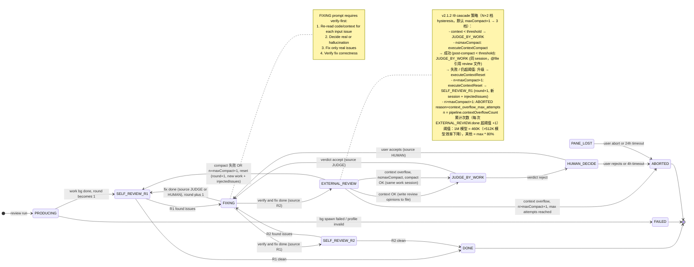
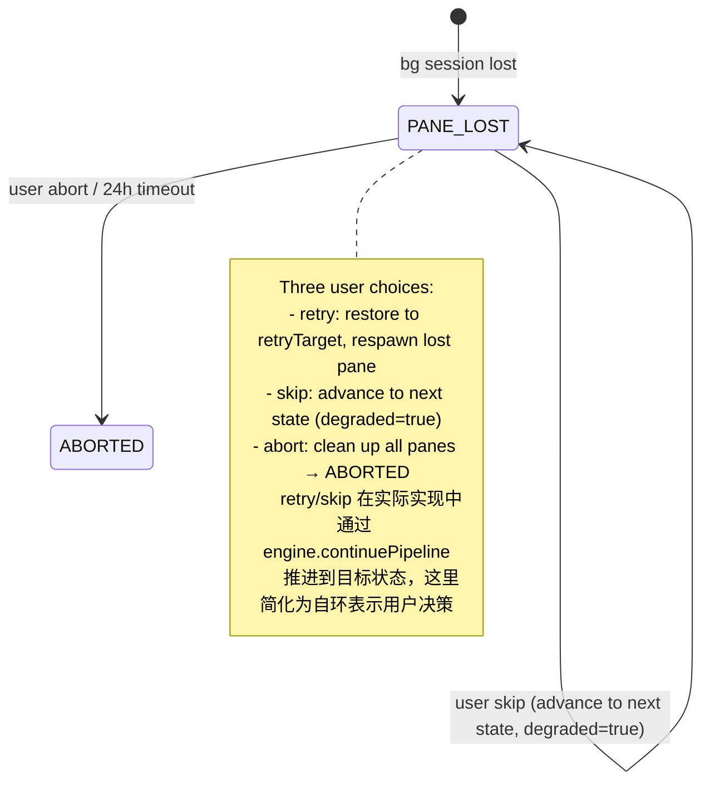

# Review Engine v2.1.1 — 数据流 & 状态机

> 属于 [overview.md](./overview.md) 的下游文件。

## 4. 数据流

### 4.1 一次完整 pipeline 的事件序列

```
时间轴  组件                       动作
─────  ─────────────────         ────────────────────────────────────────────────
T0    用户                        cc-linker review run "帮我修 NPE in auth.ts"
T1    CLI (review doctor)         验证：profile.default 引用 provider + CLI ≥ 2.1.163 + daemon 健康
T2    Engine                      调 phase-detect.detect(...) → 'code'
T3    Engine                      调 profile.load('default') → merged profile
T4    Engine                      调 adapter.startSession({ role:'work', provider:'claude-sonnet-4', prompt:'NPE in auth.ts', isNew:true })
T5    Adapter                     Bun.spawn(['claude','--bg','NPE in auth.ts','--settings',sonnetPath])
T6    CLI (Claude)                spawn bg session, 写 ~/.claude/jobs/<short1>/state.json, 返回 shortId
T7    Adapter                     解析 stdout "backgrounded · short1" + 轮询 readJobState 拿 sessionId
T8    Engine                      写 PipelineRecord 到 running/<pipelineId>/pipeline.json
                                  panes.work = { sessionId: '<uuid>', currentRoundShortId: 'short1', startedAt: ... }
T9    CLI (watch mode)            ANSI 进度条更新：state=PRODUCING, panes=[work:busy]
T10   CLI (Claude work bg)        ...处理中...
T11   CLI (Claude work bg)        state.json.state: 'running' → 'done'
T12   Adapter.poll(short1)        detect state.json.state == 'done' → emit 'work_produced'
T13   Engine                      transition: PRODUCING → SELF_REVIEW_R1 (round=1)
T14   Engine                      调 adapter.resumeWorkSession({ sessionId, prompt:'review 你的产出（identify only）...', provider:'claude-sonnet-4' })
T15   Adapter                     Bun.spawn(['claude','--bg','review...','--resume',sessionId,'--reply-on-resume','--settings',sonnetPath])
T16   CLI (Claude work bg)        新 shortId2，sessionId 不变
T17   Engine                      panes.work.currentRoundShortId = 'short2'
T19   ...                         R1 收敛 → R1 发现 3 issues
T20   Engine                      transition: SELF_REVIEW_R1 → FIXING (source=R1)
T21   Engine                      调 adapter.injectReply({ shortId:'short2', prompt:'verify each issue, fix real ones...' })
T24   Adapter.poll(short2)        FIXING 完成 → emit 'fix_complete'
T25   Engine                      FIXING(source=R1) → SELF_REVIEW_R2
T28   ...                         R2 发现 1 new issue → FIXING(source=R2) → EXTERNAL_REVIEW
T31   Engine                      adapter.startSession({ role:'review', provider:'kimi-for-coding', prompt:'review X...' })
T32   Adapter                     spawn 1 个 bg session，shortId5
T33   Engine                      panes.review = {role:'review', shortId:'short5', sessionId:'uuid-r', round:1, cycle:'initial'}
T36   Adapter.poll(short5)        done → emit 'external_opinions_ready'
T37   Engine                      transition: EXTERNAL_REVIEW → JUDGE_BY_WORK
T38   Engine                      调 adapter.injectReply({ shortId:'short2', prompt:'judge opinions...' })
T41   Adapter.poll(short2)        verdict: accept (P0/P1 rejection ratio < 30%)
T42   Engine                      JUDGE_BY_WORK → FIXING (source=JUDGE)
T45   Engine                      FIXING(source=JUDGE) → SELF_REVIEW_R1 (cycle: 'postfix', round=2)
T46   ...                         循环直到 R1/R2 收敛 → DONE
T47   Engine                      写 PipelineRecord 到 done/，CLI 输出 state=DONE + Markdown 报告路径
```

### 4.2 bg session 之间"传递内容"

| 角色 | 生命周期 | 启动方式 | 跨轮续接方式 |
|------|---------|---------|------------|
| `work` | 长生命周期（sessionId 跨轮不变） | 第一次 `claude --bg <prompt>` → 新 shortId1 + sessionId；后续每轮 `claude --bg <newPrompt> --resume <sessionId> --reply-on-resume` → 新 shortId2/3/4... | 每次新 shortId，但同一 sessionId |
| `review` | 轮次性（每轮新 session） | 永远 `claude --bg <prompt>`（不传 --resume）—— 单一 review 模型 | 不续接，每轮新 |

**pane 总数**：1+1（work + 1 review）。v2.1 的 arbiter 已删除。

**work pane 的"长生命周期"实现**：
- `panes.work.sessionId`：跨 R1/R2/JUDGE/FIX/postfix 全部不变
- `panes.work.currentRoundShortId`：每轮变
- `panes.work.roundShortIds`：数组，记录每轮的 shortId

**JUDGE_BY_WORK / FIXING 注入实现**：
- **不**调用 `adapter.startSession` + `--resume`（实测会报错）
- **改用** `adapter.injectReply({ shortId: currentRoundShortId, text })` → `RendezvousClient.injectReply()` → daemon → 注入到 bg session

### 4.3 判定"work 产出完成" / "review 收齐"

不自己 parse 进程 stdout，**只**看 `~/.claude/jobs/<short>/state.json.state`：

| state 值 | 含义 |
|---------|------|
| `running` / `working` + tempo=`active` | 还在跑 |
| `running` / `working` + tempo=`blocked` + `needs` 非空 | 等用户输入 |
| `blocked` | 等用户输入 |
| `done` | 已完成（看 `output` 字段拿最终输出文本） |
| `stopped` | 被 stop 或用户中止 |
| `failed` | Claude 进程异常 |

**实现**：`adapter.poll(shortId, timeoutMs)` 包装 `readJobState` 轮询（500ms 一次），超时抛 `PollTimeoutError`。

### 4.4 并发控制

| 并发维度 | 谁决定 | 怎么控 |
|---------|--------|--------|
| Pipeline 之间 | PipelineStore 的 `running/` + `queued/` 目录 | 默认 1 个同时跑，超限入 `queued/`（§6.5） |
| Pipeline 内的 pane | 状态机驱动 | R1/R2 串行；EXTERNAL_REVIEW 单 review 串行；FIXING 串行 |
| Polling 频率 | adapter 内部 | 500ms 一次 |

### 4.5 CLI `--watch` 模式（替代 v2 的 SSE）

```typescript
async function watchPipeline(pipelineId: string): Promise<void> {
  while (true) {
    const record = await pipelineStore.readRunning(pipelineId);
    if (record.state.kind === 'DONE' || isTerminal(record.state.kind)) {
      renderTerminal(record);
      return;
    }
    renderLive(record);
    await Bun.sleep(500);
  }
}
```

---

## 5. 状态机

### 5.1 ReviewState 枚举

```typescript
type ReviewState =
  // === Produce 阶段 ===
  | { kind: 'PRODUCING';         pipelineId; round: number; pane: 'work' }
  // === 自查阶段（identify-only，fix 在后续 FIXING 节点）===
  | { kind: 'SELF_REVIEW_R1';    pipelineId; round: number; cycle: 'initial' | 'postfix'; pane: 'work';
                                  contextOverflowApplied?: 'reset';   // v2.1.2：从原 contextReset 升级
                                  injectedIssues?: Issue[] }
  | { kind: 'SELF_REVIEW_R2';    pipelineId; round: number; cycle: 'initial' | 'postfix'; pane: 'work' }
  // === 修复节点（从 R1/R2/JUDGE/HUMAN 4 个调用点统一进入）===
  | { kind: 'FIXING';            pipelineId; round: number; pane: 'work';
                                  source: 'SELF_REVIEW_R1' | 'SELF_REVIEW_R2' | 'JUDGE_BY_WORK' | 'HUMAN_DECIDE';
                                  inputIssues: Issue[] }
  // v2.1.2 修正（P1-5）：inputIssues 语义说明
  // - source=R1/R2 时：inputIssues = 当轮自查发现的 issues（不跨轮累积）
  // - source=JUDGE 时：inputIssues = JUDGE accept 的 issues（来自 DecisionContext.issues）
  // - source=HUMAN 时：inputIssues = 用户通过 decide 选中的 issues
  // - 每轮 FIXING 的 inputIssues 是独立的（替换），不是前轮累积
  // - 如果需要追踪历史所有 issues，通过 pipeline.history[].issues 回溯
  // === 外审（单一 review session）===
  | { kind: 'EXTERNAL_REVIEW';   pipelineId; round: number; cycle: 'initial' | 'postfix';
                                  pane: { role: 'review'; shortId: string } }
  // === 评判（2 值 verdict）===
  | { kind: 'JUDGE_BY_WORK';     pipelineId; round: number; pane: 'work';
                                  contextOverflowApplied?: 'compact' } // v2.1.2：通过 compact 抵达此状态
  // === pane 丢失（用户询问，不直接 FAILED）===
  | { kind: 'PANE_LOST';         pipelineId; round: number;
                                  lostPane?: { role: 'work' | 'review'; shortId: string };
                                  detectedAt: string;
                                  retryTarget: ReviewState['kind'] }
  // === 人工兜底 ===
  | { kind: 'HUMAN_DECIDE';      pipelineId; round: number; pending: DecisionContext }
  // === 终态 ===
  | { kind: 'DONE';              pipelineId; round: number; totalCostUsd; issueTrail;
                                  contextOverflowApplied?: 'compact' | 'reset' }   // v2.1.2：abort 不进 DONE
  | { kind: 'FAILED';            pipelineId; round: number; reason; totalCostUsd }
  | { kind: 'ABORTED';           pipelineId; round: number; reason; abortedBefore };
```

**辅助类型 DecisionContext**：

```typescript
interface DecisionContext {
  trigger: 'verdict_reject';
  rejectionSummary: {
    p0p1Total: number;
    p0p1Rejected: number;
    ratio: number;
    threshold: number;
  };
  issues: Array<{
    id: string;
    source: 'review';  // v2.1.1 固定
    severity: 'P0' | 'P1' | 'P2' | 'P3';
    location: string;
    description: string;
    suggestion: string;
    workDecision: 'accept' | 'reject' | 'partial';
  }>;
}
```

### 5.2 max_rounds 计数规则

**Round 语义**：1 round = 1 个完整 cycle。`round` 计数器仅在每次进入 `SELF_REVIEW_R1` 时 +1。

| 类别 | 状态 | round 增量 |
|------|------|-----------|
| **Round start** | `SELF_REVIEW_R1`（每次 entry） | ✅ **+1** |
| **Round 中间** | `SELF_REVIEW_R2` / `FIXING` / `EXTERNAL_REVIEW` / `JUDGE_BY_WORK` | 0 |
| **免费** | `PRODUCING` / `DONE` / `FAILED` / `ABORTED` / `PANE_LOST` | 0 |
| **逃生** | `HUMAN_DECIDE` | 0 |

**默认值**（v2.1 减半）：

| Phase | 默认 | 含义 |
|-------|------|------|
| Spec  | 4 cycles | 最多跑 4 轮 |
| Plan  | 5 cycles | 最多跑 5 轮 |
| Code  | 8 cycles | 最多跑 8 轮 |
| Global | 6 cycles | 全局默认 6 轮 |

### 5.3 状态转换图

#### 5.3.0 设计概述

| Lane | 状态 | 驱动者 |
|------|------|--------|
| **Engine lane** | PRODUCING / R1 / R2 / FIXING / EXTERNAL_REVIEW / JUDGE_BY_WORK | Engine 自动 |
| **Human lane** | HUMAN_DECIDE | User CLI |
| **Trouble lane** | PANE_LOST | User + Engine |
| **Terminal** | DONE / FAILED / ABORTED | — |

#### 5.3.1 主状态机（Mermaid）



#### 5.3.2 ASCII 备查版

```
  ┌──────────┐  work bg done   ┌──────────────┐  issues>0  ┌──────────────┐
  │PRODUCING ├───────────────►│SELF_REVIEW_R1├──────────►│    FIXING    │
  │          │  (spawn #1)    │              │            │  (source=R1) │
  └──────────┘                │ 0 issues ─┐  │            │ verify-first │
                              └───────────┼──┼────┐       └──────┬───────┘
                                          ▼  ▼    │                     │
                                       ┌────────┐ │ verify+fix done     ▼
                                       │  DONE  │◄┘──────────┐  ┌──────────────┐
                                       └────────┘            │  │SELF_REVIEW_R2│
                                                             └─►│              │
                                                                │ 0 issues→DONE│
                                                                │ issues→FIXING│
                                                                └──────┬───────┘
                                                                       ▼
                                                                ┌──────────────┐
                                                                │EXTERNAL_REVIEW│
                                                                │ (1 review)    │
                                                                └──────┬───────┘
                                                                       │ done + 写 review opinions 到文件
                                                                       │
                                                          ┌────────────┴───────────┬─────────────┐
                                                          ▼ context OK              ▼ n≤maxCompact ▼ n>maxCompact
                                              ┌────────────────┐  ┌─────────────────┐  ┌────────────────┐
                                              │ JUDGE_BY_WORK  │  │   /compact      │  │  strategy=reset│
                                              │  (context OK)  │  │  (同 session)   │  │  (新 session) │
                                              └────────┬───────┘  └────────┬────────┘  └────────┬───────┘
                                                       │                  │                   │
                                                       │          ┌───────┴────────┐          │
                                                       │          ▼ 成功           ▼ 失败     │
                                                       │   ┌─────────────┐ ┌──────────────┐ │
                                                       │   │JUDGE_BY_WORK │ │ SELF_REVIEW_R1│ │
                                                       │   │(contextCom..)│ │ (round+1)    │ │
                                                       │   └──────┬──────┘ └──────────────┘ │
                                                       │          │                        │
                                                       ▼          ▼                        ▼
                                                ┌──────────────────────┐          ┌──────────┐
                                                ▼ verdict=accept        ▼ reject   │ ABORTED  │
                                          ┌──────────────┐    ┌──────────────┐    │(n>maxC+1)│
                                          │    FIXING    │    │ HUMAN_DECIDE │    └──────────┘
                                          │ source=JUDGE │    │  (4h timeout)│
                                          └──────┬───────┘    └──────┬───────┘
                                                 │                   │
                                                 ▼                   ▼
                                          SELF_REVIEW_R1       FIXING(source=HUMAN)
                                          (cycle=postfix)      → SELF_REVIEW_R1(postfix)
```

#### 5.3.3 PANE_LOST 决策流程



#### 5.3.4 状态转换表

| 当前状态 | 触发事件 | 下一状态 | 动作 | pane 角色 | round |
|---------|---------|---------|------|----------|-------|
| `[*]` | `cc-linker review run` | PRODUCING | doctor 验证 + 创建 PipelineRecord | — | 0 |
| **[*]** | profile invalid（doctor 阶段） | FAILED | reason=`profile_invalid` | — | 0 |
| **PRODUCING** | work bg spawn 失败 | FAILED | reason=`bg_spawn_failed` | — | 0 |
| **PRODUCING** | work bg state=`done` | SELF_REVIEW_R1 | 记录 `panes.work.sessionId` | work (bg short1) | 0 → 1 |
| **SELF_REVIEW_R1** | work bg done, issues=[] | DONE | 生成 report + 移到 `done/` | work | 1 |
| **SELF_REVIEW_R1** | work bg done, issues=[N] | FIXING (source=R1) | 记录 R1 issues 作为 `inputIssues` | work | 1 |
| **SELF_REVIEW_R1 (contextOverflowApplied='reset')** | work bg done, all fixed | DONE | reset happy path | work (新 session) | round+1 |
| **SELF_REVIEW_R1 (contextOverflowApplied='reset')** | work bg done, partial fix | SELF_REVIEW_R2 | reset mixed path | work (新 session) | round+1 |
| **SELF_REVIEW_R2** | work bg done, issues=[] | DONE | 生成 report | work | 不变 |
| **SELF_REVIEW_R2** | work bg done, issues=[N] | FIXING (source=R2) | 记录 R2 issues | work | 不变 |
| **FIXING (source=R1)** | done | SELF_REVIEW_R2 | 记录 per_issue | work | 不变 |
| **FIXING (source=R2)** | done | EXTERNAL_REVIEW | 同上 | work | 不变 |
| **EXTERNAL_REVIEW** | review state=`done` + context < threshold | JUDGE_BY_WORK | 收集 review opinions + writeReviewOpinionsToFile | review (×1) | 不变 |
| **EXTERNAL_REVIEW** | review state=`done` + context ≥ threshold, n≤maxCompact, **compact 成功** | JUDGE_BY_WORK | executeContextCompact + writeReviewOpinionsToFile + @file 引用 | work (同 session) | 不变 |
| **EXTERNAL_REVIEW** | review state=`done` + context ≥ threshold, n≤maxCompact, **compact 失败** OR n=maxCompact+1 | SELF_REVIEW_R1 | executeContextReset 6 步 + round += 1 | work (新 session) | +1 |
| **EXTERNAL_REVIEW** | review state=`done` + context ≥ threshold, n>maxCompact+1 | ABORTED | reason=`context_overflow_max_attempts` | — | 不变 |
| **JUDGE_BY_WORK** | verdict=`accept` | FIXING (source=JUDGE) | 记录 accepted issues | work (injectReply) | 不变 |
| **JUDGE_BY_WORK** | verdict=`reject` | HUMAN_DECIDE | 移到 `human_pending/` | work (injectReply) | 不变 |
| **HUMAN_DECIDE** | user accept | FIXING (source=HUMAN) | 移到 `running/` | — | 不变 |
| **HUMAN_DECIDE** | user reject / 4h timeout | ABORTED | cleanup + 移到 `aborted/` | — | 不变 |
| **FIXING (source=JUDGE/HUMAN)** | done | SELF_REVIEW_R1 | cycle=`postfix`, **round += 1** | work (injectReply) | +1 |
| **任意状态 X** | bg session 消失 | PANE_LOST | 记录 lostPane + detectedAt | lost pane | 不变 |
| **任意状态 X** | user cancel | ABORTED | cleanup | — | 不变 |
| **进入 SELF_REVIEW_R1** | round ≥ max_rounds | ABORTED | reason=`max_rounds_exceeded` | — | 超过 |
| **PANE_LOST** | user retry/abort/skip / 24h timeout | 见 §5.3.3 | — | — | — |

**终态 reason 枚举**：

| 终态 | reason | 触发位置 |
|------|--------|----------|
| **FAILED** | `bg_spawn_failed` | PRODUCING spawn |
| **FAILED** | `profile_invalid` | doctor 阶段 |
| **ABORTED** | `r1_parse_degraded` | R1 parse 失败 |
| **ABORTED** | `max_rounds_exceeded` | 进入 SELF_REVIEW_R1 时 round≥max |
| **ABORTED** | `pane_lost_timeout` | PANE_LOST 24h |
| **ABORTED** | `human_decision_timeout` | HUMAN_DECIDE 4h |
| **ABORTED** | `context_overflow_max_attempts` | v2.1.2：cascade n>maxCompact+1 时触发（默认 maxCompact=1 → n≥3） |
| **ABORTED** | `context_reset_spawn_failed` | reset 中 startSession 失败 |
| **ABORTED** | `review_opinions_write_failed` | v2.1.2 新增：写 review opinions 文件失败（fallback inline 会撑爆 context，所以直接 abort） |
| **ABORTED** | `work_session_lost_exceeds_max_rounds` | retry PANE_LOST 触发 |
| **ABORTED** | `user_cancelled` | `cc-linker review cancel` |
| **ABORTED** | `budget_exceeded` | costUsd > max_cost_usd |
| **ABORTED** | `reset_loop` | contextResets > max |
| **ABORTED** | `reset_timeout` | 单次 reset > max_reset_duration_ms |

#### 5.3.5 走查示例

**输入**：`cc-linker review run "fix NPE in auth.ts" --phase code --profile default`

| t (秒) | 状态 | round | 备注 |
|--------|------|-------|------|
| 0 | PRODUCING | — | spawn short1 |
| 60 | **SELF_REVIEW_R1** | **1** | R1 发现 3 issues |
| 60+ | **FIXING (source=R1)** | 1 | verify-first，2 real fixed, 1 hallucination |
| 80 | FIXING → **SELF_REVIEW_R2** | 1 | source=R1→R2 |
| 105 | R2 → **FIXING (source=R2)** | 1 | 1 new issue |
| 130 | FIXING → **EXTERNAL_REVIEW** | 1 | spawn short5 (kimi) |
| 170 | **JUDGE_BY_WORK** | 1 | ratio=0.10 < 30% → accept |
| 200 | **FIXING (source=JUDGE)** | 1 | apply accepted |
| 245 | **SELF_REVIEW_R1** | **2** | cycle=postfix |
| 350 | **SELF_REVIEW_R1** | **3** | 0 issues → DONE |

> **v2.1.2 修正（P2-2）**：round 2 的 postfix cycle 中 R1 直接发现 0 issues，因此跳过 R2/EXTERNAL_REVIEW/JUDGE，直接 → DONE。这是正常收敛路径，不是遗漏步骤。完整 postfix 路径（R1 有 issues）见 §5.3.5.1。

**总耗时**：~6 分钟，3 cycles。

#### 5.3.5.1 走查示例 2：context overflow 触发 I9 cascade（compact 成功路径）

**前置**：在 §5.3.5 示例的 round=1 中，假设 work session context 用量到 195K/200K（超 80% 阈值）。

| t (秒) | 状态 | round | 备注 |
|--------|------|-------|------|
| 130 | **EXTERNAL_REVIEW** | 1 | spawn short5 (kimi)；work session context 195K/200K |
| 170 | EXTERNAL_REVIEW done | 1 | review state=done → onExternalReviewComplete 触发 checkContextOverflow |
| 170.1 | (cascade n=1) | 1 | 195K ≥ threshold(160K) → executeContextCompact |
| 170.2 | (compact 中) | 1 | injectReply `/compact` → poll → re-check |
| 175 | (compact 完成) | 1 | post-compact usage 80K < threshold(160K) → compact 成功 |
| 175.1 | (写文件) | 1 | writeReviewOpinionsToFile → state/external-review-r1.{json,md} |
| 175.2 | (注入 judge prompt) | 1 | injectReply "读 @external-review-r1.md，judge accept/reject..." |
| 175.5 | **JUDGE_BY_WORK** (contextOverflowApplied='compact') | 1 | 同 session，worker 继续 |
| 200 | JUDGE_BY_WORK → **FIXING (source=JUDGE)** | 1 | accept verdict → verify+fix |
| 240 | **SELF_REVIEW_R1** (cycle=postfix) | **2** | round+1（postfix cycle 触发 +1） |
| 350 | SELF_REVIEW_R1 | 3 | 0 issues → DONE |

**总耗时**：~6 分钟，3 cycles，1 次 compact。

#### 5.3.5.2 走查示例 3：context overflow cascade 升级（compact 失败 → reset → abort）

**前置**：在 §5.3.5 示例的 round=1 中，假设 work session context 用量到 198K/200K（极度接近上限，compact 无法消化）。

| t (秒) | 状态 | round | n | 备注 |
|--------|------|-------|---|------|
| 130 | EXTERNAL_REVIEW | 1 | 0 | spawn short5；work context 198K/200K |
| 170 | EXTERNAL_REVIEW done | 1 | 1 | 198K ≥ threshold(160K) → cascade n=1 → executeContextCompact |
| 175 | (compact 失败) | 1 | 1 | /compact 后 usage 仍 180K ≥ threshold → 升级 reset |
| 175+ | (reset 中) | 1 | 1 | 杀 work + spawn 新 + 注入 issues/history/docs + @file 引用 |
| 180 | **SELF_REVIEW_R1** (postfix, contextOverflowApplied='reset') | **2** | 1 | 新 work session |
| 280 | R1 → FIXING → R2 → EXTERNAL_REVIEW | 2 | 1 | 第二个 cycle 开始 |
| 350 | EXTERNAL_REVIEW done | 2 | 2 | context 又到 190K/200K → cascade n=2 → 直接 reset（不再试 compact） |
| 360 | SELF_REVIEW_R1 (reset) | **3** | 2 | 新 session again |
| 460 | R1 → FIXING → R2 → EXTERNAL_REVIEW | 3 | 2 | 第三个 cycle |
| 540 | EXTERNAL_REVIEW done | 3 | 3 | context 仍超 → n=3 → ABORTED |
| 540+ | **ABORTED** (context_overflow_max_attempts) | 3 | 3 | max_attempts 触发 |

#### 5.3.5.3 走查示例 4：`max_compact_attempts=2` 的 4 档 cascade（v2.1.2 P0-3 修正）

**前置**：profile 配置 `max_compact_attempts = 2`，其余同 §5.3.5。4 档行为：n=1 → compact, n=2 → compact, n=3 → reset, n≥4 → abort。

| t (秒) | 状态 | round | n | 备注 |
|--------|------|-------|---|------|
| 130 | EXTERNAL_REVIEW | 1 | 0 | spawn short5；work context 185K/200K |
| 170 | EXTERNAL_REVIEW done | 1 | 1 | 185K ≥ threshold(160K) → n=1 ≤ maxCompact(2) → compact |
| 175 | (compact 成功) | 1 | 1 | /compact 后 usage 95K < 160K → 注入 JUDGE prompt → JUDGE_BY_WORK |
| 240 | JUDGE → FIXING → SELF_REVIEW_R1 (postfix) | **2** | 1 | round+1 |
| 340 | R1 → FIXING → R2 → EXTERNAL_REVIEW | 2 | 1 | 第二个 cycle |
| 400 | EXTERNAL_REVIEW done | 2 | 2 | context 到 175K → n=2 ≤ maxCompact(2) → 再试 compact |
| 405 | (compact 成功) | 2 | 2 | /compact 后 usage 88K < 160K → JUDGE_BY_WORK |
| 470 | JUDGE → FIXING → SELF_REVIEW_R1 (postfix) | **3** | 2 | round+1 |
| 570 | R1 → FIXING → R2 → EXTERNAL_REVIEW | 3 | 2 | 第三个 cycle |
| 630 | EXTERNAL_REVIEW done | 3 | 3 | context 到 190K → n=3 = maxCompact+1(3) → 直接 reset（跳过 compact） |
| 640 | SELF_REVIEW_R1 (reset) | **4** | 3 | 新 session |
| 740 | R1 → FIXING → R2 → EXTERNAL_REVIEW | 4 | 3 | 第四个 cycle |
| 800 | EXTERNAL_REVIEW done | 4 | 4 | context 仍超 → n=4 > maxCompact+1 → **ABORTED** |

**总耗时**：~13 分钟，4 cycles，2 次 compact + 1 次 reset + 1 次 abort。

> **对比 §5.3.5.2**（`max_compact_attempts=1`）：`max_compact_attempts=2` 多给了 1 次 compact 机会（n=2 时再试而非直接 reset），但总 cascade 档位从 3 变成 4，最终仍会 abort。

### 5.4 Verdict Decision Logic

`JUDGE_BY_WORK` 的 verdict 由 **P0/P1 rejection ratio** 决定（确定性算法）。

```typescript
function computeVerdict(
  reviews: ReviewOpinion[],
  workDecision: WorkDecision[],
  threshold: number  // default 0.30
): 'accept' | 'reject' {
  const p0p1Issues = reviews.flatMap(r => r.issues)
    .filter(i => i.severity === 'P0' || i.severity === 'P1');
  const p0p1Total = p0p1Issues.length;

  const p0p1Rejected = p0p1Issues.filter(issue => {
    const decision = workDecision.find(d => d.issue_id === issue.id);
    return decision?.decision === 'reject';
  }).length;

  const ratio = p0p1Total > 0 ? p0p1Rejected / p0p1Total : 0;
  return ratio >= threshold ? 'reject' : 'accept';
}
```

| 条件 | verdict | 下一状态 |
|------|---------|---------|
| P0/P1 ratio ≥ 30% | `reject` | HUMAN_DECIDE |
| P0/P1 ratio < 30% | `accept` | FIXING |
| P0/P1 total = 0 | `accept` | FIXING |

**边界 case**：
- 所有 review 空（0 issues）→ `accept`
- work 没回复 per-issue decision → 视为全部 `accept`
- work 全部 partial → 按 accept 计算

**阈值可配**（profile `[guards]` 段）：`p0_p1_reject_threshold = 0.30`

**issue_id 命名**：Engine 用 fingerprint（SHA256 前 8 位）+ 历史匹配保证跨轮稳定。详见 [implementation.md → §7.5](./implementation.md#75-output-contract)。

---

> **继续阅读**：[implementation.md](./implementation.md)（PipelineStore / Profile / 错误处理）
